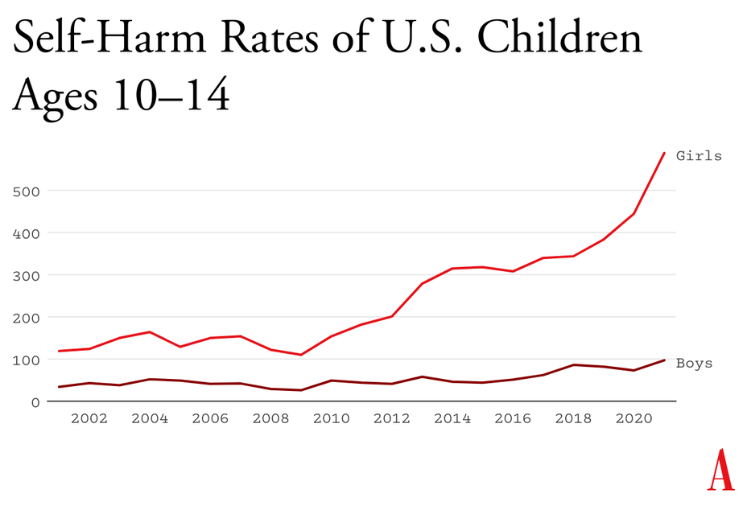

---
authors:
- first: Po
  last: Bronson
  role: author
- first: ''
  last: Ashley Merryman
  role: author
cover: ./cover.jpg
date_reviewed: 2024-06-01
isbn: '9780446504126'
narrator:
  first: Po
  last: Bronson
  role: narrator
og_cover: ./og-cover.jpg
page_count: 336
publication_year: 2009
publisher: Twelve
rating: 5.0
reads:
- year: 2024
runtime_hours: 7.95
tags:
- parenting
- non-fiction
title: 'NurtureShock: New Thinking About Children'
type: audiobook
---

*Nutureshock* is a fascinating synthesis of the best available research by a pair of journalists on paradoxes in childrearing. Despite raising children for, well, as long as there have been people, there is a lot of diversity of opinion about how best to do it.  Even with decades of research, we still don't really know how to best raise children.

The good news is that children are resilient. Short of outright abuse, it's hard to really mess a child up. The bad news is that children are resilient.  There's very little evidence of *any* intervention or change in condition that leads to better outcomes for kids.

I will focus on some paradoxes.  In the past 16 years since this book was first published, it's become broadly accepted that praising children for intelligence leads to fragile perfectionists, and that it is much better to praise children for grit.

Social aptitude is also a mixed bag. Increased social aptitude is associated with lying in very small children, around five or six. In elementary school, children with high social aptitude score very high in both empathetic and relational aggression, using a mixture of kindness and cruelty to shape the norms and social hierarchy of their classrooms. This extends into the teenage years. While most parents believe that their teens would talk to them about anything, teens routinely lie about topics from the serious, like drug and alcohol use and older boyfriends, to the medium, like is homework done, to the irrelevant, like what you did after school, when the options are hang out at the mall or the park. 

What does strike me as true through the paradox is that teens arguing is a sign of respect, not disrespect. What is important is not to be permissive or strict, but to have a finite number of well-enforced rules, and an open and contextual process for debating them so that teens feel like participants in their own growth and developing autonomy.

Another area where the book hits at conventional thinking is in gifted classrooms. Educational tracking is a third rail in American politics, where providing the best resources for talented kids runs into serious concerns about equity and racial discrimination. Either way, most districts start gifted programs far too early, with initial sorting at or before kingergarten. IQ scores vary wildly in young children over time, and don't really settle down until third grade. 

Surveys of new curriculums and teaching methods to develop both cognitive and emotional skills is a litany of null results, except for the Tools of the Mind curriculum, which apparently boasted astonishing results. I use past tense, because a [2021 survey](https://srcd.onlinelibrary.wiley.com/doi/full/10.1111/mono.12425) shows no result, again.

Finally, there are some real head scratchers. The authors have no opinion on corporal punishment, and note a racial divide, that White kids find spanking traumatic and Black kids don't. This hints at some of the worst "Black people don't experience pain the same way" racist psuedoscience, though the explanation, that African-American culture more broadly accepts getting whooped a few times as something that just happens, and that the moral exclusion from the family signified by spanking is what is traumatic, is at least cultural and not biological. I do wonder if the authors would be okay with me taking a swing at their kids. 

As an older book, *NutureShock* has little to say about whatever the fuck has happened to kids since 2010. Jonathan Haidt blames cellphones, I think a little thing called the Global Financial Crisis might be to blame, but whatever the cause, mental health is DOWN and Skibidi Toilet is UP.

*Plot from The Atlantic, [End the Phone Based Childhood Now](https://www.theatlantic.com/technology/archive/2024/03/teen-childhood-smartphone-use-mental-health-effects/677722/)*

And again, returning to the use of evidence, while the authors provide citations and ably discuss the research, epistemic closure on interactive kinds is impossible. Or without the STS jargon, as much as we try to determine the truth about people, they change as we examine them. For any topic as politically fraught as education, there will be ample room to disagree.