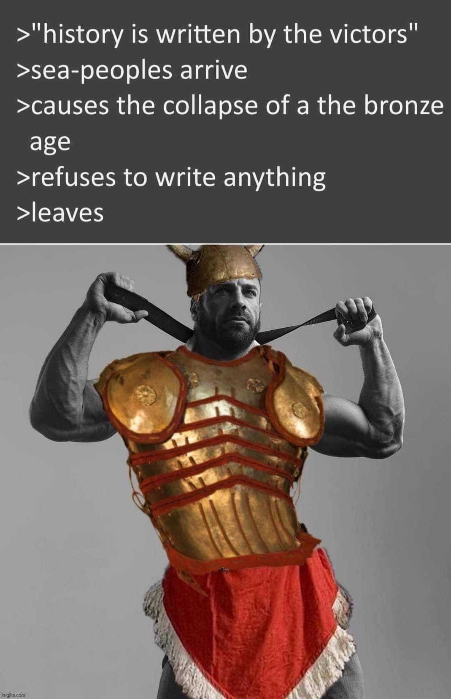

---
authors:
- first: Eric H.
  last: Cline
  role: author
- first: ''
  last: Barry S. Strauss
  role: author
cover: ./cover.jpg
date_reviewed: 2024-07-30
isbn: '9780691140896'
og_cover: ./og-cover.jpg
page_count: 264
publication_year: 2014
publisher: Princeton University Press
rating: 3.0
reads:
- date_finished: 2024-07-30
  year: 2024
tags:
- academic
- history
title: '1177 B.C.: The Year Civilization Collapsed'
type: book
---

One of the great mysteries of history is the Sea Peoples. They arrived from somewhere in the 12th century BC, sacked the palaces of the literate civilizations of the Eastern Mediterranean, caused the collapse of the intricate society of the Late Bronze Age, and vanished.

Cline aims to explain what happened, but archeology is as much art as science, and despite ample ruins and inscriptions, including diplomatic correspondence, we simply don't know. There were webs of trade and communication, and then they stopped, cities burned, and people stopped writing anything for centuries. It's frustrating, because along with the mystery of the Sea People, two great epics of Western civilization are set in the Late Bronze Age, and extra-textual evidence for both the Iliad and Exodus is scanty at best.

Cline points at a multitude of causes: earthquake, drought, disease, and invasion. He draws labored comparisons to our own integrated and global world. One key factor was that bronze requires tin, which at the time only came from a region that is now Afghanistan. This single tenuous land link was an obvious vulnerability, though not one that is much discussed. It's a long way from Mycenae to Afghanistan. What was traded for tin?

I found Graeber's Debt a much more interesting exploration of the period.