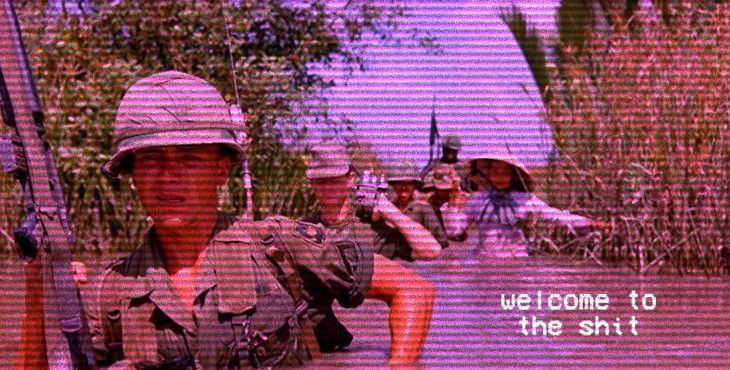

---
authors:
- first: T.R.
  last: Napper
  role: author
cover: ./cover.jpg
date_reviewed: 2024-03-11
og_cover: ./og-cover.jpg
page_count: 453
publication_year: 2022
publisher: Titan Books
rating: 4.0
reads:
- date_finished: 2024-03-11
  year: 2024
tags:
- sci-fi
title: 36 Streets
type: book
---

*36 Streets* is gritty retro cyberpunk set in the Old Quarter of 21st century Hanoi. Lin, our protagonist, is a senior leg-breaker for the Binh Xuyen gang. Her boss dumps a novel assignment on her, acting as a private detective for a Herbert, wealthy Englishman, which draws her into a political intrigue.

The setting, while nominally futuristic, is a flipped version of The Second Indochina War, what Americans call The Vietnam War. This time, China has been attempting to reconquer what they regard as the province of Jiaozhi from a resurrected Viet Minh for 20 years. China is swollen on the arrogance of its population, military, and being the country that defeated climate change. And despite their wealth and power, Vietnam will still not submit.

*A Vietnam War photo redone in vaporwave style*

In this environment, one oddly popular immersive video game is called Fat Victory, which puts you in the boots of an American soldier in the historical Vietnam War. Fat Victory is a mashup of tropes, the Vietnamese classic *The Sorrow of War*, *Dispatches*, *Platoon*, etc, which ends with the players inevitable death at the hands of implacable Viet Cong soldiers. Herbert was one of the three creators of Fat Victory. Of the other two, one is dead and one is missing. Lin's boss at the Binh Xuyen, Bao, banned the game in the district he controls. Whatever is at the end of Herbert's mystery might reveal something important about the nature of the war.

The key technology of *36 Streets* is memory editing. Most people rely on an exo-memory, digital backups of what they see and hear, tagged and trawled by friendly AIs. Both digital and natural memories can be edited and erased through various techniques. The Binh Xuygen and other criminal gangs specialize in providing alibis and erasing all evidence of their activities. Chinese Ommissioner operate on an even higher level, chopping out PTSD-inducing memories from their soldiers and sending them back into the fight. Herbert's memory is tatters, a few worn strips over an enigma, and on a grander scale, Fat Victory is a psychological warfare agent to destroy the memory of Vietnam as an independent nation.

There's plenty of style and action to be had. Even in a genre noted for damaged protagonists, Lin is exceptionally damaged. She's a drunk, addicted to an anesthetic drug called Ice-Seven, outcast from the mostly male Binh Xuyen gang due to her Australian upbringing, and deliberately provokes her twin sister (a respected pillar of the community) and adopted mother. Lin is a void surrounded by rage at the world and a demand for respect which leads her into repeated self-destructive confrontations with Passaic Powell, an immense American tough for several rival mobs.

However, the plot kind of ambles along, a drunken brawl rather than intrigue. T.R. Napper, though a white Australian, spent a lot of time in Southeast Asia and lived in the real 36 Streets district of Old Hanoi, which gives this book a bronze authenticity. However, the setting is less imaginative than something like *The Windup Girl*, the memory editing technology important, but not central. The finale and various revelations at the end, are explosive but also feel unearned given what has happened before. If you like cyberpunk, you'll probably enjoy this book. I believe Napper has a truly great novel inside him, he just needs a little more time to find his voice.