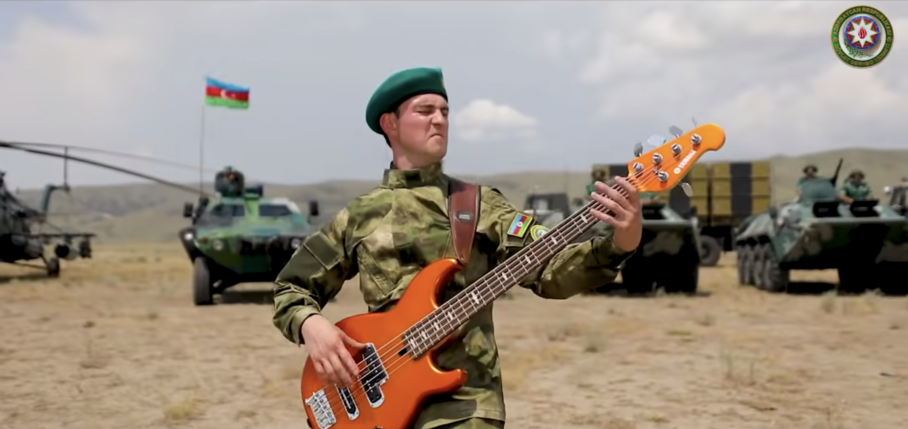

---
authors:
- first: John
  last: Antal
  role: author
- first: ''
  last: Alexander Kott
  role: author
cover: ./cover.jpg
date_reviewed: 2024-04-17
isbn: '9781636241234'
og_cover: ./og-cover.jpg
page_count: 160
publication_year: 2022
publisher: Casemate
rating: 3.0
reads:
- date_finished: 2024-04-17
  year: 2024
tags:
- history
- war
title: '7 Seconds to Die: A Military Analysis of the Second Nagorno-Karabakh War and
  the Future of Warfighting'
type: book
---

Anybody who's been following the news for the past couple years or decades knows that we're on the cusp of one of those terrifying revolutions in military affairs, where the hard-won skills of previous generations get shredded by new technologies, along with the flower of whatever generation has the misfortune to be on the frontlines. The 2022 Russian invasion of Ukraine is clearly the first major action, but before that, there was the almost forgotten 2020 Second Nagorno-Karabakh War. This book, written in 2021 and published a few weeks before Russian columns headed towards Kiev and were turned back by Bayraktar drones and Javelin missiles, is a mixed bag: a decent summary of a conflict not much covered in the west, breathless and a naive transcription of defense industry brochures, and a muddled sketch towards a futurism of the "kill web".

But first, some music!

*["Atəş" - a music video](https://youtu.be/bSh5tm2Hmn0) released by the Azerbaijani military on the eve of the war, which 'unfortunately slaps' according to a [Vice article](https://www.vice.com/en/article/epdgjn/azerbaijan-dropped-a-music-video-before-going-to-war-with-armenia) on the dueling songs of the conflict* 

First the war. Nagorno-Karabakh was an ethnically Armenian enclave within Azerbaijan, which had been an autonomous region since Armenia won the first war in the 90s after the breakup of the Soviet Union. Azerbaijan, flush with oil wealth, spent years preparing for a rapid war of conquest, investing in Turkish and Israeli drones and loitering munitions. In the runup to the war, Azerbaijan's military budget was comparable to Armenia's GDP.  Armenia's strategy rested on the strength of traditional defense in mountainous terrain, and hopes of intervention from Russia. At the end of September 2020, Azerbaijan provoked a *casus belli* and attacked.  The coordinated effort involved a wave of obsolete An-2 biplanes converted into flying bombs to activate the Armenian air defense network, which was then comprehensively destroyed by Bayraktars and loitering munitions. With Armenian air defenses degraded and destroyed (and notably, the Soviet-era SAM systems seemed totally unable to deal with relatively low and slow flying Bayraktars), Azerbaijani drones worked down the target list of artillery, command, tanks, and infantry bunkers.  Meanwhile, conventional armored forces made attacks through the mountain passes, and Azerbaijani special forces infiltrated and seized the strategic town of Shusha, which dominated the M-12 highway. After 44 days, Russia negotiated a ceasefire. Armenia suffered a crushing defeat, both sides sustained real casualties, approximately 3000 out of 17000 soldiers for Azerbaijan, and 4000 casualties out of an unpublished force for Armenia, and tens of thousands of civilians of both ethnicities were forced from their homes.

The strategic narrative that Antal pushes is the kill web, a distributed, automated, rapid and precise expansion of the kill chain that links detection of a target to a weapon system and its destruction. In particular, drones like the Bayraktar enable a low-cost combined reconnaissance-strike package, where a single platform can spot targets, fire missiles at them, and accurately evaluate the results. But this seems like a jargon laden excuse to note that traditional infantry and armor have limited range, undirected artillery is random, and jet pilots are notorious for overclaiming the effects of bombing. The defensive counterpart to the kill web is masking, an all spectrum use of camouflage and mobility to prevent the enemy from acquiring your own weapon systems.

The tech is a read of drones and electronic warfare circa the late 2010s, at about the level that you might get from skimming a Lockheed Martin press release. Antal is obsessed with active camouflage systems, everything from hexagon panels of Peltier junctions to scramble IR silhouettes to metamaterial cloaks that would bend light around soldiers. Plato wrote about Gyges' ring as a cautionary tale, but it would be strategically useful.  

My critical take is that we are definitely moving towards a new way of fighting war, but kill webs and masking are insufficient theories. Some serious questions I have are:

1) Kill webs rely on high-bandwidth video transmission, while masking requires minimizing electromagnetic signatures. Who transmits and under what circumstances? How can jammers survive against home-on-jam anti-radiation missiles?

2) War is economic. A $10,000 drone is not worth shooting with a $100,000 interceptor, unless firing would protect a $1,000,000 tank or similar asset (and scale for more sophisticated weapons and strategic targets). What is the economic balance of offense and defense?

3) Guided weapons stocks run out very rapidly in most recorded conflicts. How can Western militaries ensure both adequate munitions stockpiles and the ability to rapidly replenish them?

4) What level of command is proper for integration of various drone forces? Platoon, company, battalion, brigade, division. Should drones be organic to fire/maneuver units, or a supporting enabler, or both?

5) Are FPV drones the future, or is there a hard counter in terms of jamming, directed energy weapons, or just old fashioned airburst shells?