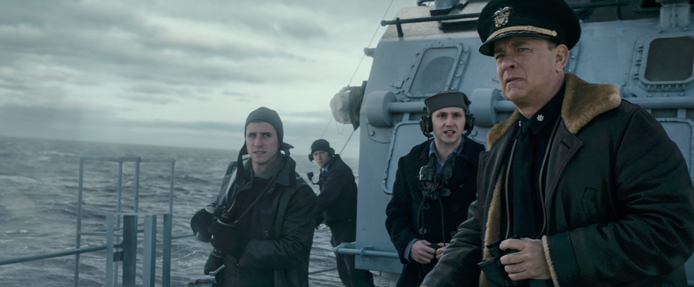

---
authors:
- first: Simon
  last: Parkin
  role: author
cover: ./cover.jpg
date_reviewed: 2022-07-24
isbn: '9780316492096'
og_cover: ./og-cover.jpg
page_count: 320
publication_year: 2020
publisher: Little, Brown and Company
rating: 5.0
reads:
- date_finished: 2022-07-24
  year: 2022
tags:
- history
- war
- ww2
title: 'A Game of Birds and Wolves: The Ingenious Young Women Whose Secret Board Game
  Helped Win World War II'
type: book
---

The Battle of the Atlantic was one of the few truly critical campaigns of the war.  While other campaigns mattered, especially to the people who fought in them, ultimately the material superiority of the Allies meant the initiative would return, the Axis would be pushed back eventually.  But if the Atlantic convoys did not get through, England would have starved. Russia would not have gotten its Lend-Lease trucks and locomotives that supported the Red Army. The state of the Battle of the Atlantic was one of the few things which scared Winston Churchill during the war.

*Tom Hanks in Greyhound, a damn good movie about North Atlantic convoys*

Parkin makes a strong case that the key piece in this allied victory was the Western Approaches Tactical Unit, a wargame training team in Liverpool led by Captain Gilbert Roberts, who had been invalided out of the Royal Navy due to tuberculosis pre-war, and was staffed mostly by the young women of the Wrens (Women's Royal Navy Auxiliary). Roberts and his Wrens created and ran a series of intensive tabletop exercises to teach anti-submarine tactics, training 5000 officers from January 1942 till victory.

The game itself was played on an immense linoleum floor strewn with models and chalk tracks. Players stood around the perimeter of the room, peering through canvas sheets with holes in them that simulated the limited situational awareness of a ship in the tossing seas. U-boat tracks were marked in green chalk, invisible from a distance, while the convoy and its escorts were indicated in white chalk.  Players had two minutes to evaluate the situation and give their orders for the turn, after which the Wrens would advance the board and repeat until debrief.

The WATU game has moments of hilarity. A 20 year-old Wren with no combat experience who had possibly never been to sea telling a grizzled destroyer captain, "I wouldn't do that, sir," and being right.  Or proving the effectiveness of a new "Beta search pattern" by putting Admiral Max Horton, England's most decorated submariner and then-Atlantic escorts commander, as the U-boats player and having the Wrens depth-charge him five times in a row.  But the WATU game is enough for a [short article](https://www.professionalwargaming.co.uk/171210WATU-MORS.pdf) (Strong, 2017, "Wargaming the Atlantic War: Captain Gilbert Roberts and the Wrens of the Western Approaches Tactical Unit", *Military Operations Research Society*), and this book covers the unit in context.

This historical non-fiction approach is both a strength and a weakness, as other reviewers have noted. Parkin writes with novelistic flair, mining memoirs and contemporary articles for dialog and detail.  Some of this works: sections on the torpedoing of the *SS City of Benares*, carrying British children to America, and the *SS Aguila* taking Wrens to Gibraltar, make the human terror of the U-boat war real in a way that tallies of tonnage sunk doesn't. Details of romances and daily life among the Wrens make their service feel more real, though there were tens of thousands of Wrens, and only 64 served in the WATU.  The weakness is a certain floppiness in chronology: I remember a one year jump between a bet between U-boat aces over who would hit 250,000 tons and an Admiralty response at one point, and the first chapter ends with a cheap scare of a stranger with a gun entering Captain Parker's quarters which does not pay off.  While I am confident in Parkin's sources and methods having checked the footnotes, this is not an academic work.  Someone looking for a complete history of the Wrens or the Battle of the Atlantic may feel disappointed.

Like most historians, Parkin puts the critical moment of the Battle of the Atlantic in May 1943, but he focuses down even more to the action of Convoy ONS.5, where over seven days multiple escort groups managed to defend the America bound ships from a super-wolfpack of fifty U-boats.  The convoy took losses, but the escorts sank a U-boat for every two Allied ships lost. After the painful losses of May, Admiral Donitz ordered a 17 week pause in U-boat operations, and even when the U-boats returned it was a far cry from the deadly "happy days" of the early war, with perilous losses for few successes.  There are many contributing factors to this Allied victory: a critical density of escort ships, long-range aircraft that could plug the 500 mile gap in the mid-Atlantic previously out of air surveillance, better radar and weapons like the Hedgehog mortar, breaking the Enigma code and conversely securing Allied codes against Nazi codebreakers.  

Parkin makes the compelling case that it was teamwork among escort commanders that was the critical factor, and this teamwork was learned at WATU, from young women in uniform, by playing a game.