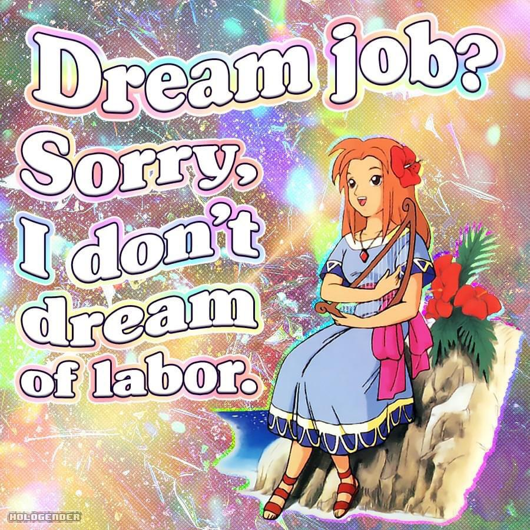

---
authors:
- first: The School of
  last: Life
  role: author
cover: ./cover.jpg
date_reviewed: 2023-08-27
og_cover: ./og-cover.jpg
page_count: 142
publication_year: 2017
publisher: The School of Life
rating: 4.0
reads:
- year: 2023
tags:
- self-help
title: A Job to Love (The School of Life Library)
type: book
---

Work sucks. I know it, you know it, we all know it.  But what if it didn't have to be quite so bad.

*Dream job? Sorry, I don't dream of labor.

--r/antiwork meme*

*A Job to Love* is an introspection guide, full of prompts about how to examine activities you really enjoy, not just say you enjoy them because you've been doing them for a while, or they're prestigious, or your parents expect you to.  I've been lucky, in that all my jobs have been pretty easy and tolerable, with the exceptions of bad bosses and bureaucratic nonsense which is probably the same everywhere. 

I really should go back and do the introspective bits in full now that I've read the entire book, but it just seemed like too much at the time.