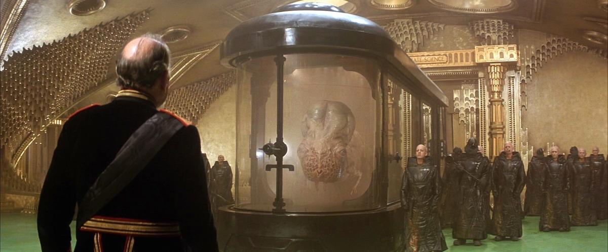

---
authors:
- first: Max
  last: Evry
  role: author
date_reviewed: 2023-10-02
isbn: '9781948221290'
page_count: 520
publication_year: 2023
publisher: 1984 Publishing
rating: 5.0
reads:
- year: 2023
tags:
- sci-fi
- non-fiction
title: 'A Masterpiece in Disarray: David Lynch’s Dune—An Oral History'
type: book
---

David Lynch's *Dune* opens with one of the greatest scenes ever in sci-fi, with the Emperor of the Galaxy clearing his court to receive a Guild Navigator. The Navigator arrives in an immense black casket, which slides open to reveal an aquarium of orange gas, out of which swims a horrific vagina-faced man-fish who speaks in a harsh buzz that is translated by a nearby gimp in a latex raincoat.  It is harsh, and stunning and like nothing else put to film. And the rest of the movie kind of limps downwards, until at some point you realize that this is awful, and it's never going to get better.  Hopefully you have consumed a lot of "Spice Essence" yourself.

*Lynch's Guild Navigator is the high point of the movie, which unfortunately occurs right at the start.*

So it's not a good film. It might be a great one, but it's not a good one. Defeat is an orphan, and there's been a lot of finger pointing over the years. The producers, Dino and Rafaella de Laurentiis, murdered the movie in the edit, David Lynch wasn't the right director, the story made no sense, the effects were laughable, and so on.

Objectively, Dune is a tricky book to adapt to a movie. There have been a lot more failed versions than successes. Of the existing versions, both the recent Villeneuve *Dune* and the early 2000s SyFy miniseries cheat by spreading the story over more hours of film than Lynch was allowed. Ridley Scott abandoned the project before Lynch, and Jodorowsky's Dune inspired a documentary movie, but would have been an insane version with almost nothing in common with the book.

*A Masterpiece in Disarray* is a 500 page oral history of pre-production, filming, the release, and legacy, which interviews pretty much the entire living cast and major crew, as well as a variety of fans. The basic thesis is that David Lynch is a visionary who got many things right, and who's style of filmmaking taps directly into the collective subconscious. Evry even managed an interview with David Lynch himself, since David does not like to talk about a movie he regards as a traumatic experience. Somewhat surprisingly, the de Laurentiises come off better than I expected. While Dino was a charming old pirate, he and Rafaella apparently genuinely cared for the story. *Dune* was the favorite book of Dino's dead son Federico, and the film is dedicated to his memory. Universal studios expected something fun and toyetic, a new Star Wars, and they definitely failed to market the movie that they got. Lynch was the only person who had an actively bad time on the movie, and unlike a lot of directors he kept his pain private. Everybody is still friends.

The flipside is that the production was genuinely a fiasco. Preproduction dragged out forever and somehow ended without a filmable script. Filming in Mexico presented major challenges, including customs barriers, unreliable electricity, and food poisoning that afflicted cast and crew. A lot of people were drunk much of the time. Filming proceeded without call sheets, with every day an improvisation. Lynch responded to calls for discipline from Los Angeles by inventing new scenes to film. Ultimately, when filming was done, there was no budget left for effects, and the original effects house, John Dykstra's Apogee (Dyskstra basically invented modern special effects working on *Star Wars*) demanded a lot of money from empty pockets. The second choice studio did their best, but didn't have the chops, leaving a film with some amazing shots, like the combined miniatures and live action shot of the Arrakis landing field, and a lot of stuff that simply didn't work.

When *Dune* hews close of Lynch's passions of biological monstrosity and industrial decay, it works very well. But the political intrigue is pro-forma, and so far none of the adaptations have managed to capture Paul-the-prophet.

Evry's book is probably the first and last word on Lynch's Dune. It's not for everyone, but the obsessive Dune fan, Lynch fan, or cvlt fan will absolutely love it.