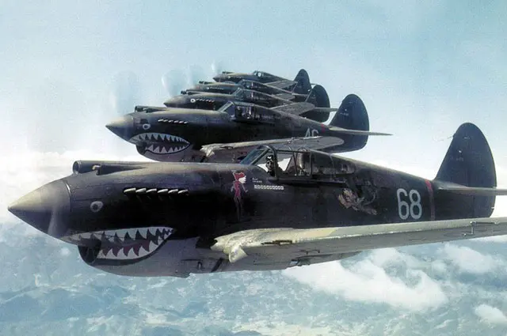

---
authors:
- first: Gregory "Pappy"
  last: Boyington
  role: author
cover: ./cover.jpg
date_reviewed: '2026-06-15'
isbn: 978-0804150798
og_cover: ./og-cover.jpg
page_count: 363
publication_year: 1956
publisher: Bantam
rating: 4.0
reads:
- date_finished: '2026-06-14'
  date_started: '2026-06-10'
  year: 2026
tags:
- war
- ww2
- biography
title: 'Baa Baa Black Sheep: The True Story of the "Bad Boy" Hero of the Pacific Theatre and His Famous BlackSheep Squadron'
type: book
---

I was familiar with the existence of Pappy Boyington from the 1976 NBC show, which is loosely based on his WW2 experience.  The book is quite surprising, a punchy and personal take on a very up and down career.

Boyington had been a Marine aviator for years when he violated the cardinal rule of the Corps ("Never volunteer for anything") by signing up with the American Volunteer Group, better known as the Flying Tigers. Going to China seemed like a good way to get away from trouble at home, which included hefty debts, an ex-wife and three kids, and an incipient court martial for punching another officer.

China was chaotic, a shoestring operation at the far end of the Allied effort in the days before formal American involvement. The 3 squadrons of Claire Chennault's Flying Tigers flew P-40 Warhawks, famously painted with the shark's mouth. 

Though substantially outnumbered and chronically short of supplies, the Flying Tigers inflicted outsized casualties on the Japanese, and offered some protection to Chinese cities which were otherwise entirely vulnerable from the air. 

As the war became more official, Chennault began making bureaucratic moves to fold the Flying Tigers into the US Army Air Forces. Boyington's response was "Hey, I'm a Marine" and when told he'd be reduced in rank from Major to 2nd Lieutenant, he resigned his contract and made his way across India, Africa, and the Atlantic back to Washington DC. In one of those real-life SNAFU moments that characterize actual war, a personnel officer refused to reinstate him, and this veteran fighter pilot wound up parking cars in LA while battles raged across the Pacific.

By the time Boyington got back to the war, it was 1943, and the Marines were operating F4U Corsairs out of Vella Lavella. At first a major without an assignment, Boyington organized various misfits and replacement pilots into the provisional squadron, VMF-214, which became known as the infamous Black Sheep.

Boyington was an aggressive commander who led from the front. He admits he has no talent for remembering or describing air-to-air combat, but he found more than his share of the enemy and became a leading ace. He also drank like a fish, chased women in Australia, and generally made a nuisance of himself. 

On one last mission to try and exceed WW1 ace Eddie Rickenbacker's score, Boyington bit off more than he could chew, and outnumbered 10 to 2, was shot down. He was picked up by a Japanese submarine and became a prisoner of war for a long 20 months.

In what's perhaps the most surprising part of the book, Boyington bears the Japanese no particular ill-will. While routinely brutalized by some guards and placed on starvation rations, he was talented at finding human sympathy with ordinary civilians and reluctant educated translators. Through grit and optimism and stealing food, he survived the war and came home a hero with a total of 28 kills, a Navy Cross, and a Medal of Honor.

Postwar life did not prove kind to Boyington. Booze was a constant problem, and he was fired from multiple sales jobs. Prior to getting sober and writing this book, the best thing he had going was refereeing professional wrestling matches, which was somehow even more of a farce in the 1950s than it is today.  Fortunately for Boyington, a handful of good friends walked him through the 12 AA steps, he managed to dry out, and hold down a flying career.

I'll admit that WW2 memoirs are a little outside my usual range. Boyington has a distinctive voice, which is a pro and con. The stories are a little repetitive, but a lot of fun.