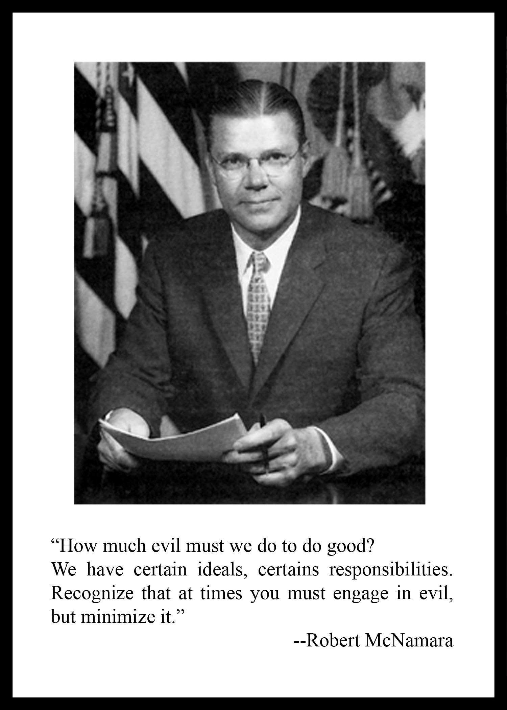

---
authors:
- first: Craig
  last: McNamara
  role: author
cover: ./cover.jpg
date_reviewed: 2022-07-25
isbn: '9780316282239'
og_cover: ./og-cover.jpg
page_count: 288
publication_year: 2022
publisher: Little, Brown and Company
rating: 5.0
reads:
- date_finished: 2022-07-25
  year: 2022
tags:
- biography
- vietnam-war
title: 'Because Our Fathers Lied: A Memoir of Truth and Family, from Vietnam to Today'
type: book
---

I remember watching *The Fog of War* in high school the year it came out, lights dimmed in history class. I was fascinated by the flickering ancient newsreels, the psychographic phonography of airpower, and above all else, McNamara himself, his planetary confidence in data which ultimately was merely confidence in himself, his earnest message to us that we should consider peace on the eve of another pointless American war, and also the limits of his responsibility and sorrow.  Here was a man who had taken up the wheel of history and been broken by it. What could I learn from him?

*"How much evil must we do to do good?"*

Craig's book is a surprisingly excellent memoir about coming to terms with his father's legacy. In one eye, there is Dad, a stern yet loving father in the Greatest Generation mold, an avid outdoorsman who shared his love of mountains, hiking, skiing, and swimming with his son.  Dad was a family man who tried to leave work at the office to protect his loved ones from its burdens.

But that's the other eye, the historical figure and war criminal.  McNamara's work wasn't something mundane, like teaching economics or managing an auto company. From 1961 to 1968, he was Secretary McNamara, one of the most powerful men in the world. He was part of small group of people who held our common destiny in his hands during the Cuban Missile Crisis.  And he escalated and hobbled the Vietnam War, committing America to a war that he was privately skeptical of.

Vietnam was the wedge between Craig and his father. If you're expecting some special insight into McNamara's thinking, Craig has had to reconstruct his father from the same historical record we have. As the title suggests, Craig believes that his father's sin was a lie, and a subsequent life of silence and misdirection to cover up that lie. He believes his father's lifelong inability to hold himself accountable was rooted in what seemed to be good reasons, loyalty to the memories of Kennedy and Johnson, to the grand program of advancing American values and American empire. But the generalities in McNamara's later life, the "we made mistakes" rather than a firm "I lied, and because of that others lost everything and suffered so much", stood between them, and stands between McNamara and his legacy.

Craig was born in 1950, a core Boomer, eligible to be drafted in the despondent wake of the Tet Offensive.  He writes about his radicalization through a miserable boarding school existence, looking to his father for personal assurance that the war with his name on it was just, and getting nothing as his classmates agitated for peace. Craig went to Stanford, became active in the antiwar movement, received his draft notice and got a medical deferment. A mediocre student, hampered by undiagnosed dyslexia and the fervent climate of the time, Craig dropped out of college and decided to motorcycle to Tierra del Fuego with some friends.

At this point, the book abruptly changes track to mid-20s bildungsromans.  Somehow, with minimal Spanish and motorcycle skills, Craig and his friends managed not to crash, run out of gas money, or get knifed between California and Chile. Craig spent formative years in Chile and on Easter Island, where he lived in a cave and organized a dairy cooperative. He hung out with idealistic leftists and was enraptured at a speech by Fidel Castro, who he (still!) regards as the greatest American political figure. In these years, separated from his family and his country by thousands of miles, Craig figured out that he wanted to be a farmer.

And eventually, he made his way back to the states to do that.  The only thing harder than being a family farmer is being a first-generation family farmer.  Craig is upfront that a hefty loan from his father made his dream possible, but he also spent years paying off that loan, growing walnuts near Winters, California. This is a good life, if not a remunerative one. Meanwhile, Robert McNamara was settling into his third (fourth? fifth?) career as globe-trotting elder statesman, serving on boards and dispensing sage advice.  

Yet the war and the silence came between them, and Robert was never truly able to be a father or grandfather, at least not the one Craig wanted. There is a final coda about finding yourself in the shadow of your historical parents, and Craig's kinship with the other children of Vietnam War statesmen, and the *strange heavy incommensurability* of that state.  

When Robert McNamara died, all his physical goods, the lifetime of relics and heirlooms went to his second wife, who auctioned them off at Sotheby's.  Craig and his sisters wound up ransoming back their father's 13 days in October silver calendar, a gift from Jackie Kennedy, for $100,000.  They wanted but did not get the two Cabinet chairs from the Kennedy administration.  But in a bit synchronicity, those chairs were acquired by the artist Danh Vo and [deconstructed into an art exhibit](https://www.guggenheim.org/audio/track/lot-20-two-kennedy-administration-cabinet-room-chairs-by-danh-vo).  Danh and Craig became friends, and he seems this deconstruction of power, of reputation, of history, and as vital to the process of healing.

So yeah, these is a odd book. On the one hand, it's Old Farmer Craig talking about how he spent his youth bouncing around South America and got radicalized into agricultural work by Fidel Castro. It's also a look family trauma, lies, and silence, not so different from any other family's. I think everybody has a realization that their parents are not in fact omniscient.  But most of us don't have fathers who lead their country into a war that we could very well have died in, if not for the random benevolence of a medical board.

There are definitely better histories of the Vietnam War and of McNamara himself, but as a McNamara-stan (frankly, that's the most honest way to describe my relationship with the Secretary of Defense), this is great reading.