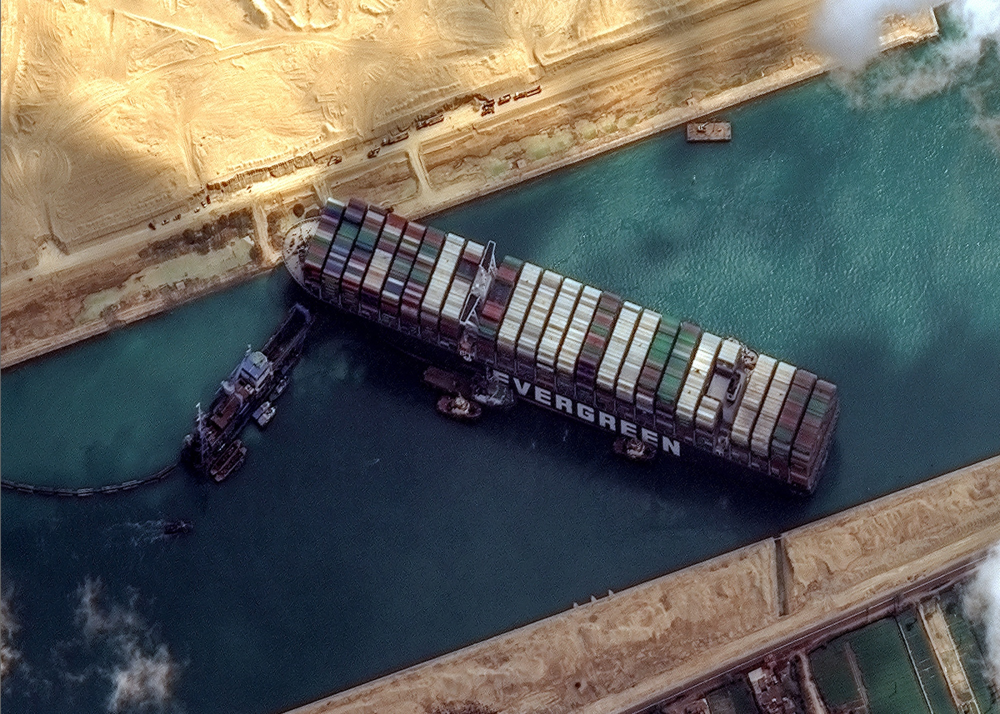

---
authors:
- first: Alex von
  last: Tunzelmann
  role: author
cover: ./cover.jpg
date_reviewed: 2024-06-06
isbn: '9780062249241'
og_cover: ./og-cover.jpg
page_count: 560
publication_year: 2016
publisher: Harper
rating: 4.0
reads:
- year: 2024
- year: 2024
tags:
- history
- war
title: 'Blood and Sand: Suez, Hungary, and Eisenhower''s Campaign for Peace'
type: book
---

The Suez Crisis is one of those weeks where decades *almost* happen, to paraphrase Lenin. The overall situation is rather unbelievable: two simultaneous international crises, one a meticulously planned fiasco and one a spontaneous revolt, right before an American Presidential election. And yet it all happened, and came very close to overturning 20th century order as we know it.

*The Ever Given stuck in the Suez Canal in 2021. Don't cry because it's over. Smile because it happened.*

*Blood and Sand* is a day-by-day account of the crisis, with events well contextualized with both their origins and later consequences. Tunzelmann frames the Suez Crisis as a personal battle of wills between British Prime Minister Anthony Eden and Egyptian President Gamal Abdul Nasser. Nasser was an ambitious able Egyptian patriot, and one of his actions as part of policy of de-colonization was nationalizing the Suez Canal. In practical terms, the effects were basically nil. Egypt ran the canal effectively, fees were stable, and Nasser even allowed the transit of Israel-bound cargo, though not Israeli flagged ship. But Suez was the trachea of the British economy, the channel through which vital supplies of Arab and Iranian oil flowed. What if Nasser's ambitions lead him to put pressure on that oil supply?

So Eden embarked on a scheme to seize control of the canal and hopefully depose Nasser, enlisting France and Israel as allies. Each nation had their own reason for participating. David Ben-Gurion of Israel identified Nassar as the most dangerous Arab leader to Israeli security, and saw this as an opportunity to attack with cover from great powers. France's Guy Mollet had problems with Algerian independence fighters who were supported by Nasser. 

However, this unlikely alliance couldn't just *do the thing*. Rather, Eden orchestrated an elaborate plan where Israel would attack, and then the British and French forces would intervene as "peace-keepers". To carry this act of outright imperialism under a lawful *casus belli,* Eden wove an elaborate and farcical web of deceit, lying to the international community, the British people, his own ministers, and the officers who were to carry out the invasion. 

By the time everything had come together, it was months after the nationalization of the Suez Canal, and in the midst of the Hungarian Revolution. A spontaneous nationalist gathering in Budapest was fired upon by the Secret Police, and rather than dispersing the crowd found their mustard and comprehensive threw the hardline Stalinists and Soviets out. 

It's unclear that Khrushchev would have let Hungary leave the Warsaw Pact, but when he saw Britain and France lurch into Egypt, and America leave them out to dry in the UN, there was nothing stopping Soviet armored divisions from rolling back into Budapest and smashing the Hungarian Revolution permanently.

Meanwhile, the Suez invasion was haltingly failing its military objectives, and utterly failing in its political ones. Israeli troops struck deep into the Sinai, achieving their main geopolitical objective at the Straits of Tiran. The French and British amphibious attack on Port Said was dilatory and piecemeal. Egypt had sunk blockships throughout the canal well before forces from the alliance reached it. Meanwhile, Britain's allies through the Muslim world, including Jordan, Iraq, Iran, and Pakistan, all violently denounced it.

Eisenhower, in the midst of a tense reelection campaign and kept out of the l0op, refused to allow American power, prestige, or money to be used to support the British effort, in Tunzelmann's argument maintaining a moral clarity through the whole mess that was one of the higher points of American Cold War policy. With the pound falling and oil rationing in the future, Eden backed off, failing in all of his objectives and showing once and for all that the British Empire was done.

This is the first book I've read on Suez, so I'm not sure how well the personality-driven framing works, but it makes for an engaging read.