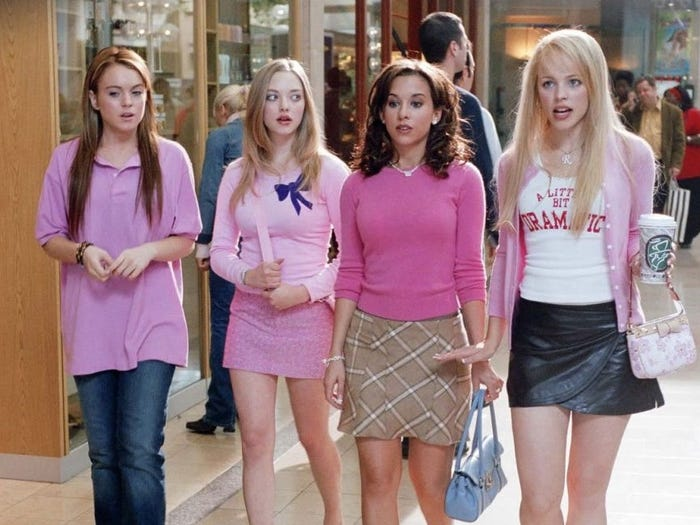

---
authors:
- first: Jonathan W.
  last: Jordan
  role: author
cover: ./cover.jpg
date_reviewed: 2022-10-20
isbn: '9780451232120'
og_cover: ./og-cover.jpg
page_count: 552
publication_year: 2011
publisher: NAL
rating: 4.0
reads:
- date_finished: 2022-10-20
  year: 2022
tags:
- biography
- history
- war
- ww2
title: 'Brothers, Rivals, Victors: Eisenhower, Patton, Bradley and the Partnership
  that Drove the Allied Conquest in Europe'
type: book
---

*Brothers, Rivals, Victors* is a well-crafted if conventional account of the relationship between the three top American soldiers in the European theater. Working from diaries and letters, Jordan reconstructs the emotional state of these three men as they liberated occupied Europe.  The tone of the book is perhaps best brought out by the names used to address the generals, Ike, Brad, and George. This book is familiar and gossipy, *Mean Girls* in HQ instead of high school.

Mean Girls *"On D-Day we wear khaki"*

Patton is the protagonist of the book. Charismatic, immensely self-assured, vain, and a warrior to the bone, Patton saw his destiny to be one of the Great Captains of history. His military skills were rivaled by a lack of restraint and a mouth that got him in trouble repeatedly, most notoriously in the Sicily slapping incidents, where he struck two soldiers in the hospital for 'combat fatigue' and berated them as cowards.  But again and again, the basic plot of this book is Patton saying something stupid, and Eisenhower saving the old warrior's career.

Jordan is aware of Patton's self-mythologizing and mastery of the press, but not aware enough to avoid participating. It's hard to blame him. Among other traits, Patton was an inveterate diarist and letter writer, and his "private" remarks have an acid candor about the personalities of the other commanders. I use private in quotes because Patton absolutely planned his memoirs. If he had not died in a car crash in 1945, they might have been more edited and considered, but I believe his remarks on Eisenhower's pro-British leanings and Bradley's caution were meant for history, not just venting spleen.

Eisenhower is the second great personality of the book. Ike and George were genuine friends, dating back to joint service in the nascent tank corps immediately after WW1. But where Patton was a showboat who saw the tank as a means to an industrial version of the classic cavalry pursuit, Ike became a well-rounded, strategic commander. Picked by Chief of Staff Marshall for the key job of overseeing the American contribution to North Africa, Ike's steady leadership and ability to balance the competing military and political priorities across the services and allies made his the central figure of the war. Despite the lofty title of 'Supreme Commander', Eisenhower had less direct power than it seemed. His orders always had to be filtered through subordinates, not all of whom were willing to listen, and political considerations complicated direct military strategy. One thing that comes through is the stress Eisenhower was under as the face of the Allied effort. He smoked up to four packs of cigarettes a day and basically imploded his health trying to keep the war together.

Bradley is the forgotten member of the trio, lacking Eisenhower's presidential legacy and Patton's gift of showmanship. It's an unfortunate oversight, as Bradley was Eisenhower's trusted right hand, and in the first ranks of American combat commanders along with General Grant and General Sherman. Bradley's steadiness in combat and reputation as the 'GI's general' was balanced by an explosive temper and a merciless attitude towards subordinates who he deemed incompetent. Patton was a sentimentalist, and Ike was willing to bestow second chances. Bradley would cashier an officer who made a single mistake.

If there's an antagonist to this book, it's British general Bernard Montgomery. Monty used his reputation as the hero of El Alamein and his position as the senior British ground commander to demand the lion's share of supplies and key terrain features, claiming priority for his immaculately planned set-piece attacks which often came to naught (Market Garden), or were superseded by events.

Overall, I'd describe this book as 'Dadly'. It's not that far from the movie version of *Patton* with extra footnotes.  As a conventional Greatest Generation hagiography, it's not particularly challenging, but it's well done.