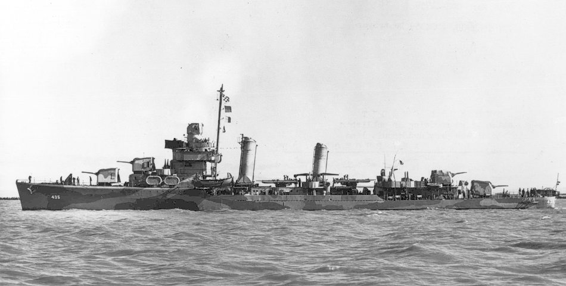

---
authors:
- first: Frederick J.
  last: Bell
  role: author
cover: ./cover.jpg
date_reviewed: 2024-06-15
og_cover: ./og-cover.jpg
page_count: 211
publication_year: 2017
publisher: Frigate Publications
rating: 3.0
reads:
- year: 2024
- year: 2024
tags:
- war
- history
title: 'Condition Red: Destroyer Action in the South Pacific'
type: book
---

*Condition Red* is a contemporary memoir of life on a World War 2 destroyer, written and published by a destroyer captain in the middle of the war to give the folks back home some idea of what it was like at the front. Bell commanded the *USS Grayson*, referred to as the G-- throughout the book for security reasons. It's a pretty fine tale, though not one that's particularly thrilling for anyone without a specific interest in the period.

*The Grayson, star of this book*

Bell's overall picture is one of dedicated professionalism and endurance. "Condition Red" is the call for the ship to go to battle stations: guns manned, damage control parties on standby, and every eye searching the skies and seas for targets. For more than six months in the waters around Guadalcanal, the *Grayson* was on constant alert and frequent Condition Red, as it escorted convoys, swept the channels for the survivors of lost ships, fending off Japanese bombers, and conducted shore bombardment.

Again and again, Bell applauds the crew of the Grayson as clever and dedicated men who do their duty under arduous circumstances, ready to go to battle at an instant. The basic message to the home front is "don't worry, and send more ammo!", your sons and husbands are surrounded by brave sailors, commanded by skill professionals, and supplied with every necessity. While the Grayson and its crew are the star, other US Navy ships, Marines, merchant sailors, and allies from the Netherlands and New Zeeland receive praise as well. 

Some of the descriptions of battle, such as the action alongside the USS Enterprise which opens the book, are quite thrilling. But there's not much of that, and there's a lot more of the day-to-day work of keeping the destroyer in fighting trim while taking care of the innumerable tasks of being in the Navy. It sounds like hard work, and while destroyermen do get three hot meals and a cot, there isn't much time to enjoy them, or to do anything but work, scrub, and sleep.