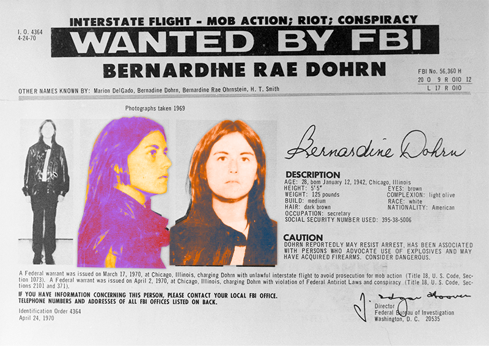

---
authors:
- first: Zayd Ayers
  last: Dohrn
  role: author
cover: ./cover.jpg
date_reviewed: '2026-08-10'
isbn: 978-1324089315
og_cover: ./og-cover.jpg
page_count: 448
publication_year: 2026
publisher: W.W. Norton & Company
rating: 5.0
reads:
- date_finished: '2026-08-08'
  date_started: '2026-08-05'
  year: 2026
tags:
- history
- politics
- vietnam-war
title: 'Dangerous, Dirty, Violent, and Young: A Fugitive Family in the Revolutionary Underground'
type: book
---
Some people are born to write a specific book. Only one person could have written *Dangerous, Dirty, Violent, and Young*. Zayd Ayers Dohrn grew up like a lot of other 70s kids, eating Italian ices, watching *Star Wars*, and playing with G.I. Joes. Unlike most 70s kids, he kept everything he owned in a milk crate ready to go at a moment's notice and learned how to spot an undercover cop and lose a tail. His parents, Bernardine Dohrn and Bill Ayers, were two of the most notorious members of the Weather Underground, aspiring revolutionaries raising children while living in the fallout of their political commitments.  This book examines the choices and legacies of his parents' violent pasts, probing the complex questions "Did they love their cause more than their kids?" and "Was it all worth it?" Only someone inside the movement could have gotten the interviews Zayd used to write this book. And yet, he never chose revolution. He made his commitments to art and education, and can step back and look at the big picture.

*Bernardine Dohrn's FBI most wanted mugshot. Dohrn combined radical politics, leadership qualities, and iconic fashion sense*

Dohrn could not have been a more American story. Her father, Bernard Ohrnstein, grew up poor in Chicago and clawed his way into the White middle class, marrying a woman of Swedish background, moving to Milwaukee, and changing the family name to Dohrn. Bernardine did a year of college at Miami University in Ohio, where she found out that her father's efforts weren't enough to make her socially White. She transferred to the University of Chicago and worked with Martin Luther King Jr on housing discrimination in Chicago. Her increasing radicalism led her into the Students for a Democratic Society (SDS), and ardent left wing politics.

Ayers came from a more WASPy upper-class background; his father was a utility executive, but followed a similar if more diffuse trajectory. He missed Freedom Summer by a matter of months and drifted to the University of Michigan and the regional SDS chapter. Around 1968, Dohrn and Ayers were both SDS leaders with radical politics and knew each other professionally, but of the two, Dohrn was much more important in every way. The iron will she deployed in organizing would become a future family joke.

In 1969, Dohrn splintered the SDS between more orthodox Marxists who wanted to focus on class organization, and her Revolutionary Youth Movement, which saw race as the primary issue in America. She believed that there had to be a White counterpart to the Black Panthers, an allied guerilla movement which would broaden the revolution beyond the ghetto. In this book, she acknowledges this fracture as her biggest mistake, squandering the momentum of the movement at its peak.

The Revolutionary Youth Movement renamed themselves to the Weathermen and began transforming into guerrilla fighters. They trained in karate, guns, and bomb making. In an attempt to expunge bourgeois tendencies from themselves, they embarked on a brutal program of Maoist self-criticism. Members would stand before the group and confess their many failings and weaknesses, emerging from the psychological flaying purged and committed. No one was sleeping much. Everyone was taking a lot of drugs and engaging in radical free love which pushed the limits of fragile emotional states. They were under a lot of stress and no one was thinking clearly about means and ends. For all the ostensible debate over ideology and strategy their actions were a simple emotional reaction: the violence of the US Government at home and in Vietnam had to be countered by similar violence from within.

The Weathermen suffered a major reversal when a Greenwich Village townhouse used as a bomb making factory exploded on March 6, 1970. Three Weathermen were killed by their own bomb, including Ayers' best friend Terry Robbins. The Greenwich Three would be the only victims of the Weather Underground. Though the group embarked on years of bombings, they chose symbolic targets to be attacked in the dead of night, with warnings phoned in before. The group struck targets including the U.S. Capitol, the Pentagon, and the State Department, all following a similar plan of attack. A young White woman dressed as a secretary would walk in carrying a large purse, find an under-used bathroom, hide the bomb somewhere, often in the pipes, which would then explode hours later after a phoned in warning.

Some of the more interesting parts of the book cover Zayd's thoughts on growing up in the underground. Even for a target on the FBI's Most Wanted List, government investigation is passive. Agents trawl files to see who pops up in car registration, real estate rentals, and reporting from workplaces. The Weather Underground became adept at getting new IDs, using birth certificates for children who had died in infancy to get state governments to issue credentials up to authentic driver's licenses. A fake name deflected more investigation, and there were plenty of cash-only rentals and cash-only jobs that didn't report anything to feds. In one instance, Bill Ayers was working as a longshoreman at the Port of San Francisco when immigration raided. They hauled away the Hispanic half of the docks and didn't even look at a White man.

Bernardine Dohrn and Bill Ayers eventually left the underground in the 1980s, turning themselves in. The government's case against the Weathermen had foundered on massively unconstitutional practices related to COINTELPRO. With all the evidence of revolutionary activity tainted, Dohrn was placed on probation for battery and bail jumping. It seemed like Zayd's family might go back to normal, but the revolution wasn't done with him yet.

While most of the Weather Underground had returned to open society, a handful remained underground in alliance with the most revolutionary fragments of the Black Panthers, the Black Liberation Army.  Black radicals had it tougher in every way than their White counterparts.  They were more aggressively hunted by the police, with the outright assassination of Chicago Black Panther Fred Hampton as a foremost example of extrajudicial brutality. The Weather Underground got donations from mainstream leftist figures, allegedly including the band Jefferson Airplane. The Black Liberation Army had to fund its existence with "expropriations", starting by robbing local drug dealers and escalating to bank robberies.

These bank robberies were tactically clever. BLA members would do the crime and then immediately transfer to a vehicle driven by a pair of White allies from the Weather Underground, who would slip through the police cordon. The 1981 Brinks Armored Car robbery would have gone off according to plan, except a witness saw the BLA members slip into a U-Haul truck driven by Kathy Boudin and David Gilbert. When the truck was pulled over, the BLA members came out shooting. Two police officers and a Brinks guard were killed. Everyone involved received heavy sentences.

Bernardine Dohrn had assisted the Brinks robbery by using her job as a salesclerk at a fancy midtown baby boutique to steal the identities of several women, which she had passed to Kathy Boudin to rent the U-Haul truck. She was imprisoned for a year in an attempt to get her to testify, and holding to a revolutionary code of honor she absolutely refused to do so. The kids, Zayd, his younger brother Malik, and Kathy and David's son Chesa Boudin, who was being adopted by Bernardine and Bill, were absolutely devastated. Somehow Bill managed to keep things together as a single father, with the assistance of a non-political but *very gay* friend who acted as a nanny--this in itself a radical move in the 1980s.

*Dangerous, Dirty, Violent, and Young* is an incredible memoir. Zayd comes to the assessment that for his parents, revolution was an act of love. Raising children meant creating a better world for them to live in, which was worth any passing individual discomfort. I have my personal politics, and while I do not condone the use of violence, Dohrn and Ayers were and are absolutely right about the America that they fought.  This was a country which was actively murdering a village worth of Vietnamese civilians every day and oppressing its Black citizens with only a little less force than it deployed overseas. America is a contradiction of a nation, founded equally on lofty ideals of liberty and equality, and on a reality of exploitation, slavery, and genocide. 

The forces of reaction who held real power in this period: Nixon, Hoover, the anonymous Chicago cop with a billy club, all embody the latter America. It's not hard to kill for what you believe in, especially if that belief is that you should be able to do anything you want without pain or even discomfort. Dohrn and Ayers and their comrades were willing to die for their beliefs, and a lot of them (mostly Black) actually did. They are authentic Americans, idealists with bloody hands. "Bring the war home" was an SDS/Weatherman slogan, the bombings a desperate message after voting and protesting made no impact. Politics is the art of compromise, and if there's one word to describe Bernardine Dohrn it's "uncompromising". I'm not sure there was any possible political solution to the crisis of the 1960s she would have found acceptable. I do know that she was, and is, clear about the better future she was fighting for. She reached for weapons after years of non-violent struggle, while her opponents reached for weapons out of habit.

It doesn't take a weatherman to know who the real terrorists are.