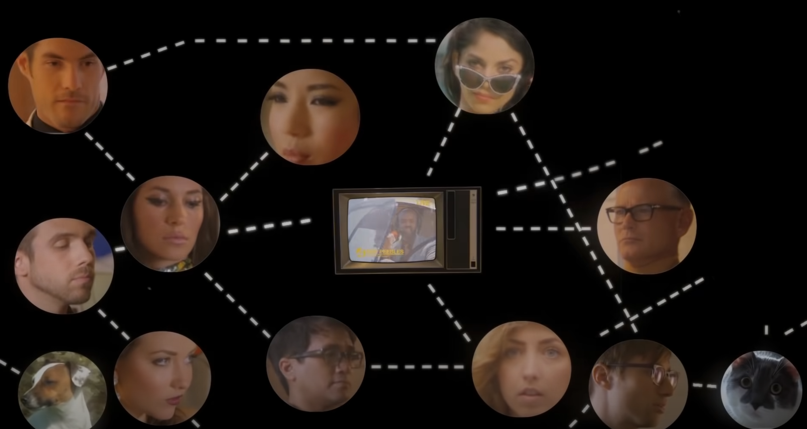

---
authors:
- first: Amy
  last: Webb
  role: author
cover: ./cover.jpg
date_reviewed: 2023-06-02
isbn: '9780525953807'
og_cover: ./og-cover.jpg
page_count: 296
publication_year: 2013
publisher: Dutton
rating: 5.0
reads:
- year: 2023
- year: 2023
tags:
- non-fiction
- self-help
- data-science
title: 'Data, A Love Story: How I Gamed Online Dating to Meet My Match'
type: book
---

A few months ago out of a sense of boredom I hopped onto some of dating apps after a decade in a relationship. At first it went pretty well: the women I was seeing were genuine *babes*, and when I switched to guys to scope out the competition, well, heterosexual men are not sending their best. I'm not exactly 90s Nicolas Cage in real-life, but I'm better than those mopes. But I got about two connections for all my swiping, and the quality of the matches started going downhill. If computerized dating has always been a bit of a scam, even back to the Harvard-based mainframe era Operation Match, modern monetization apps are a quagmire of dark patterns.  If I were a data scientist with questionable ethics (oh dang, I am), and I controlled the horizontal and vertical via the recommender system, I could do some messed up things to get desperate people to buy-in in the hopes of finding true love, never letting them find it, while providing just enough of a drip of hope to keep them swiping and spending.

Getting laid these days requires not just good l0oks, charm, and a little luck. It takes hacking your way through a hostile platform. Webb is writing about the ancient days of 2005, but the fundamentals are pretty similar. Having skimmed the reviews, a lot of the variance comes down to how much you like Webb herself, and frankly, she is just my type: an intelligent type-A neurotic Jewish woman with wide ranging interests and a few obsessions.

[Saint Motel - My Type](https://www.youtube.com/watch?v=IyVPyKrx0Xo)

Webb is also nuttier than my grandma's ruggelach. She's the kind of person who when starting therapy creates a dossier of all the psychological trauma she's experienced, color coded by theme, charted by year and severity, and cross-referenced. A professional futurist and spreadsheet fanatic, she doesn't do things by halves, and after a series of absolutely awful dates, she decided to tackle this problem in a data-driven way.

Step one was to envision her ideal man, brainstorming a 70 item list of the things she wanted, and then distilling those down to 10 major and 25 minor area, along with a set of dealbreakers, all of which were given numerical point values, along with a personal promise not to go out with anyone who scored too low.

Step two was to get inside the user-experience of her ideal man via what we now call catfishing. She made 10 Jdate profiles of different versions of her tall, handsome, professional match, a variety of doctors, lawyers, stockbrokers, and other professionals, and saw what kind of women messaged them. For ethical reasons and time, her interactions were minimal

Basically, the competition was a bunch of blond shiksas lying about their height; every single one of the roughly 100 women who bite her hooks was less than the American average height of 5' 4". The general vibe was a kind of Cameron Diaz girl next door, being fun and approachable without being too ambitious. Webb's current profile, with bad pictures and her insanely ambitious resume copied-pasted verbatim, looked both sad and crazy.

So, smash cut, Webb starts working out six days a week, gets a very expensive haircut, buys a whole new wardrobe, takes new photos, rewrites her profile to fit in 150 non-threatening words, and does the geek-to-glam transformation. Then she waits, chats, and meets her perfect doctor husband, and they get married and have kids and move to New York, where she runs a futurist consulting agency.

Now, Webb had a lot of advantages. She was 31, had enough spare time and cash to do a makeover, and is definitely in the top half for brains, personality, and looks (likely higher, but I'm going to draw some generous lines that more of us might fit into). And the relatively open data policies of dating websites circa 2005 made it easier for her to do her research. 18 years later, the whole field has changed, but it can still be hacked.

The biggest change is swipe-based matching. While online dating was never exactly about thoughtful analysis, these days it's entirely instinctual, decisions made in seconds. And in that very old mammalian part of our brain, [guys go for looks and girls go for status](https://www.youtube.com/watch?v=UipHxGkcgEY). So you have to hack the other gender's swipe behavior with a visual story that communicates the right things.

And good swipes matter, because according to some reliable sources, Hinge, Tinder, and so on use a kind of collaborative filtering recommender system. Basically, you get shown people who are like the people who swiped on you, so if your profile is bad you slide down the slope from perfectly tanned people who divide their time between high profile professional life and extreme sports towards people with regrettable facial tattoos who can absolutely explain those parole violations and why their last three relationships ended in literal flames.

I really enjoyed this book, and it provided some solid background to what the other side saw.  If your tastes diverge strongly from Webb's, you probably won't like it nearly as much.