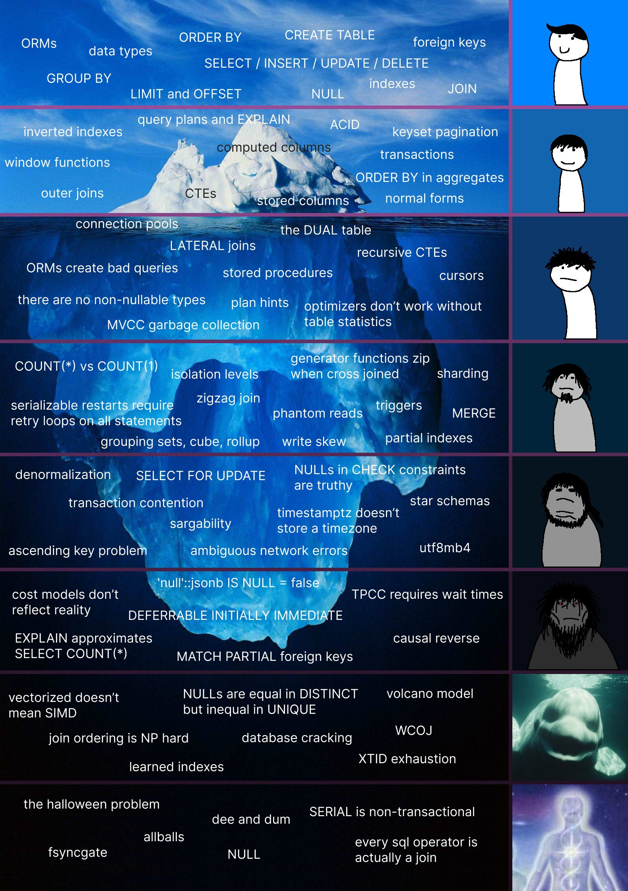

---
authors:
- first: Martin
  last: Kleppmann
  role: author
cover: ./cover.jpg
date_reviewed: 2022-08-09
og_cover: ./og-cover.jpg
page_count: 562
publisher: O'Reilly
rating: 4.0
reads:
- year: 2022
tags:
- data-science
title: Designing Data-Intensive Applications
type: book
---

One of the odd gaps in my knowledge is that as a data scientist, I don't really know that much about data.  Most of my work is with very high level abstractions, things like Pandas DataFrames and Numpy Arrays or the various SQL tables of the data warehouse. Computers are fast enough that most things I work with are effectively medium data, large enough that I have to consider optimizations for my own sanity, if nothing else, but small enough that I can be confident that local RAM and disk will handle it without problems. 

*How many levels of SQL are you on? from [@largedatabank](https://twitter.com/largedatabank)*

Working with data when you have one computer, or perhaps a simple database and an app engine, is pretty easy.  You can trust that writes and reads will happen robustly and in a sensible order. But true web-scale big data cannot be done on any single machine.  And when data is distributed across many disks and many data centers, things get complex very fast. I'm not a data engineer, I won't have to implement the gritty details of a distributed data warehouse and solve the hard problems of leader election, linearizability, serializability, and data consistency at scale. But knowing a little about how it works is useful.

The last chapter has some interesting nods towards "the modern data stack", and the idea that we can borrow old ideas from Unix, like the pipe operator linking together simple components, to describe dataflows as append-only change logs, allowing us to replicate state by replaying the past.