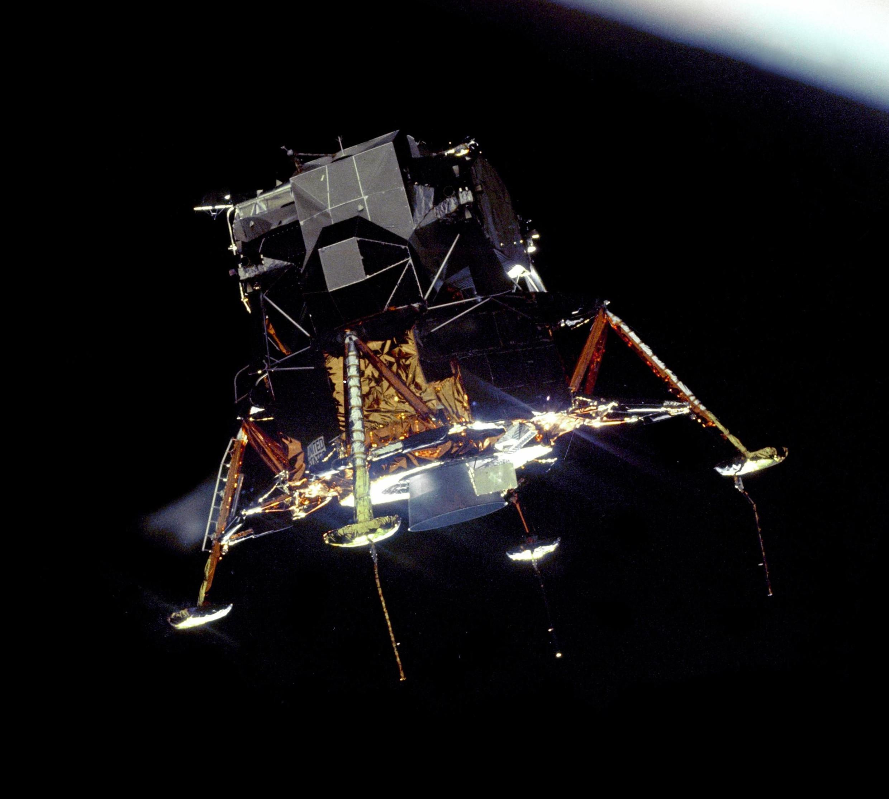

---
authors:
- first: David A.
  last: Mindell
  role: author
cover: ./cover.jpg
date_reviewed: 2022-11-29
isbn: '9780262134972'
og_cover: ./og-cover.jpg
page_count: 359
publication_year: 2008
publisher: MIT Press
rating: 5.0
reads:
- date_finished: 2022-11-29
  year: 2022
tags:
- academic
- sts
title: 'Digital Apollo: Human and Machine in Spaceflight'
type: book
---

*Digital Apollo* is the serious, sober, scholarly take on the golden age of the space program, the same basic ground as Tom Wolfe's classic account *The Right Stuff*, but with a unique and fascinating viewpoint on how Apollo drove innovation in human and computer interaction.

*Lunar Excursion Module Eagle in orbit*

[Public Service Broadcasting - Go!](https://www.youtube.com/watch?v=BHIo6qwJarI) a kicking rad song about the Apollo landing.

The basic conflict was one which stretched back to the dawn of flight, of airmen versus chauffeurs. Airmen preferred nimble, high performance machines, which represented a kind of macho challenge to be mastered. Chauffeurs were mere bus drivers, overseeing a complex machine.  In the early 1960s, as the space program spun up, this was exemplified by conflict between astronaut/test pilot culture, which saw the human as both the pinnacle of precise control in the face of danger and an accurate engineering participant, and the rocket boys, who believed that rockets were too fast and complex for any human being to control, and that ICBMs provided a model for automated navigation.

The Apollo program that resulted was a synthesis, mediated by the key technologies of the Apollo Guidance Computer, the DSKY numeric input/display unit, and the MIT Instrument Laboratory as the primary contractor.  Effectively, astronauts were flying a digital simulation of their own craft, with inputs being translated via various programs into thruster burns.  The actual flight behavior of the lunar module was too unruly for even the best pilots to safely manage without computer controls. While it would have been theoretically possible to navigate to the moon via star sextant and sliderule, digital precision saved precious fuel and astronaut time.

While the Apollo Guidance Computer was woefully small and slow by modern standards (my microwave has higher specs), it was a wonder of engineering. Most computers in the 1960s were room sized mainframes that ran batches of punch cards. The Apollo computer was small and light, and ran in a novel asynchronous interactive mode, where many subprograms competed for resources, and functions could be changed on the fly by astronaut input. And unlike my microwave, it had to be *absolutely reliable* over hundreds of hours in the harshest conditions.  Software in the 1960s was a new field, and unlike today with reasonable architecture, friendly syntax highlighting, test suites, and rapid deployment to production, AGC code was *literally woven bit by bit* into ropes of core memory at great effort and expense by 'Little Old Ladies'. 

As Mindell closes by discussing, while the AGC was critical to every flight, astronauts flew the final approach by hand. While they mostly trusted the computer to handle the physics of descent, it couldn't distinguish a safe landing zone from a crater or house-sized boulders. Even as balky errors in Apollo 11 and Apollo 14 threatened safe landing, neither related to core computer functions, and the AGC's robust architecture and ability to rapidly recover from faults saved the day.  The AGC was the predecessor of all modern fly-by-wire technologies, used on anything with wings larger than a Cessna 172, as well as an entire paradigm that computers are something a human interacts with, rather than a tool for automating calculation.

I'll admit that *Digital Apollo* hits my tastes straight on, but it's truly a great work of scholarship.