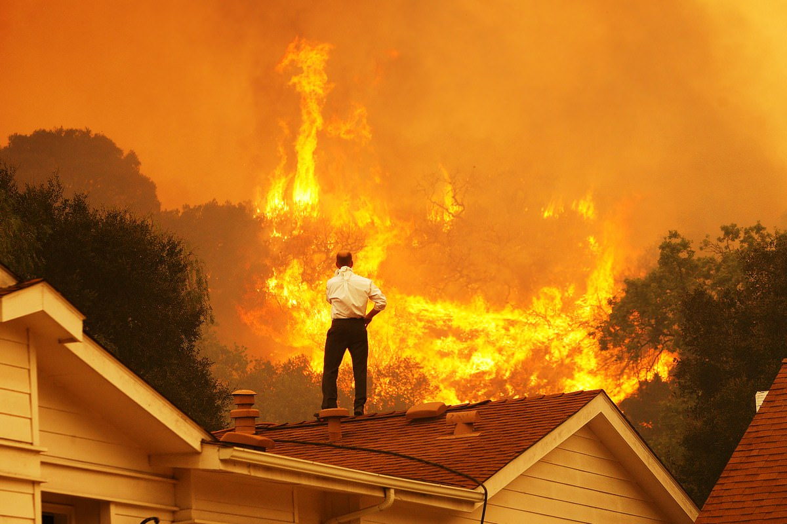

---
authors:
- first: Gregory L.
  last: Simon
  role: author
cover: ./cover.jpg
date_reviewed: 2018-10-14
isbn: '9780520966161'
og_cover: ./og-cover.jpg
page_count: 272
publication_year: 2016
publisher: University of California Press
rating: 4.0
reads:
- date_finished: 2018-10-14
  year: 2018
tags:
- academic
- sts
title: 'Flame and Fortune in the American West: Urban Development, Environmental Change,
  and the Great Oakland Hills Fire'
type: book
---

*Flame and Fortune* is a dense and provocative academic text on the history and political ecology of fire in the American West, centered around the case study of the 1991 Tunnel Fire, also called the Oakland firestorm, which destroyed approximately 3000 structures and killed 25 people.  Simon, then a high school student, lived in the area and evacuated with only the family cat. Some fluke of terrain and wind saved his family's home, while neighbors on either side burned.  The Tunnel Fire serves as a human anchor for the history and theory that follows. Simon's goal is a full and accurate depiction of the 'hybrid' entity that is wildfire, in the sense of Latour's *We Have Never Been Modern*, without the ontological gaps imposed by using dualistic categories of 'natural' and 'cultural'.

Simon's argument centers around the need for new definitions and labels, as a prelude to comprehensive political action.  The language that we use to describe the phenomenon of wildfire has been profoundly depoliticized, preventing communities from coming to grips with the root causes of destructive wildfire.  His first target is the WUI, the Wildland-Urban Interface (or intermix in some publications), which makes the locations of destructive fires seem like a natural part of the universe.  Instead, he prefers the term Affluence-Vulnerability Interface, which draws attention to the fact that these communities are the result of a *social* history.

In Oakland in particular, this history is one of wealth accumulation.  The 19th century hills of Oakland were once covered in stands of redwoods, which were cut down to feed the lumber trade.  Redwoods were replaced with eucalyptus groves, which were lousy lumber, but provided an arcadian fantasy that was parceled out and sold by developers. The Oakland hills developed into a community of elegant suburban homes along narrow twisty canyon roads. In California, this process was exacerbated by the Proposition 13 tax revolt, which left cities starving for revenue and unable to staff sufficient fire stations to protect these new communities. As long as there is money to be made, development will follow.  Disaster even provides another opportunity for profit, as replacement homes tend to be built slightly larger, with an extra room on average.

"Vulnerability" is the second pillar of Simon's AVI framework.  Drawing from the hazardscapes literature, Simon sees vulnerability as a *process* that is variegated on an individual level, and one which shifts and deepens over time. Vulnerability is the potential for loss of life or property, mitigated by the ability to adapt, for example by having expensive fire insurance and even concierge private firefighters and foam crews, being able to politically mobilize to demand state and federal assistance, and to rebuild with new hardened infrastructure.  A particularly dramatic case of vulnerability is elderly people, who may lack the strength and dexterity to evacuate from a fire without help.  In 1991, Simon helped carry a wheelchair bound neighbor to his car.  But everyone in a fire zone is vulnerable, even those with a robust investment portfolio and insurance.

The third rhetorical move is to stop calling the west a 'flammable landscape' and instead call it the Incendiary (capital 'I' in the book). The conditions for firestorms are something that we've created by scattering house-sized Duraflame logs across the landscape. Debates over climate change, pine beetles, and eucalyptus are distractions from the essence of the situation, the metaphorical bombs planted at the edges of major cities. 

Simon's recommendations lack the pointed social justice critique of Mike Davis' classic article "The Case for Letting Malibu Burn", but the major points are equally radical.  To disarm the Incendiary, new growth in the affluence-vulnerability interface must be stopped.  Existing communities should be pared back in favor of urban in-fill. As we do this, we must be careful not to replace the million-dollar homes with the trailer parks and shanty towns of the vulnerable poor. Political debates should recognize that life in the AVI is a choice which has consequences, while protecting the rights of those who have made this choice.

*Flame and Fortune* is an important book, and I hope that its intended audience finds it persuasive. I have a PhD in Foucauldian studies of science and technology, so hybridizing nature and culture is a move which I'm comfortable with. I'm worried that fire professionals and home-owners in the affected areas may not be willing to make the cognitive shift to thinking in terms of the AVI, let alone the Incendiary. Degrowth is a platform that I'm wary of, especially given the California housing crisis. I can't see a political coalition for it.  And finally, I think this book could have used a chapter on the idea of the 'permanent emergency'.  As fire seasons lengthen and intensify, wildfire fighting tactics based on the idea of mutual aid may be overwhelmed by a comprehensive disaster.  Budgets based on ad hoc funding for the current emergency don't represent the fact that we know this year was bad, next year will be bad, and it's only getting worse. The only real question is "How bad will the Incendiary get before we try to change it?"