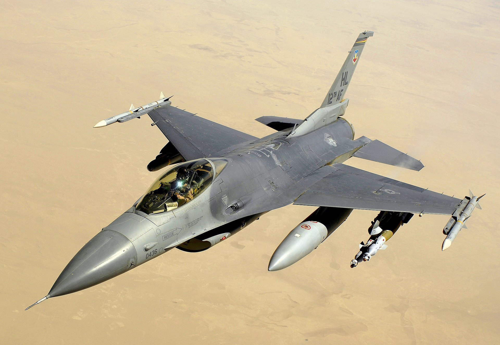
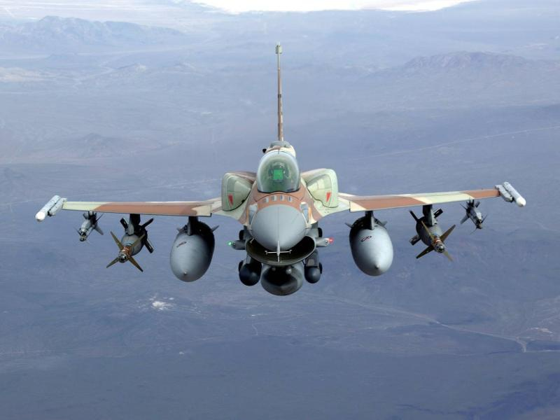

---
authors:
- first: Michael W.
  last: Hankins
  role: author
date_reviewed: 2021-11-24
isbn: '9781501760679'
page_count: 402
publication_year: 2021
publisher: Cornell University Press
rating: 5.0
reads:
- date_finished: 2021-11-24
  year: 2021
tags:
- academic
- war
- sts
title: 'Flying Camelot: The F-15, the F-16, and the Weaponization of Fighter Pilot
  Nostalgia (Battlegrounds: Cornell Studies in Military History)'
type: book
---

*Flying Camelot* is a fascinating look at how the aggressive and hypermasculine fighter pilot culture reached its apogee in the F-15 and F-16 fighters, and then collapsed with the 80s Military Reform Movement. The movement's intellectual leader, Colonel John Boyd, is a divisive figure, lauded as a genius by supporters and a braggart failure by opponents (caveats: I'm a moderate Boydian).  Hankins tries to take an objective look, which mostly comes down against the Military Reform Movement, and tells a fascinating story in the process.

*The F-16 was designed as the ultimate dogfighter, and became a much heavier all-weather strike aircraft. Or to quote Vito Corleone, "Look how they massacred my boy"*

In Hankins analysis, fighter pilots are distinguished by five pillars* of aggressive individuality and identification with their airplanes. The acme of fighter pilot skill is the turning dogfight, with a nostalgic link to the silk scarf days over the trenches of the Western Front. In the 1950s and 1960s, these traditional skills were sidelined in an Air Force culture focused on strategic nuclear bombers, high speed interception, and tactical interdiction.  Worse, the Air Force wound up flying the gunless (!) two-seat (!!) Navy (!!!) F-4 Phantom. When Phantoms faced MiGs over North Vietnam, the American pilots were shockingly outclassed, and the guided missile dangerously useless.

At the same time, Boyd was a key part of a project to design the next generation Air Force fighter, the plane which became the F-15. Boyd's energy maneuverability theory provided a mathematical engineering assessment for the benefits of a powerful and maneuverable aircraft.  Part of the Military Reform Movement's program has been systematically amplifying the Boyd legend, so while he was important, the F-15 didn't spring forth from his brow like Athena from Zeus.

While the F-15 was a success, the production aircraft was more expensive and complex than Boyd and his allies wanted, and they turned to the next generation Lightweight Fighter Program, which produced both the F-16 and F-18, to get the plane they really wanted.  This would be a dayfighter armed with a cannon and two Sidewinder missiles, with minimal avionics and complex gizmos. The goal was to make the ultimate fighter pilot's airplane, one where dogfighting would be the best and only option.

Boyd's fighter mafia, including Pierre Sprey and William Lind, among others, broadened into a political movement through the 80s, arguing against bloated procurement projects and the failures of the Vietnam War and Operation Eagle Claw in favor of simple and cheap weapons that enabled individual initiative and aggressiveness. The military reform movement attracted bipartisan political support in Congress, as well as a spate of articles in the public press. But its historical and material analysis was as blinkered and flawed as the establishment they critiqued.

And when the rubber met the road in Desert Storm, they were proven comprehensively wrong. The qualitive edge of Coalition equipment: stealth fighters, laser guided bombs, AWACS radars, the M1 Abrams tank, and so on shattered the Iraqi Army in one of the most one-sided routs in history.  While a fullscale test of equipment and doctrine, NATO AirLand Battle vs Soviet Deep Battle in a tactical nuke-pocked Europe, thankfully never happened, in a limited war, the complex equipment the reform movement railed against surpassed all expectations.

Hankins has written a fascinating and enjoyable study of fighter pilot culture, the power of *nostalgic design* (see my review of [The Charisma Machine](https://www.goodreads.com/review/show/3040698985) for more on that topic), and the genesis of two of the best aircraft of the 20th century. 

*I can't tell you what the five pillars are because I foolishly bought this book off of the publisher's website rather than Amazon, and had to read it with Abode Digital Editions, which is one of the worst apps I've had the displeasure to use.