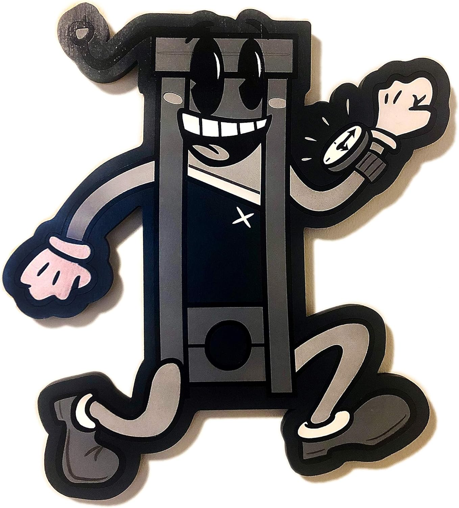

---
authors:
- first: Robert Frederick
  last: Opie
  role: author
cover: ./cover.jpg
date_reviewed: 2023-12-19
isbn: '9780750944038'
og_cover: ./og-cover.jpg
page_count: 224
publication_year: 2006
publisher: Sutton Pub Ltd
rating: 2.0
reads:
- year: 2023
tags:
- non-fiction
- history
title: Guillotine
type: book
---

*Guillotine* is an enthusiastic but amateurish history of a grim and powerful symbol.  Made infamous during the Terror of the French Revolution, the guillotine remained in service for almost two centuries more, with it's final execution coming in 1977. Yes, hypothetically someone could have seen *Star Wars* and then gotten a rather fatal shortening.

*They got the TV- we got the truth

They own the judges and we got the proof

We got hella people- they got helicopters

They got the bombs and we got the- we got the

We got the guillotine

We got the guillotine, you better run*

**[The Coup - The Guillotine](https://www.youtube.com/watch?v=acT_PSAZ7BQ)

Originally, the guillotine was supposed to be a modern and merciful form of execution. It's name-sake, the Doctor Joseph-Ignace Guillotin, was a member of the National Assembly who opposed capital punishment entirely, but in bowing to popular pressure, urged an egailitarian reform from the diverse and grotesque ways the *Ancien Regime* had tortured the condemned to death. He had nothing to do with the design or implementation, aside from suggesting some kind of gravity driven device, and spent the rest of his long life running from the device.

Opie covers the period of the terror in most detail, as fascinated by the device as period French society. Thousands were executed, starting with common criminals, then traitors, then the king and queen, and finally Danton and Robespierre and the worst of the Committee of Public Safety.

The post-revolutionary aftermath of the guillotine is fairly interesting, though briefly treated. There were guillotine memorial balls for people who's had lost loved ones to the People's Razor, where guests wore red ribbons around their necks. The official Parisian executioner, a descendent of the Sansom family, wound up pawning the guillotine due to debts, and lost his post when the government had to redeem it.  The Guillotine, the device that killed King Louis XVI and Marie Antoinette, was likely purchased by Madame Tussaud's museum (Madame Tussaud got her start making wax death masks of guillotine victims) and destroyed in a fire in the 1920s. 

The guillotine ambled into the 20th century, used mostly on the worst of ordinary criminals.  Compared to other industrial methods of execution: snap-neck hanging, the firing squad, electrocution, and lethal injection, it is relatively simple and error-proof, though extremely bloody.  It remains an open medical question of how long a severed head retains awareness, though the likeliest answer is 'mere moments'.