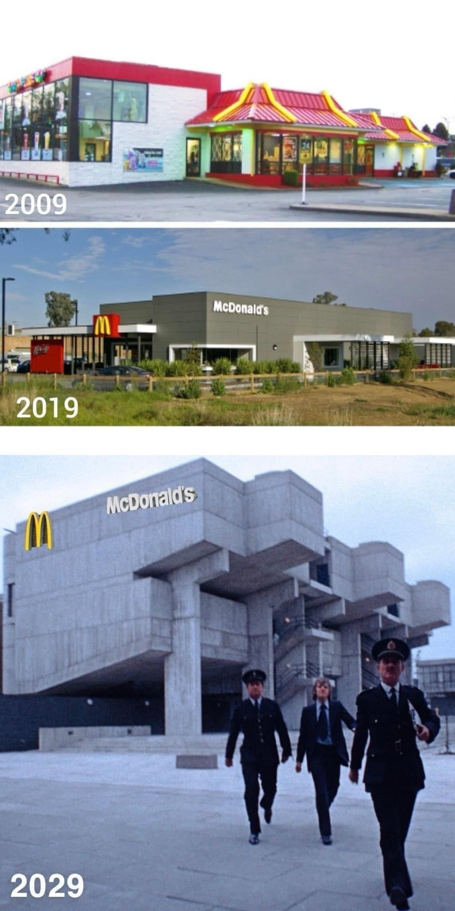

---
authors:
- first: Stewart
  last: Brand
  role: author
cover: ./cover.jpg
date_reviewed: 2022-07-30
isbn: '9780140139969'
og_cover: ./og-cover.jpg
page_count: 256
publication_year: 1995
publisher: Penguin Books
rating: 5.0
reads:
- date_finished: 2022-07-30
  year: 2022
tags:
- sts
- non-fiction
title: 'How Buildings Learn: What Happens After They''re Built'
type: book
---

I'd make *How Buildings Learn* mandatory reading for everybody.  It's that good.

We spend a lot of time in buildings, but the fact is many buildings are pretty awful. Expensive yet shoddily constructed, full of hidden decay, boring and monotonous, wasting space, and poorly adapted to the climate. Brand's approach to improving buildings is characteristically counter-intuitively Brand; look at the old buildings that have survived and try and find out why they've survived and why they're loved. He does so with clever insights and a succession of photographs taken from the same place over long periods of time to show how different buildings evolve.

*McLoving It is McMandatory*

Borrowing from architect Frank Duffy, Brand defines a building at several levels.  Site is the location and the property lines, as close to permanent as anything humans can make. Structure is the basic frame, the trusses and pillars, which should be good for centuries. Skin separates the inside from the outside, and should last decades before weather and fashion demand major replacement. Services are the utilities, plumbing, electrical, and all the gadgets that make life livable, which tend to last several years.  And finally, there's the interior partitions of the space plan and all the stuff of furniture and décor, which is easily modifiable by the inhabitants.

There are two major paths towards being a successful building.  The obvious one is named the High Road, landmark structures like English country houses and the Boston Athenæum, where centuries of money and good taste under careful supervision have aided a grand journey towards beloved classic. The other option is the Low Road, structures so cheap and obviously shoddy that no one cares about what happens to them, so they're quickly suited to the needs of their occupants.  Brand has a deep love for the hippie compound growing organically off of an initial trailer through accretion and connection of various sheds, or its commercial counterpart in the early 20th century light industrial space, where ample natural light and a solid yet sparse steel frame provide a useful starting ground for second and third acts as professional offices, high end retail, or trendy loft apartments.

One of the better section is a direct comparison of MIT's beloved Building 20, aka the Rad Lab, a WW2 era "temporary" structure which survived until the 1990s, against the trendy I.M Pei designed Media Lab building.  Building 20 was long fingers of heavy wood construction, endlessly modifiable by its occupants, where the crudity of the structure created a convivial sense that this was where real work was done. The Media Lab is a modernist monster centered around an inhuman atrium, full of specialist spaces devoted to experiments ended before the building opened. It's impossible to meet anyone, competition for what useful space there is is fierce, and in a final screw you, the fluorescent lights are angled at 45 degrees to the walls, making it difficult to reshape the space.

Brand is savage towards the forces he believes are killing good buildings. He decries architects who designs buildings that play with form and space to make striking photographs, rather than humane and durable structures for their inhabitants. The failure of architects to make workable buildings has lead to the rise of paraprofessional construction managers and facilities managers, who patch up the bad ideas as best they can.  Zoning and codes, which strangles construction in paperwork and a civic masterplan that is a bureaucratic utopia of rules, are a sure way to create buildings which are neither High Road nor Low Road, but simply mediocre.

The book is full of useful adages and asides. There's a *mea culpa* on domes from the Whole Earth Catalog era. Domes are impossible to seal against rain and waste space in innumerable ways. Buildings are destroyed by water, markets, and money. Keep the first two away, and feed the latter in small amounts. The Mediterranean courtyard house is a classic design, but another useful model is the northern European three corridor house, with a large central nave and smaller private rooms under the eaves. Stick to rectangular forms, because they're easy to modify and extend. Overbuild Structure and make Services accessible, because at some point you'll have to get at the pipes and wires, and later occupants may want to add another story. When in doubt, you can always use more storage. To build for the long term, trust in stone, brick, and stout hardwood. Use local materials, and be suspicious of new plastics. A good material will tell you that it needs attention before it fails. Take photographs of the studs, plumbing, and wiring before putting up drywall, because it'll help you later. And for the love of all that is holy, get a good roof, because water will destroy your house in a single season. Simple angled designs shed rain, where flat roofs cause constant problems. 

This book isn't flawless.  Brand elides the useful role of codes in having buildings that don't catch routinely fire, or not putting an explosive fertilizer factory next to to an elementary school. He is more favorable to the historic preservation movement than I am after decades of weaponized NIMBYism.  But there is a lot of pragmatic advice, and the 1990s "End of History" optimism has aged to become its own charming relic. My only wish is that at 25 years on we could get an updated bibliography, but I'm sure that many of Brand's choices are actual classics, and worthy of their own reads.