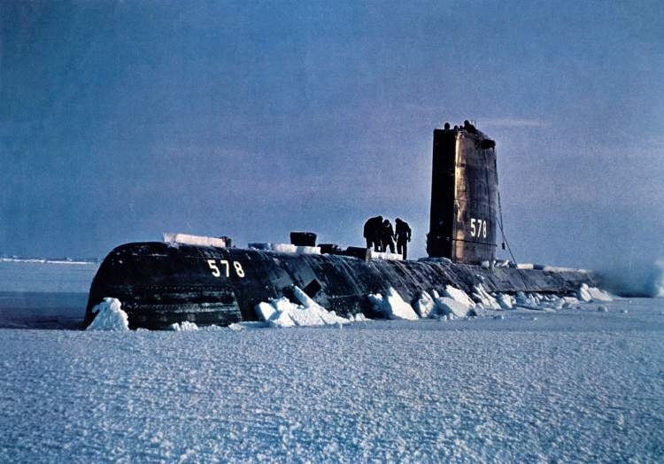

---
authors:
- first: Alistair
  last: MacLean
  role: author
cover: ./cover.jpg
date_reviewed: 2023-08-02
isbn: '9780007252893'
og_cover: ./og-cover.jpg
page_count: 392
publication_year: 2005
publisher: HarperCollins Publishers
rating: 5.0
reads:
- year: 2023
tags:
- fiction
title: Ice Station Zebra
type: book
---

*Ice Station Zebra* is a classic Cold War technothriller and mystery novel.  A British arctic ice weather station has sent an SOS that fire had destroyed most of the base and killed several members of the crew, and with winter closing in, the only chance of rescue for the survivors is a cutting edge nuclear submarine, the *USS Dolphin*.  The story is told through the eyes of Dr. Carpenter, a British expert in arctic survival with surprising resources, as he bonds with the suspicious American crew, survives several sabotage attempts that nearly destroy the *Dolphin*, and reveals a dangerous traitor.

*USS Skate surfacing at the North Pole in 1959, an inspiration for the book*

What works is the gripping tension of the book, the escalating stakes. Zebra is not an innocent weather station, and the men there did not die in some tragic accident, but were deliberately murdered as part of an espionage mission with stakes that could change the course of the Cold War. The enemy is willing to kill again and again, and it takes all of Carpenter's cleverness and personal bravery to figure out who among the crew and survivors can be trusted, and who is his ultimate enemy. 

However, Carpenter's hidden knowledge about the true purpose of Zebra, to capture a Soviet reconnaissance satellite film package, and his true identity as a British counter-intelligence agent, is doled out to the reader in dribs and drabs, with an irritating "But I have more secrets" internal monologue, which does drive the mystery, but is also an obvious gambit.

Ultimately, MacLean is a master storyteller. My high school library had a well-loved copy of *The Guns of Navarone*, and while I think WW2 is his native ground, *Zebra* holds up 60 years later, with the cutting edge technology having worn its way into a period thriller.