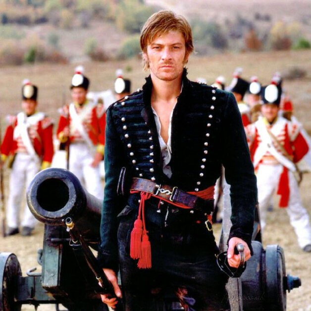

---
authors:
- first: Erika
  last: Chappell
  role: author
- first: Molly
  last: Skyfire
  role: illustrator
cover: ./cover.jpg
date_reviewed: 2025-02-05
isbn: '9781738312412'
og_cover: ./og-cover.jpg
page_count: 482
publication_year: 2024
rating: 5.0
reads:
- date_finished: 2025-02-05
  year: 2025
tags:
- sci-fi
title: Lieutenant Fusilier in the Farthest Reaches
type: book
---

*Lieutenant Fusilier* is a love letter to Bernard Cornwell's Sharpe series, with the central conceits transposing the setting to space and replacing the main character with a sapphic robot. It's a rollicking adventure which approaches and then tragically backs away from some hard questions in service to the source material. 

*Sean Bean as Sharpe. I honestly didn't know dudes could look this slutty*

Theodora Fusilier is a soldier in a future British Army which got frozen in amber at the Battle of Waterloo. Optical muskets, bullet resistant red coats, purchased commissions, and most importantly mechanical soldiers. The army is Theodor/a Fusiliers, of varying models depending on introductory date, with human officers. Our narrator has spent her entire career saving up the 700 pounds sterling to be commissioned as a lieutenant, which is Simply Not Done. No formal rule against it, but mechanicals are designed to serve, not to lead.

The first half of the book is a social comedy as Dora deals with being very much out of water. The social life of the regiment centers around the mess hall, which is a difficult place for a being that doesn't eat or drink. While her fellow human officers are distant, the other Fusiliers are actively hostile to the idea, including my favorite character, Theda the Prussian, who despises Theodora for doing something she can't, and tries to organize a minor mutiny. Meanwhile there are minor issues like finding a date for the Duke's ball and learning to fence properly.

(Aside: The regiment includes exchange soldiers from other nations. Theda carriers her needle gun rather than the issue musket, though in this case the weapons are a personal railgun firing a variety of needle slugs and an optical musket is basically a tunable laser cannon than can melt a contemporary tank with a full power shot.  Another notable exchange is the American Theo Rifleman, who is very clear that he isn't a soldier, he's a Marine.  If you laughed, this book is probably for you.)

But the life of a soldier isn't all dances and social awkwardness. An archeological team on a nearby world trips *something*, and the regiment is dispatched to save the civilians from an enemy deemed the Stalkers, crab-like bipeds with extremely tough physiologies and just enough brains to exercise tactics. Stalkers and Fusiliers are even matches for each other, and in the conflict, Dora's unit is forced to retreat through an alien gateway, which strands them on a world with genuine sentient aliens at about a 19th century level of technical and social development. Dora has to navigate first contact and her own ethics to get her unit back home in one piece.

Napoleonics in spaaaaace is a popular enough framework that I can think of at least three series offhand (Honor Harrington, Nicolas Seafort, Alexis Carew) that are transparently inspired by the Horatio Hornblower series. *Lieutenant Fusilier* leans into the absurdity and does it well. While the aesthetics are early 19th century, the actual nuts-and-bolts make a cohesive whole. There are gaps in the society's technology: space travel, artificial people, and energy weapons are commonplace; radio is a novel and flaky technology. While a lot of these books uncritically romanticize the politics of the past (cough, David Weber, cough), Chappell knows that imperialism and strong social striations are awful.

Making the entire economy work via mechanical people is a bit of a dodge to avoid some hard questions that drive dramatic tension. The mechanicals are an ideal working class, designed such that they're only unhappy when they don't have work, and with minimal material needs. That something is deeply off about this universe, and that Dora doesn't have enough experience to figure it out is lampshaded, but everyone is so fundamentally bloody decent that tensions analogous to those caused by Richard Sharpe's low social origins hit with padded blows. No one doubts that mechanicals are people, (almost) no one doubts that Dora can make tactically sound choices, and the question of "Should there be a Field Marshall Dora?" is left hanging, along with "And what the hell happened to all the regular people?"

The other missed opportunity is Dora's extreme psychological repression. It's natural for her character and it does work in some aspects, but it also blunts the two romances, one with mechanical romance writer Bea, and the other with Diana Kennedy, a human artillery lieutenant. People who shut down their emotions in service to professional advancement are very real, but I was hoping for some more passion. Dora has a heart of steel, literally (okay, technically I recall the mechanicals are air-cooled and battery powered, so no heart-analog, but you get the point), but the motivation for Dora's choice to be an officer, and the sacrifice it takes rings hollow against the stated motivation to prove herself and to get a human out of harm's way. I feel like there's a missing motivation here, or an opportunity to play with how mechanicals are designed to a purpose and their personalities implanted, which deserves more love.

Ultimately, I'm pushing back on these two points because this book is really good, and could be great. Of this microgenre, it sits right up there with the first four Honor Harrington books, and is soundly better than the rest I mentioned above. I can't say I actually know Erika Chappell, except in a parasocial internet way, but her RPGs *Patrol, Flying Circus,* and the upcoming *Torchship* are genius games about the toll of combat and the complexities of finding where duty lies. I also know what she thinks about authors who use subtext (they are all COWARDS), and I'm excited to see where book 2 takes our lovably useless gay robot hero.