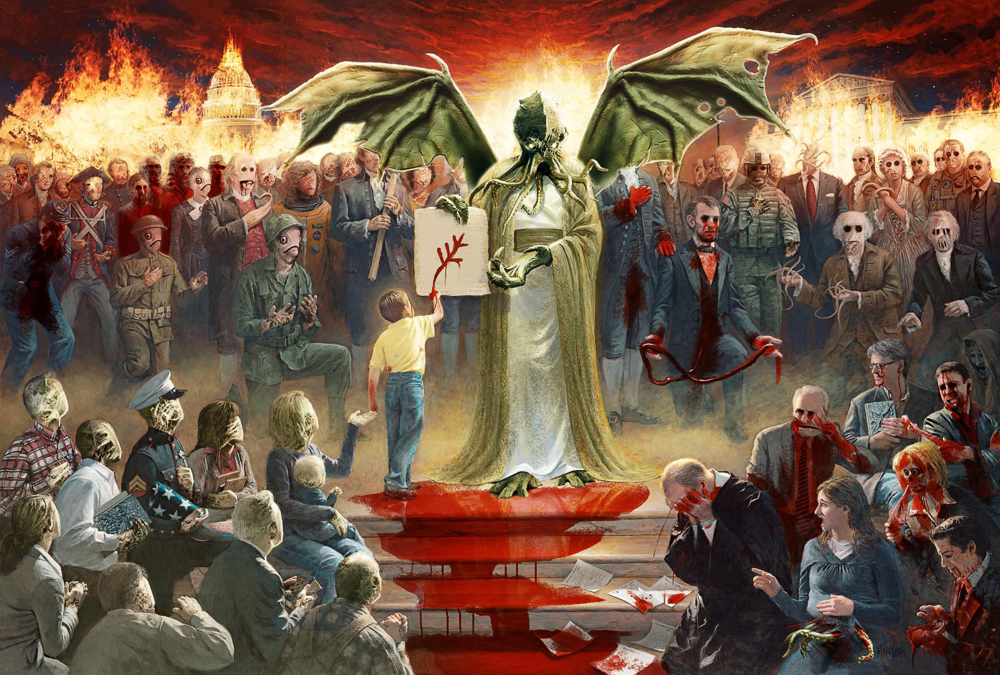

---
authors:
- first: Matt
  last: Ruff
  role: author
cover: ./cover.jpg
date_reviewed: 2019-01-13
og_cover: ./og-cover.jpg
page_count: 400
publication_year: 2016
publisher: Harper
rating: 4.0
reads:
- date_finished: 2019-01-13
  year: 2019
tags:
- fantasy
- horror
title: Lovecraft Country
type: book
---

An ancient terror haunts this guilty land.  An unspeakable horror perpetrated generation unto generation, ambition and the desire for dominance curdling into evil. It's Jim Crow.  Oh, and also Cthulhu cultists. 

Ruff's novel re-imagines a version of H.P Lovecraft's Mythos through the lens of Atticus Turner and family, who's ordinary lives publishing *The Safe Negro's Travel Guide* is upended when Atticus turns out to be the lineal descendant of a powerful sorcerer, and the current leading American sorcerer, Caleb Braithewait, plans to use Atticus to secure a new age of occult power. 

*Lovecraft Country* is a linked series of short stories, as Turner and his relatives advance and confound Braithewait's plans, using their hard-won survival skills to vanquish ordinary racists and supernatural foes.  It's quite good, and will soon be an HBO prestige drama.  And yet, I have a few quibbles.  First, I'm always concerned about a white writer's handling of such an integral part of the Black experience.  I think Ruff does a solid job, and it's better that these sorts of stories are told than not, but I can't be 100% sure about the integrity of the artwork.  Second, Lovecraft's whole thing was cosmic horror, the idea that as human we're not special, and soon our eon will be at end.  And there's goodness in subverting Lovecraft's racism, and clear parallels between cosmic horror and a Jim Crow system which says very loudly that Black Lives Don't Matter, and This Land Is Not For You, yet Ruff doesn't quite click on this.  In particular, the use of human ghosts as key plot points is, I think a mistake, and lessens the impact of the story. 

Still very good.  But not quite great.