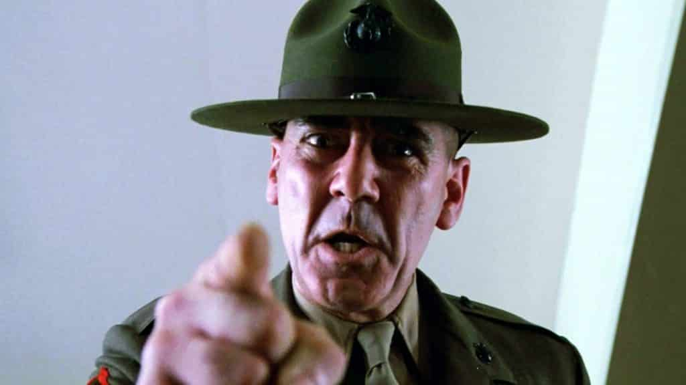

---
authors:
- first: Thomas E.
  last: Ricks
  role: author
cover: ./cover.jpg
date_reviewed: 2019-08-11
isbn: '9780684848174'
og_cover: ./og-cover.jpg
page_count: 320
publication_year: 1998
publisher: Simon & Schuster
rating: 4.0
reads:
- date_finished: 2019-08-11
  year: 2019
tags:
- war
title: Making the Corps
type: book
---

Boot camp is iconic, maybe infamous. Boot camp is the 11 weeks where hardassed drill instructors turn snotnosed civilians into Marines. 

*R. Lee Ermey, in his most famous role as Gunnery Sergeant Hartman in Full Metal Jacket*

In *Making the Corps*, Ricks uses the journey of Platoon 3086 through Parris Island in 1996 as a lens to understand the Marine Corps as a whole, and their place in the American defense posture in the 21st century, and American society. The Marines are self-consciously about a warrior culture, the living legacy of *Semper Fi*, and boot camp is where that foundations of that culture are laid. Ricks is both caught up in the myth-making, he genuinely *likes* the Marines, but he has enough to distance to see warning flags where appropriate.

First, boot camp. The point of boot camp is to mold individualist and lazy teenagers into decisive, calm, and collectivist professionals.  Every Marine is a rifleman, and every Marine should be prepared to kill, and if necessary, die, for his brother Marines. The yelling, the PT, the discipline, is all designed around this simple goal.  In 1996, Parris Island had a 24% attrition rate, including injuries, psychological breakdowns, and 'Failure to Adapt'.  While it's tough, it's not sadistic or particularly dangerous. We're a long ways away from the bad days of Ribbon Creek incident, where six recruits died while marching across tidal flats on the orders of a drunk DI, or the post-Vietnam funk.  Ricks manages to make enough of the 55-odd recruits of Platoon 3086 individuals to give character to this transformation, without losing touch with the big picture.

The boot camp parts are interspersed with musings on what the Marines might do going into the 21st century.  It's been over 20 years and two medium-sized wars, so a lot of this Clinton-era speculation feels very dated. But even with a pre 9-11 mindset, Ricks manages to grasp the essential contradictions of a highly disciplined warrior elite in a nation that is increasingly anything but.