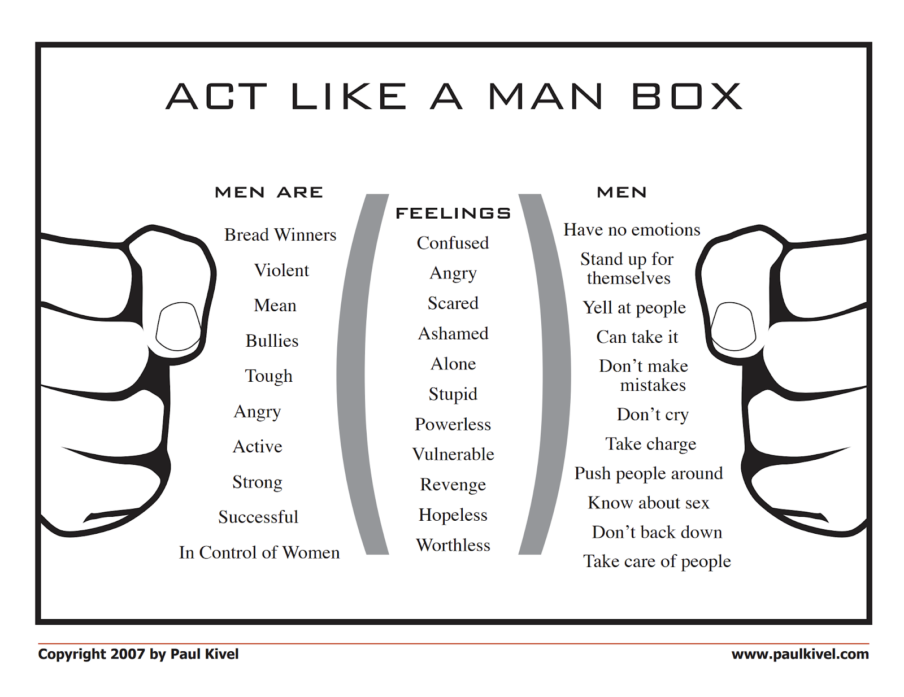

---
authors:
- first: Paul
  last: Kivel
  role: author
cover: ./cover.jpg
date_reviewed: '2026-09-10'
isbn: 978-0345471857
og_cover: ./og-cover.jpg
page_count: 320
publication_year: 1995
publisher: Random House
rating: 3.5
reads:
- date_finished: '2026-09-07'
  date_started: '2026-09-01'
  year: 2026
tags:
- self-help
- psychology
title: 'Men''s Work: How to Stop the Violence That Tears Our Lives Apart'
type: book
---
*Men's Work* is a foundational text for modern male self-help, which has important insights. Unfortunately, its impact has been lessened by 30 years of social transformation mostly along the lines it advocates, and a narrow grounding in the Oakland Men's Project rather than a broader theoretical perspective.

Kivel's major theoretical object is the Act Like a Man Box, a cluster of behaviors and attitudes which describe the socially acceptable way to be a man, and which imply an emotionally stunted life characterized by alienation and pain.

The Man Box is defined and delineated by violence. Men are supposed to use violence to control people around them, and any man who doesn't fit in the box is attacked until he does. The results are disastrous on an individual and social level. Kivel argues that oppression, both on the local levels of bullying and domestic violence, and on the social levels of racism, sexism, homophobia, and imperialism, are all extensions of the Man Box.

The best parts of the book are where Kivel simply describes his work, leading workshops with groups from troubled teens to convicted domestic abusers and even child rapists. Starkly, there is nothing obvious that separates these worst of "bad men" from the rest of us. There's no mark of Cain to be spotted on the forehead of a wife-beater. What separates monsters from the rest of us is chance and self-restraint.

The part that I am more skeptical of is that the questions closing each chapter about your male privilege and your own experience of violence could be used to prompt introspection, or could be used more like Maoist self-criticism. Worse, the latter is likely more effective in changing behavior, at least in the short term. Undoing the kind of fundamental "see-no-evil" male solidarity around bullying and sexual harassment is important, but I want more specifics. The program to be less violent is... to be less violent.

There's a line in [*Of Boys and Men*](/book/of-boys-and-men-why-the-modern-male-is-struggling-why-it-matters-and-what-to-do-about-it-reeves) that is roughly "Conservatives say boys should be more like their fathers, liberals say boys should be more like their sisters, and neither is correct." Kivel doesn't say flat out that being inside the Man Box is forbidden, but it sure feels like it, and there are a few useful traits in there. Gender is pretty damn durable. We can deconstruct the Man Box, but we can't deconstruct men, and even decades into it, I'm not sure what Kivel's future of masculinity looks like.
