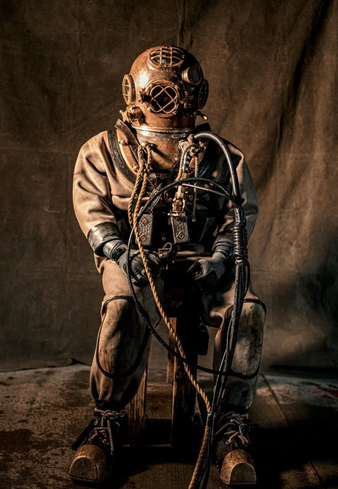

---
authors:
- first: Edward
  last: Ellsberg
  role: author
- first: ''
  last: Edward L. Beach
  role: author
cover: ./cover.jpg
date_reviewed: 2024-11-17
isbn: '9780451211514'
og_cover: ./og-cover.jpg
page_count: 272
publication_year: 2004
publisher: Penguin Publishing Group
rating: 4.0
reads:
- date_finished: 2024-11-17
  year: 2024
tags:
- history
title: 'On the Bottom: The Raising of the U.S. Navy Submarine S-51'
type: book
---

*On the Bottom* is Ellsberg's first popular book, an account of the salvaging of submarine S-51 from 160 feet of water in 1926 by a team of US Navy divers.  Compared to the other books I've read, it's more technical and has less human interests, this is after all a team of competent professionals without any of the cultural conflicts that make his other books so interesting. 

The story of men against the sea has enough drama. Deep sea diving is one of the most hazardous and extreme activities people do, and crude technology of 1926 meant that everything had to be done by hand in the dark and cold, where divers survived in a precarious equilibrium and a single mistake could prove fatal.

*Mark V Standard Diving Dress, of the kind used by Ellsberg. From [Will Kutscher](https://www.instagram.com/willkutscher/p/Com_X7PJhGI/?img_index=1)*

Perhaps the most terrifying way to die was a squeeze, where air pressure in the suit dropped below the water pressure and the diver was compressed into the helmet. Conversely, if air pressure built up too high, the suit would blow up, forcing the diver spread eagle and unable to operate their relief valves as they shot to the surface. Ascend too quickly and the diver would be crippled or killed by the bends. At depth, oxygen itself had an intoxicating effect, so try thinking while five drinks drunks, and moving while carrying hundreds of pounds of extra weight. Visibility at the bottom was between feet and nil, with much work having to be done by feel.  One diver got helplessly loss for a half-hour in a 15 foot triangle between the sunken submarine and a house-sized pontoon. A narrow lifeline connected the diver to the surface, carrying air and a balky telephone, and if that line got snarled or the diver got stuck, there was little chance of help. Suits leaked, dives and decompression sequences took hours, and their were ordinary risks of exhaustion and pneumonia.

The plan to raise S-51 was complex. First the remaining good compartments of the damaged submarine would have to be made watertight and pumped full of air. Divers practiced on the sistership S-50 until they could turn the necessary valves blindfolded, and then did the same same thing on the bottom, in a listing wreck full of corpses. Repairs and special hatches had to be installed to keep the pressurized air in, which was literally backbreaking labor.

Next, a cradle of chains had to be laid around and under submarine. The bow and stern rose above the bottom, making this easy, but the two middle cables had to be passed through tunnels dug undersea. These were dug with water-pressure, leading to one of the more incredible feats of bravery I've read, where Diver Smith was in a 20' long tunnel that caved in on him.  He managed to get the hose turned around and held it between lead-booted feet to dig himself out. Then he caught his breath and *went back into the hole*, a calm and cold-blooded heroism under literal and metaphorical pressure to get the job done.

After that, pontoons had to be submerged and laid alongside the submarine, a process Ellsberg compares to lowering a train car into place from the top of a 16 story building in a midnight gale. And once all this was done, there were the sundry matters of accidentally raising the submarine before a storm and having to sink and untangle the entire mess to do it again, running the wreck around in the East River and having to salvage it a third time in shifting tides, and finally bringing the ship and the men home. 

As a first book, Ellsberg's writing is a hair weaker, and salvage doesn't have the same historical weight as World War 2. Yet for a certain type of nautical geek, this is a fantastic yarn and well worth the read.