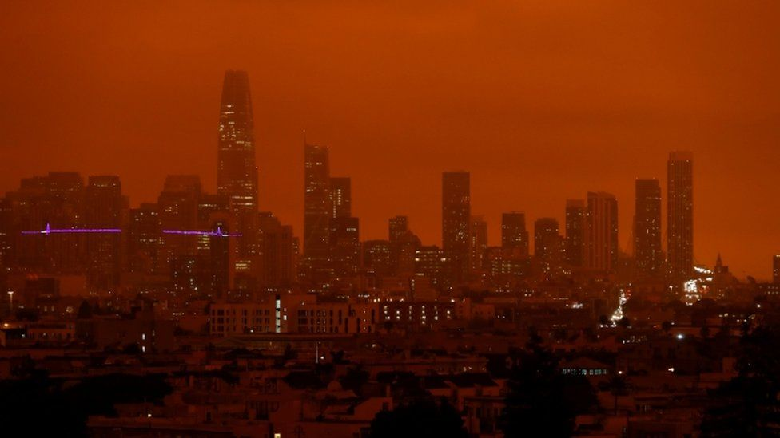

---
authors:
- first: Andrew Dana
  last: Hudson
  role: author
cover: ./cover.jpg
date_reviewed: 2022-06-07
isbn: '9780823299546'
og_cover: ./og-cover.jpg
page_count: 224
publication_year: 2022
publisher: Fordham University Press
rating: 5.0
reads:
- date_finished: 2022-06-07
  year: 2022
tags:
- academic
- futurism
- sci-fi
title: 'Our Shared Storm: A Novel of Five Climate Futures'
type: book
---

Everyone knows the world is falling apart. 

We just don’t like to talk about it.

*Blade Runner skies over San Francisco. California wildfires September 2020*

But what if we did talk about climate change? What if we stopped being paralyzed by the immensity of the problem, the multifaceted slow-motion catastrophe that everyone is responsible for, and nobody is accountable for?  Decarbonization and any associated global political change are famously wicked problems, with manifold uncertainties and high costs, but climate change and how we deal with it is the story of the 21st century. And for all that climate change is **the story**, there are not enough stories about climate change.

Most climate fiction remains resolutely Delugist in orientation. In *Oryx and Crake, The Windup Girl*, or *Don’t Look Up* the core message is that the sins of industrial civilization will finally overwhelm a weak and corrupt society. Out of the seeds of the devastation, a handful of survivors will rebuild, climate absolution paid for in gigadeaths. This kind of story about climate change is an apocalyptic fantasy, a re-inscription of Christian mythology into a modern context. It can make for a fine horror story, but it's facile, boring,  and it’s a lie. If we’ve learned one thing about the apocalypse in the past few years, there will not be angelic trumpets and letters of fire in the sky. You’ll just have to keep going to work, even as the sky rains blood.

*Our Shared Storm* is climate fiction done right. It’s a serious piece of futurism inspired by the latest IPCC scenarios and ethnography at COP24 (Conference of the Parties, the major UN climate conference)  in Krakow in 2018. It’s also such good storytelling that I could not put it down, and stayed up far past a sensible bedtime to finish it in one gulp. 

The stories are centered around COP60 in 2054, held in Buenos Aires.  With a bit of literary and futurological sleight of hand, Hudson holds constant the basic plot of the conference being hit with a torrential “neverstorm”, and the characters of Noah, Saga, Luis, and Diya, and lets the world shift around them to show the five official IPCC Shared Socioeconomic Pathway scenarios. I’ll confess to skepticism reading the introduction, but this is very much not the same story five times. Shifts in point of view and central dramatic tension along with the state of the world, make each timeline its own unique experience, and I was excited to see what in the characters remained fixed and what changed.

The stories trace an arc, from the business as usual scenario of diplomatic horse-trading over reparations for losses against investments in the future, to a wild party of fossil-fueled development and venture-disaster-capitalism, to stark inequality between those deemed useful and worthy of survival and the restive excess population, to a world of conflict and collapse, where a handful of scientists attempt to record the climate catastrophe like monks protecting the treasures of antiquity from Visigoths, to finally a sustainable utopia, where the major choice is how much to invest in decarbonization how quickly. It’s a tour from a world very much like our own, to ones much worse, and finally one where things are, well, not perfect, but apocalypse canceled. And even in the scenarios where things are bad, life goes on. “The collapse” can only be seen in retrospect. For those living in it, it’s just another day.

*Our Shared Storm* makes bold promises in the introduction, and accomplishes all of them with verve. First, these are good short stories, some of the more well-crafted speculative fiction I’ve read in quite a while. An academic work always has the threat of being too didactic, getting lost in abstract ideas and teachable moments, rather than story-telling. *Our Shared Storm* never loses the bubble that these stories are about human beings, not planetary systems.  Second, this is a serious piece of scholarship, grounded in the best estimates we have, which successfully translates the bland bureaucratese of an IPCC report into the richly textured sensation of the future.  And third, this is a methodological advance in narrative foresight, with the conceit of the same characters and events but different settings. I’ve done work in this field (Burnam-Fink, 2015, [“Creating narrative scenarios: Science fiction prototype at Emerge”](https://www.sciencedirect.com/science/article/abs/pii/S0016328714001992), Futures), and there’s a lot of theory but precious little successful practice.

*Our Shared Storm* is an impressive debut: Provocative, imaginative, and even inspiring. Hudson is a talent to watch.