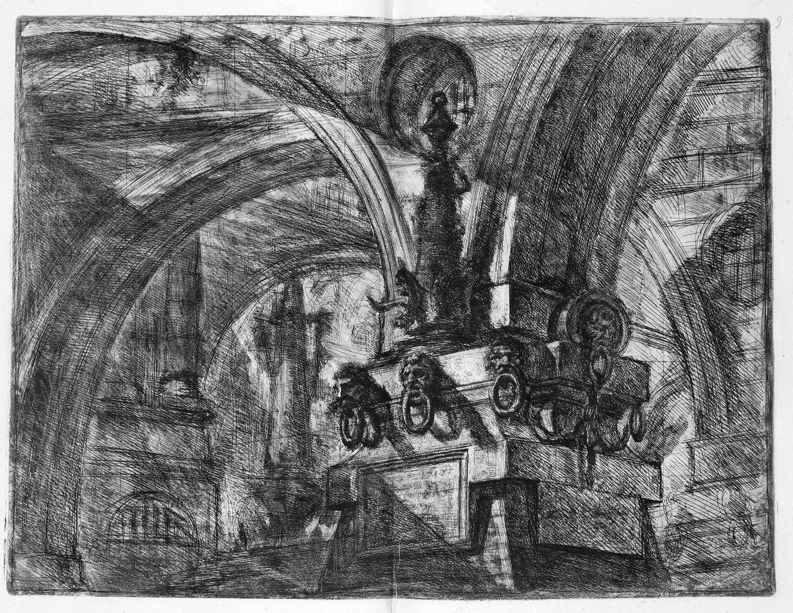

---
authors:
- first: Susanna
  last: Clarke
  role: author
cover: ./cover.jpg
date_reviewed: 2023-02-02
isbn: '9781635575637'
og_cover: ./og-cover.jpg
page_count: 245
publication_year: 2020
publisher: Bloomsbury
rating: 5.0
reads:
- year: 2023
tags:
- fantasy
title: Piranesi
type: book
---

I'll admit I held off on *Piranesi* because I was mixed on *Johnathan Strange and Mr. Norrell*, which was imaginative, but long and alienating. This was a mistake. *Piranesi* is an absolute joy. 

Our narrator lives in a Great House, an infinite labyrinth of cyclopean rooms and corridors, massive marble statues, lower chambers flooded with tides, airy upper chambers full of clouds and mist.  The House provides for him with fish and seaweed and fresh water, and he records its events and wonders dutifully in his journal.  Our narrator knows that *Piranesi* is not his name, but it's what the only other living person in the world calls him, a well-dressed man the narrator calls the Other, who is searching for some lost and ancient wisdom.

Carceri d'invenzione XV, *from *Imaginary Prisons* by the real antiquarian Giovanni Battista Piranesi*

The journal entries seem precious at first, with their Random Capital Letters, but their earnest belief in the absolute reality of this liminal world drew me in within a few chapters. The mystery of the House, the narrator's past, and the agenda of the Other unfold in a revelation of transgressive philosophy, cultist criminal academics, and the disappearance of magic.

This book is a gem!