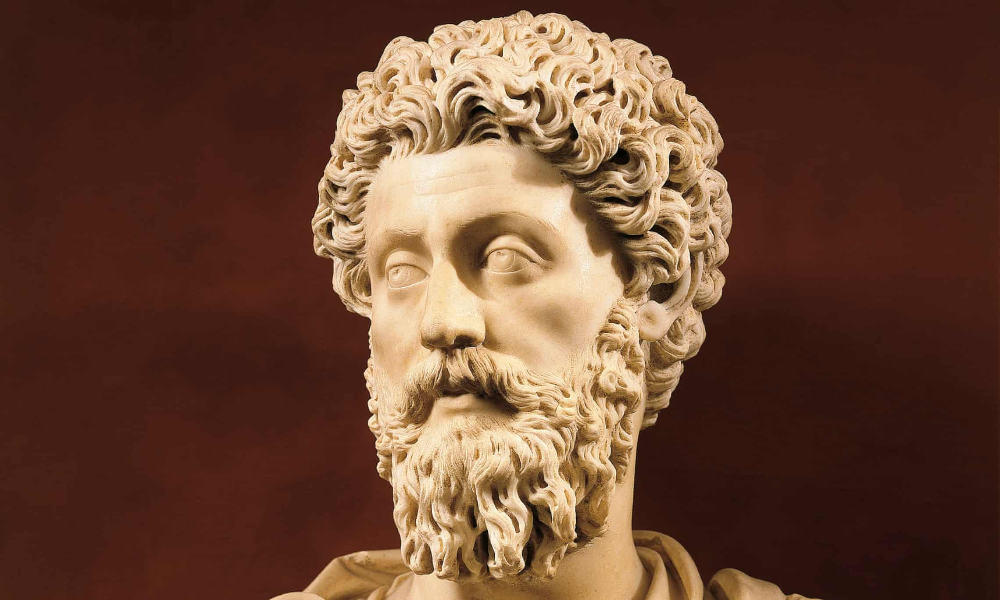

---
authors:
- first: Colin
  last: Elliott
  role: author
cover: ./cover.jpg
date_reviewed: 2024-03-04
isbn: '9780691219158'
og_cover: ./og-cover.jpg
page_count: 304
publication_year: 2024
publisher: Princeton University Press
rating: 5.0
reads:
- year: 2024
tags:
- academic
- history
title: 'Pox Romana: The Plague That Shook the Roman World (Turning Points in Ancient
  History)'
type: book
---

A mighty empire at the peak of its' power, the center of an increasingly interconnected world, suddenly crumbles under the combined weight of an erratic and idiotic ruler, the blowback from decades of unrealistic policy, and a sudden pandemic.  It's not America 2020, it's Rome AD 165, and though the parallels are perhaps somewhat stretched, there's still a lot of valuable lessons, and a good ancient medical and economic mystery around the Antonine Plague. 

Rome in 160 was at the height of the *Pax Romana*, a century and a half of expansion and peace since Augustus turned the Republic into the Empire. The empire was ruled by Marcus Aurelius and Lucius Verus, adopted brothers who seemed uncommonly able to split the duties and benefits of the Imperium. 

*Marcus Aurelius. Be suspicious of dudes with this as their profile pic*

Elliott spends plenty of time setting the stage, and makes a convincing argument that the *Pax Romana* was more of a gilded age than a golden age. While the imperial core was peaceful and prosperous, that prosperity did not reach to the masses of urban poor, who either slept rough or in crude and unsafe tenement apartments. Sanitation was poor, despite investment in aqueducts and sewers. Administration was ad hoc, the semi-private affairs of local elites and imperial delegates, who lacked training, data, and resources to react to crises. And crucially, the grain supply in Rome was dependent on Egyptian harvests, and the Nile floods had been either too little or too much for decades prior. So in 165, when victorious soldiers returning from Parthia came back with an unknown disease, it was a more fragile empire than appearances suggest that took the blow.

And the disease is truly unknown. Elliott makes a convincing case for an orthopox virus, like smallpox but not modern smallpox, though measles is another common suggestion. Despite being associated with the great physician Galen, descriptions of symptoms is vague, including fever, rashes, and then in fatal cases bloody coughs and stools. How many people died is another unknown, with ranges between 1 million and over 25 million. For such a massive event, there is little direct evidence.

Yet the indirect evidence is compelling, including tangled mass graves in cities corresponding to the dates of the plague. Census records show declines across the period, as cities shrunk and entire towns disappeared. Mines and quarries ceased production, coinage was debased, the military had trouble recruiting for wars and peacekeeping against raiders, and conflict between orthodox Pagans and early Christians who refused to perform public sacrifices to appease the gods is recorded.

Though Elliott argues for a deathcount at the lower end of the range, he makes a case that the plague really did a number on the Roman economy, and more explicitly, the Roman political system. Commodus, who succeeded Marcus Aurelian, was a clown rather than a stoic, and his assassination triggered ongoing political stability on the basis that whoever could best bribe the army deserved to rule.  The Crisis of 3rd century was clearly set up by the plague.

I will note that one thing that seems amiss is when Elliott draws more direct connection between the Antonine Plague and COVID-19, which is set in a very orthodox Chicago school economic framework. Roman macro-economics were surely bad, but it seems unfair to fault them for not reading Hayek. Similarly, the failures of pre-germ theory divine intervention have little bearing on evidence-informed public health measures. But I will say that while Elliott and I likely have significant differences in perspective over the recent pandemic, he is a gentleman and a scholar, so I'll avoid concluding this review with a rant. 

After all, we probably don't spend enough time thinking about Rome.