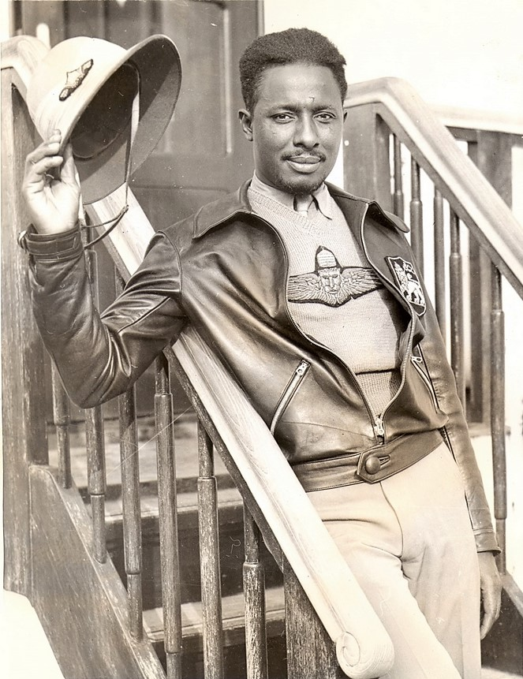

---
authors:
- first: Jeff
  last: Pearce
  role: author
cover: ./cover.jpg
date_reviewed: 2021-03-05
isbn: '9781629145280'
og_cover: ./og-cover.jpg
page_count: 616
publication_year: 2014
publisher: Skyhorse
rating: 4.0
reads:
- date_finished: 2021-03-05
  year: 2021
tags:
- history
- war
title: 'Prevail: The Inspiring Story of Ethiopia''s Victory over Mussolini''s Invasion,
  1935-1941'
type: book
---

*Prevail* is an important book on an overlooked war, but I'm not sure that the subtitle of an 'inspiring story' is necessarily accurate.

In 1935, Mussolini's Italy was aiming to add new territories and shore up popular support with a short, victorious war. Ethiopia had defeated Italy a generation before at the Battle of Adwa, and the self styled modern Caesar wanted a rematch, this time with all the products of industrialized warfare.  Mussolini manufactured a *casus belli* at the remote oasis of Wal Wal, a solid 70 miles inside Ethiopia borders.

*John "The Brown Condor" Robinson, an American pilot flying for Ethiopia*

Ethiopia's defense as orchestrated by Emperor Haile Selassie rested on two pillars.  First, he would appeal to the League of Nations and the great powers of England and France to intervene against this war of aggression. And second, he would fight.  The diplomatic effort was skillfully carried out, but floundered on the racist indifference of the European powers, who saw a dispute and decided that adjudicating the truth was outside of the their remit. France's Prime Minister Pierre Laval was pro-Italian (and would become a leading collaborator under Nazi occupation), and no one was willing to call Mussolini's bluff over general war in the Mediterranean. While Ethiopia became a popular cause with working-class England and the African American community, the opinion of people who made decisions was resolutely "not my problem".  In fact, the diplomacy may have been counterproductive, because while it failed to close the Suez canal to Italian shipping or organize an oil embargo, it lead to an arms embargo against both sides.  This was no problem for Italy, which had been preparing for war for years, but it prevented Ethiopia from sourcing modern arms it desperately needed.

The second defense was military. Haile Selassie rallied the *ras* (an Amharic term for nobility roughly equivalent to 'Duke') and dispatched armies to strategic points.  But his forces were incredibly deficient in all qualities except courage.  Machine guns and artillery were rare, rifles generally obsolete, and many soldiers equipped with traditional swords and spears. There were no tanks, and only a handful of unarmed aircraft for liaison work. Some of the *ras* were of doubtful loyalty, and none were trained in the modern warfare of concealment, entrenchment, and attrition, preferring glorious clashes to Selassie's desired Fabian strategy of guerilla war.

Against this, the Italians brought a heavy assault of war crimes, starting with mustard gas and deliberate targeting of the Red Cross, and then moving into the usual excessive force of a modern army against a medieval one. The Ethiopian defenses shattered, and Italian mobile columns seized Addis Ababa, with Haile Selassie fleeing to exile. The Italians could conquer the country, but they could not rule it. Despite arbitrary executions, concentration camps, and a host of human rights violations, bands of Patriots rose up, engaging in years of guerilla warfare without much organized support from overseas.

The Ethiopian war finally ended in 1941, with the start of the European war.  While Italian forces were large at some 300,000, they had poor morale and had been effectively immobilized by the constant low-intensity warfare.  A small set of British flying columns under *Orde Wingate*, later to gain renown for unconventional warfare in Burma,  were able to defeat the Italian forces and restore Haile Selassie to his throne, though on a provisional pro-English basis that saw a second, politer looting of the country.

The thing that comes through is the destruction of every segment of Ethiopian society. The traditional nobility, for their many flaws, were the first targets of the Italy regime. The Young Ethiopians, a small group of a few thousand Western educated youth who in better times would have been liberal reformers, were next.  Conflicts between Selassie's exiles and the surviving patriots would hinder Ethiopian politics for the rest of the 20th century. And the ordinary people suffered greatly, though as peasants writing in a minor language, their story is unknown, even in this otherwise strong work. Not a single Italian was charged for their crimes in Ethiopia, with surviving fascists folded into the Cold War against Communism. 

*Prevail* is best in the asides, the slices of life featuring characters like 'The Brown Condor' Robinson, a skilled American pilot who served opposite Trinidadian aviator Hubert 'The Black Eagle' Julian was an airborne con-artist, as well as a cadre of European reporters who included Evelyn Waugh, who *despised* Ethiopia in his characteristic style.  Pearce makes a strong case that the Ethiopian war prefigures many of the problems of diplomatic intervention we still live with, but I'm not sure the pieces come together.