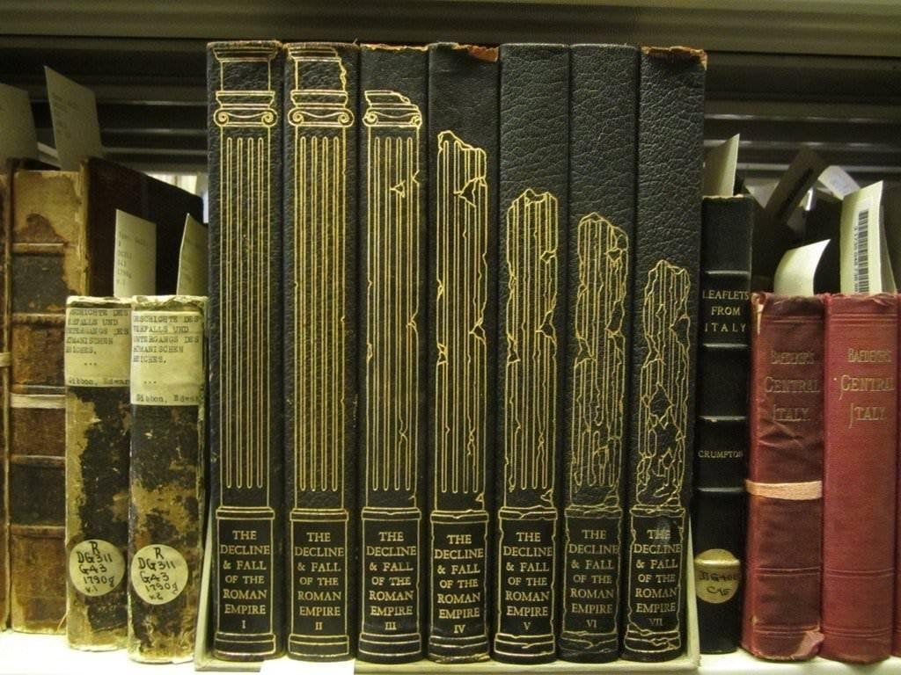

---
authors:
- first: Ralph W.
  last: Mathisen
  role: author
cover: ./cover.jpg
date_reviewed: 2024-11-14
isbn: '9780292729834'
og_cover: ./og-cover.jpg
page_count: 293
publication_year: 1993
publisher: University of Texas Press
rating: 4.0
reads:
- date_finished: 2024-11-14
  year: 2024
tags:
- academic
- history
title: 'Roman Aristocrats in Barbarian Gaul: Strategies for Survival in an Age of
  Transition'
type: book
---

Everybody knows how Rome fell. After a succession of crises, plagues, civil wars, and especially barbarian invasions, the once illustrious empire ended. Even a perfunctory examination shows some issues. Rome was sacked in 410 by Visigoths under Alaric, sacked again several times, and the last Western Roman Emperor, Romulus Augustus, was deposed in 476. Roman institutions limped along in some form or another for the whole 5th century. How did people at the time experience the fall of Rome?

*Fantastic cover design on Gibbon's *Decline and Fall, showing a pillar crumbling over time.

Mathisen conducts a close read of available sources for Gaul in the 5th century, focusing primarily on the letters of [Sidonius Apollinaris](https://en.wikipedia.org/wiki/Sidonius_Apollinaris). Mathisen establishes a Gallo-Roman aristocratic identity as one of the "good people", a criterion established by wealth, lineage, office holding, and literary accomplishment, and then discusses how that criterion shifted over time.

Wealth was always the foremost criterion. Aristocrats were distinguished by their estates. Holding on to them became trickier in the 5th century, requiring aggressive legal and physical defenses against barbarian and Roman neighbors. Lineage mattered, and intermarriage with barbarians was discouraged, but of course bloodlines were negotiable for the right price. Offices and careers shifted from the Roman civil service to the Church hierarchy, with some Bishoprics becoming family holdings, as well as ad hoc work for barbarian kings. And finally, literary matters were very important, though this is somewhat self-selecting. Sidonius collected his letters for publication, which was sponsored by his son, and wrote extensively about the importance of cultivating a literary circle. 

Yet at the same time as Mathisen makes a convincing case for the ductility of Gallo-Roman aristocratic identity, it is impossible to deny its diminishment over time. Many aristocrats sought exile. Travel essentially stopped, first between Gaul and other provinces, and then within Gaul, as various barbarian kings divided up the region. Sidonius writing that letters were the best form of friendship seems to have been sour grapes for a man who clearly did not feel comfortable embarking on even moderate journeys. While courts continued to function for some decades, ultimately justice became a matter of helping oneself, contributing to cycles of feuds.

While Sidonius was recognizably a Roman aristocratic writer in a lineage we would recognize with Cicero and Pliny, no one followed him. By the 6th century, the time of his grandchildren, genealogical records show Roman and German names in the same family. The fall of Rome was perhaps less violent than we remember, but it was definitely comprehensive.