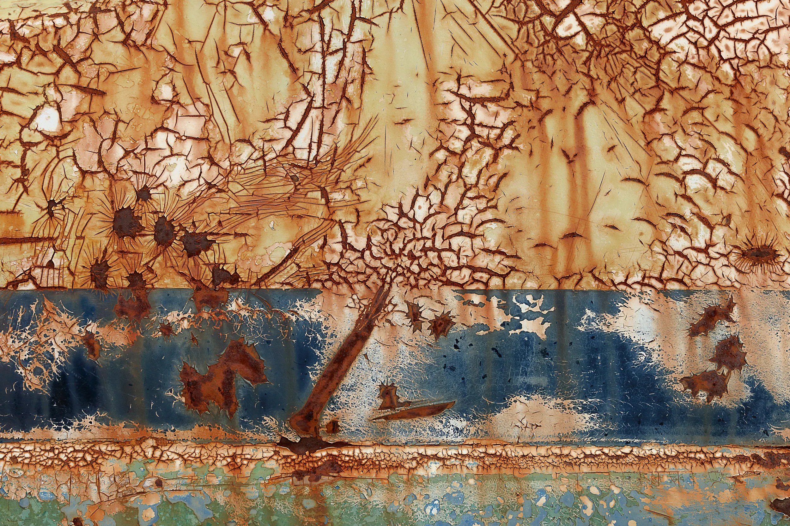

---
authors:
- first: Jonathan
  last: Waldman
  role: author
cover: ./cover.jpg
date_reviewed: 2023-10-24
isbn: '9781451691597'
og_cover: ./og-cover.jpg
page_count: 288
publication_year: 2015
publisher: Simon & Schuster
rating: 4.0
reads:
- date_finished: 2023-10-24
  year: 2023
tags:
- non-fiction
- sts
title: 'Rust: The Longest War'
type: book
---

It is infrastructure week, my dudes, and the state of America's infrastructure is... well, perennially a D from the American Society of Civil Engineers.  Rust isn't exactly the sexist topic. Waldman does his best to jazz it up by finding the human interest stories behind corrosion.

*Rust abstract by photographer Alyssha Eve Csuk, who is the subject of one chapter*

The story opens with the Statue of Liberty, which was revealed to be literally rusting to bits after a pair of Leftist protestors climbed it in the early 1980s. The book lurches around various topics, but finds its form at the end in a detailed study of Dan Dunmire, a Pentagon official and Star Trek fanatic who became Director of Corrosion Policy and Oversight, and along with trying to eliminate the $30 billion in defense related losses due to corrosion, got LeVar Burton to [narrate a series of videos on corrosion](https://www.youtube.com/watch?v=cXfCHdgePNY) to raise awareness about this pervasive menace. A long chapter on using a high-tech sensor laden pig to inspect the Trans-Alaska Pipeline is a delicious exploration of technical excellence under harsh conditions.

The individual stories are interesting, but shy away from the hard technical issues that Waldman discusses, but doesn't have the scholarly chops to full explore (no hostility intended, he's a fine journalist, but not a technical or policy expert). While rust is omnipresent and costs billions of dollars, the practical fight against rust falls into gaps in procurement and maintenance, and particularly in scientific and engineering training. Most engineers will receive a single lecture on corrosion in their education. 

Mastering corrosion means a better world, full of things which work better with less human attention, and which also fade away gracefully once we're done with them, rather than scattering litter across the Earth.