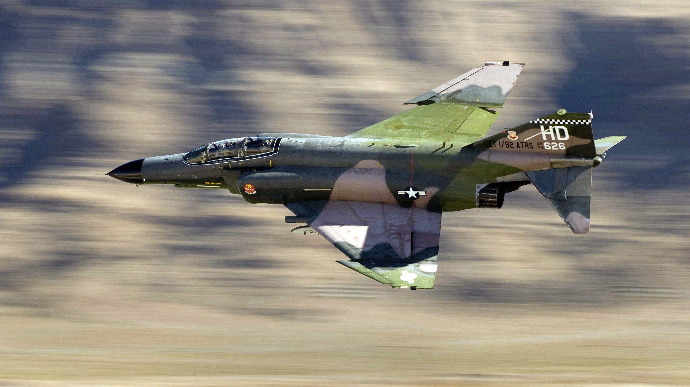

---
authors:
- first: Joseph F.
  last: Tuso
  role: author
cover: ./cover.jpg
date_reviewed: '2026-08-18'
isbn: '8900964556'
og_cover: ./og-cover.jpg
page_count: 265
publication_year: 1990
publisher: Texas A&M University Press
rating: 5.0
reads:
- date_finished: '2026-08-17'
  date_started: '2026-08-14'
  year: 2026
tags:
- war
- academic
- vietnam
- vietnam-war
title: 'Singing the Vietnam Blues: Songs of the Air Force in Southeast Asia'
type: book
---
*Singing the Vietnam Blues* is a book with a specific aim, and it nails that aim entirely. Tuso was an F-4 Phantom Guy In Back, a USAF navigator, a Vietnam War veteran with 170 combat missions, and an English professor. During his 1968/69 tour, he noticed that the songs his comrades sang were fascinating cultural expressions that would all too easily be lost to time. This book collects 148 songs, each accompanied by a brief essay explaining its context, as well as a 400+ item glossary of USAF slang.

The songs are raw and profane, spanning the gamut from celebrations of fighter pilot culture, boasts of the superiority of one squadron or plane over the rest, sardonic and brutal parodies of Christmas carols, table-pounding Officer's Club anthems, and plaintive ballads about flying near, and sometimes to, death. One favorite tune is the Salvation Army satire "Throw a nickel on the drum", with some lyrics that give the flavor of the book.

*We were cruising over Hanoi, doing four-fifty per,
When I called to my flight leader, "Oh won't you help me, sir?"
The SAMs are hot and heavy, and MiGs are on our ass.
Take us home, flight leader, please don't make another pass!"*

CHORUS (*repeat after each verse*)
*Hallelujah, Hallelujah, throw a nickel on the grass.
Save a fighter pilot's ass:
Hallelujah, Hallelujah, throw a nickel on the grass.
And you'll be saved:*

*I rolled into my bomb run, trying to set my pipper right,
When a SAM came off the launch pad and headed for our flight:
The Number Two informed me, "Hey, Four, you'd better break!
I racked the goddamn plane so hard, it made the whole thing shake.*

The song continues with getting hit, bailing out, and winds up with the narrator in the Hanoi Hilton as a prisoner of war. Most of the songs are anonymous, with a solid chunk are credited to Dick Jonas, the leading bard of the war, whose music is available on [your favorite platform](https://music.youtube.com/watch?v=Xf7pyOPd6Co&si=QPHdhMRic6RQrusz). Jonas passed away in February 2026, but at least we still have his art.

Tuso had a wild life, beyond the combat tour. He dropped out of Catholic seminary in 1955 with the goals of starting a family--reasonable, and becoming an English professor at the US Air Force Academy--which is a lot more specific than either being an English professor or an Air Force officer. He trained as a B-47 navigator, got a master's in English, and was teaching at the Academy when the commandant decided that the faculty needed combat experience, and his department chair (an enthusiastic West Pointer) volunteered five professors, including Tuso. Two of the five did not survive their tours. I've seen some academic bullshit, but the department chair dispatching faculty to an active war zone is new!

Tuso closes his introduction by comparing fighter pilots to the Anglo-Saxon warriors of *Beowulf*, a topic also wrote a scholarly volume about.
>"The center of our social life was the great hall, or Officer's Club. We ate all our meals there in an all-male, war-oriented, closed social group. Through our subchiefs, or flight commanders, we warriors were bound in loyalty to our tribe, or squadron, which was physically embodied in our lord, or squadron commander... Side by side with death existed another kind of immortality-almost every day new warriors arrived and old warriors left. Our number was always constant... Each [pilot] wanted to leave something of himself behind for his comrades before he was swept away to Valhalla by the Valkyrie-like C-130 transport."

Clear skies and following winds. Like the song says, [there are no fighter pilots down in hell](https://youtu.be/_0I6pAQDgZc?si=cf4snVwBU0Aox7Y4).