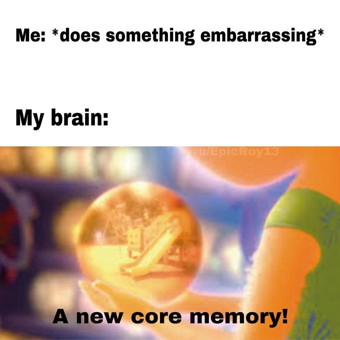

---
authors:
- first: Meik
  last: Wiking
  role: author
cover: ./cover.jpg
date_reviewed: 2021-11-14
isbn: '9780062943392'
og_cover: ./og-cover.jpg
page_count: 285
publication_year: 2019
publisher: William Morrow
rating: 3.0
reads:
- year: 2021
tags:
- non-fiction
title: 'The Art of Making Memories: How to Create and Remember Happy Moments'
type: book
---

*The Art of Making Memories* is half breezy pop science covering how to have a memorable life, and half Wiking digressing into how great it is to be a walking TED talk and Very Special Danish boy. If I may digress, I've lived with depression for a long time, and my absolute least favorite thing about depression is how it steals your memories.  I know I experienced joy in the past, but when I reach for those moments, there's a faint ghost.  Meanwhile, every awkward bump in the road of life, well...

*A new core memory*

We still don't know how memory works, scientifically speaking, but the best memories are embodied, sensural, emotional, and narrative.  By seeking novelty, by associating smells and tastes with moments, and by rehearsing those memories into stories, we can hold on to good times and build a life worth remembering. 

I'm just a little lost with how to square that with days of spreadsheets, dishes, and diapers.