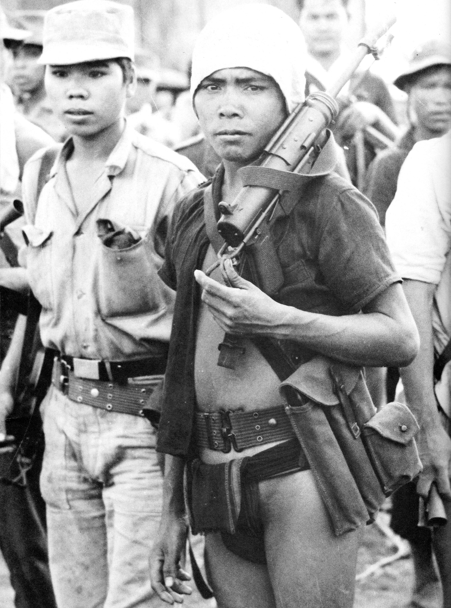

---
authors:
- first: James C.
  last: Scott
  role: author
cover: ./cover.jpg
date_reviewed: 2022-11-14
isbn: '9780300152289'
og_cover: ./og-cover.jpg
page_count: 464
publication_year: 2009
publisher: Yale University Press
rating: 4.0
reads:
- year: 2022
- year: 2022
tags:
- academic
- history
title: 'The Art of Not Being Governed: An Anarchist History of Upland Southeast Asia
  (Yale Agrarian Studies Series)'
type: book
---

Scott makes a fascinating and persuasive contra-historical argument, which is unfortunately let down by repetitive writing. The subject is the peoples of upland South-East Asia, the dense jungle massif between Eastern India, Southern China, and the Indochinese Peninsula.  The diverse peoples of this area, which Scott deems Zomia, have been portrayed a primitive barbarians, living relics who have not yet been 'cooked' into civilized people, but who will inevitably being incorporated into the state.  Against this view, Scott argues that Zomians are people who have explicitly rejected state control and power in favor of choosing their own lives, and that apparent primitiveness is a sophistical system of not being governed.

*A Montagnard tribesman during training in 1962. Traditional loincloth and M3 submachinegun. Wikimedia*

The lowlands around Zomia offer some of the best terrain for state formation, as wet rice padi agriculture is labor intensive but incredibly productive.  However, due to the limitations of transportation and communication technology, state power can only extend a few hundred kilometers from the capitol, and this reach is curtailed when plains switch to mountains, jungles, or swamps. 

The basic problem is one of control. The State needs labor for public works, for conscription, and indirectly as taxes. But as these taxes become too onerous, or drought and plague wreck havoc, or marauding armies loot on their path, the peasantry always the option to quit and take to the hills. At which point, the state increases taxes to make up their deficit, more people flee, and the state collapses.

Scott makes some good points about how since written history is almost by definition a matter for literate elites: priests, kinds, and the apparatus of state bureaucracy, we must fill in the gaps ourselves.  Barbarians and tribes are illusions the state reifies to make sense of its frontier. Oral history over written history offers advantages of a fluid social identity and lineage.  Ethnicity is a matter of politics, not bloodlines. Yet I'm not entirely persuaded of the easiness of the choice to abandon the only kind of life you've known and take to the tiger haunted hills, away from oppression but also social context.

The chapters are self-contained, which adds redundancy, but also makes it possible to assign individual ones easily in seminar (I think I just caught on to Scott's aim with the structure. I doubt he'd deliberately write a redundant book). While the history of a people without history is always challenging, *The Art of Not Being Governed* is a fascinating view of the vanishing areas where the power of the state fails.