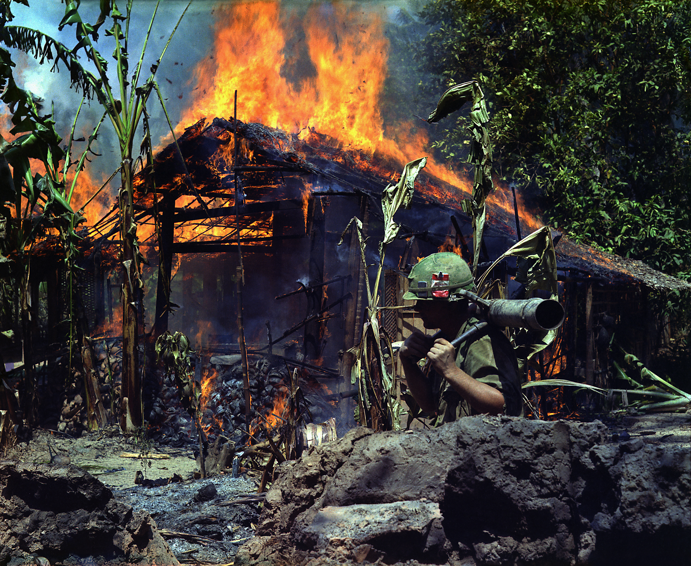

---
authors:
- first: John
  last: Laurence
  role: author
cover: ./cover.jpg
date_reviewed: 2025-01-29
isbn: '9781586481605'
og_cover: ./og-cover.jpg
page_count: 864
publication_year: 2002
publisher: PublicAffairs
rating: 5.0
reads:
- year: 2025
tags:
- vietnam-war
- vietnam
- war
title: 'The Cat from Hue: A Vietnam War Story'
type: book
---

The story of the Vietnam War is inextricably linked with stories about the Vietnam War, and especially how the war was covered at home. Walter Cronkite [saying that](https://alphahistory.com/vietnamwar/walter-cronkite-editorial-1968/) "We are mired in stalemate" in the wake of the Tet Offensive is noted as a turning point in public opinion. General Westmoreland said "Vietnam was the first war ever fought without any censorship. Without censorship, things can get terribly confused in the public mind." And while words are one thing, the immediacy of television in the 1960s brought the war into American living rooms.  As a CBS television reporter, John Laurence was a key link in that chain. This book is his attempt to grapple with his experiences in Vietnam decades later.

*Mỹ Tho, Vietnam, 5 April, 1968. A Viet Cong base camp being burned down.

--Wikimedia*

Laurence served three tours in Vietnam with a combat reporter's tours having obvious analogs to military tours to a soldier's. The first was in 1965 and 1966, the start of the American phase of the war. Laurence was not at the Battle of Ia Drang, but he was with the cavalry both before and after, and with the Marines in Operation Masher. He returned to Vietnam in 1967, in time to catch the Tet Offensive and the Battle of Hue.  And he went back once more with an ambitious project to do a focused study of a single unit, which became the award winning documentary [The World of Charlie Company](https://www.youtube.com/watch?v=8tTq1KzCruo).

Two themes drive through this book.  The first one is about a journalist's duty. Television producers were hungry for *bang-bang footage*, live combat on film which would get viewers on their channel. The US government as a whole wanted to keep everybody 'on the program', the informal understanding that the war was going well, and that the daily MACV press briefings called the five o'clock follies was relevant. Reporters were engaged in contests with each other to get better stories back home first. And finally there was some obligation to the *truth*, and the reporter's role as the intermediary between subjects of their reporting, American soldiers and Vietnamese civilians, and the people back home. There are no easy answers to this problem, but a good reporter has a sensitivity towards the construction of the story, and the ways in which images and text are always partial, always incomplete, always biased. 

A second theme is coming of age in the Vietnam War. Laurence was just a few years older than the soldiers he covered, and barely more worldly at first. Reporters were not under military discipline, they could always just go home, and yet combat exerted a magnetic draw on some of them, even to the death. Laurence chronicles the strange and lovely scene at Frankie's House, a flophouse maintained by several reporters that was a rolling party of dope and rock and roll (sex is a little vaguer in this book, probably for the best). The attraction of the war proved fatal for some reporters. About 150 correspondents died covering the war. Laurence's friends Dana Stone and Sean Flynn disappeared in Cambodia, almost certainly killed by the Khmer Rouge. Tim Page was wounded four times, the last leaving him partially paralyzed. Laurence himself suffered from PTSD, which he self-medicated with booze, marijuana, and Valium. And yet the only regrets I think Laurence and his friends have are that they didn't record *more*, that technical glitches lost shots or luck had them away from the action. 

A lot of Vietnam War memoirs are the same: Civvy life, bootcamp, one year tour, back to the states, and what the hell happened. Laurence's memoir fits the same space, but his story is both unique and well told. 

Oh, and the cat.  Laurence rescued a kitten during the battle of Hue, a white and orange cat named Mèo (Vietnamese for cat), which rapidly grew to a terrorizing king of wherever he surveyed, a beast which distrusted all Americans and would attack ruthlessly and without warning. I'm not a cat person, but there's some humor in Laurence and his friends describing Mèo as '100% Viet Cong, a hardcore warrior who'll never surrender and never break.'