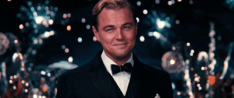

---
authors:
- first: Nghi
  last: Vo
  role: author
cover: ./cover.jpg
date_reviewed: 2024-05-15
isbn: '9781250784780'
og_cover: ./og-cover.jpg
page_count: 260
publication_year: 2021
publisher: Tor Books
rating: 5.0
reads:
- year: 2024
tags:
- fantasy
title: The Chosen and the Beautiful
type: book
---

When I heard about the premise of this book, I was immensely skeptical. Sure, Vo had written a perfect novella in **[The Empress of Salt and Fortune](/book/the-empress-of-salt-and-fortune-vo/), but it's one thing to write a perfect novella and another thing to retell *The Great Gatsby* as a queer fantasy with a Vietnamese-American protagonist. This is the **Great American Novel**. Everybody is assigned it at some point. There is an [entire academic journal](https://www.jstor.org/journal/fscotfitzrevi) devoted solely to F. Scott Fitzgerald, let alone all the other ways culture has embraced and adapted *The Great Gatsby*. If Vo thinks she can pull it off, she is welcome to try. Good luck, you're going to need it.

*Leonardo DiCaprio as Gatsby*

Well, gentle reader, Vo does pull it off. This is an incredibly lush, fun, weird, and *hot* novel about desire and its limits. I'll try to limit comparisons, because it is unfair, but the weakest point of *Gatsby* for me (and many others) is how much of a dud Nick Carraway is.  Jordan Baker is very much not a dud, she's a firecracker cutting across New York society with beauty, wealth, and daring. She's very much aware of the knife edge that she dances across, with her "exotic" Asian face, and how she is at best a pet of the people who really matter, but while she is dancing and running she'll have a damn good time. 

The basic plot is, well, Gatsby, but this has never been a story about plot. Rather this is one about the kinds of things people want, and the hollowness inside them. All the things that the characters want: glamour, excitement, romance, a drink, *love*, are what will destroy them. This endless desire, this void at the center of their selves, is surrounded by a shell of rigid high society customs. It's very cool, and very well done.

This is also a fantasy, though magic is more metaphorical than strictly necessary. Hell is real, and Gatsby may have sold his soul to get his mansion and his wealth. There are little charms and enchantments, though ultimately none of it matters more than illusion. It could be costumes and acrobats for all the impact it has. Jordan has a more significant magic, the ability to bring paper cuttings to life, which comes up in three pivotal scenes, though the nature and costs of this talent, which appear to be a Vietnamese specialty, are left undefined.

Ultimately, this book is super-stylish, character-driven, and well-researched. It's not *Gatsby*, not The Great American Novel in all its subtleties, but it's a lot more fun and stands on its own, which is perhaps a grander accomplishment.