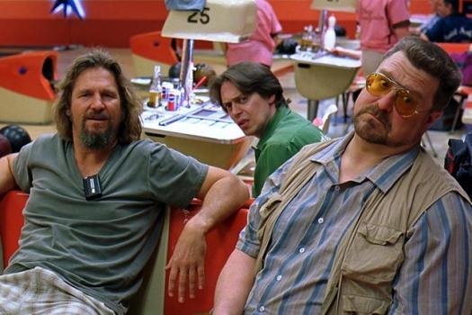

---
authors:
- first: John
  last: Scalzi
  role: author
cover: ./cover.jpg
date_reviewed: 2018-10-20
isbn: '9780765388896'
og_cover: ./og-cover.jpg
page_count: 336
publication_year: 2017
publisher: Tor Books
rating: 4.0
reads:
- date_finished: 2018-10-20
  year: 2018
tags:
- sci-fi
title: The Collapsing Empire
type: book
---

As always, Scalzi is a charming, witty storyteller, and *The Collapsing Empire* is a surprisingly optimistic take the complete destruction of human society. The Interdependency is held together by the Flow, a system of hyperspace rivers that link the scattered human habitats.  But the Flow is drying up, and humanity may only have a matter of months to find salvation.  Worse yet, the geometry of Flow connections mean most humans live in artificial habitats that require constant interstellar trade to survive.

The story takes place through the eyes of three people coming to grips with the immanent crisis.  Cardenia is the newly crowned Emperox of the Interdependency, a political outsider elevated by the accidental death of her brother, the heir apparent.  Kiva is a foul-mouthed super-Type A scion of a major trading family, who's ship has been placed under a bullshit embargo at the rebellion-wracked planet of End.  And Marce is a physicist from End who has calculated when and where the Flow will collapse.  Against them are the Machiavellian Nohamapetan family, who have their own model for how the Flow will collapse, and believe that if they move correctly, the natural cycle of the universe will leave them the new ruling family.

*The Collapsing Empire* is a 3.5 star book, but its flaws are papered over by the fact that on a sentence-to-sentence level, Scalzi is a great writer.  The characters exist to provide different views on the setting, not because they have moral arcs.  Cardenia in particular is painfully passive compared to the wheels-within-wheels grade schemers around her. The story plays out in triplicate, as the characters realize what's happening, and come to similar conclusions about what to do.  Only Kiva's mercenary ballbusting spices up a kind of doughy basic decency.  And as much as this book claims to be about politics (and the constant "hey guys, Climate Change right here right now" elbow nudges), the politics of the book are just dull.  The whole edifice of the Interdependency is a facade over the brutal extraction of wealth by robber barons who sit on the arteries of commerce with warships. Scalzi did the whole "the basis of the government is a LIE" thing already, and with more verve, in *Old Man's War. *  

Frank Herbert had *thoughts* about politics.  Heinlein had theories about individuality and conformity.  Asimov had ideas about the sweep of history.  So far, Scalzi just has like opinions, man. I wish they were better.

