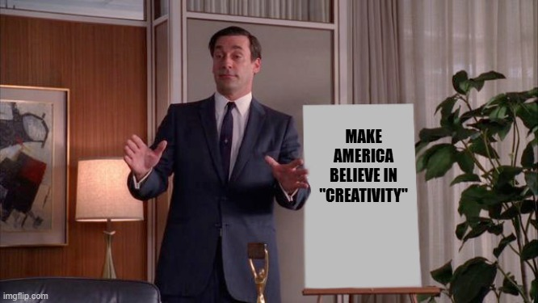

---
authors:
- first: Samuel Weil
  last: Franklin
  role: author
cover: ./cover.jpg
date_reviewed: 2025-02-02
isbn: '9780226657851'
og_cover: ./og-cover.jpg
page_count: 264
publication_year: 2023
publisher: University of Chicago Press
rating: 5.0
reads:
- date_finished: 2025-02-02
  year: 2025
tags:
- academic
- sts
- innovation
title: 'The Cult of Creativity: A Surprisingly Recent History'
type: book
---

Creativity is central to our conceptions of self and value, at least in the 21st century West. Creative people are valorized, creativity is something we encourage in our children and try to develop for ourselves, and organizations seek profit and the social good in creative solutions.  Given how much weight is placed on creativity, you'd think that it is an ancient concept, or at least a clear one. And you'd be completely wrong.

A simple [Google ngram](https://books.google.com/ngrams/graph?content=creativity&year_start=1900&year_end=2022&corpus=en&smoothing=3&case_insensitive=false) shows 'creativity' as non-existent in usage in the early 20th century, gradually rising through the 1940s, and entering a sharp upwards curve in 1950 that plateaus in 2016. Statistics are the start, and as Franklin explains through comprehensive historical work, creativity was deliberately constructed and reified by an alliance of research psychologists, management consultants, and advertising men to resolve contradictions in early Cold War American society.  And it worked.

*Don Draper is perhaps the perfect example of what creativity is all about.*

That basic tension was between the social mass and the individual. Liberal democracy cast itself as liberating each person to pursue their own best life, as against the totalitarian systems of fascism and communism. Yet workers in America, whether in factories or offices, were an infinitesimal part of a much larger system they did not understand or control. In a strategic sense, American leaders did not know how to identify, support, and deploy talent to beat the Russians. And for the final social contradiction, if the victory of democracy required acts of supreme genius, where did that leave most people who were decidedly not geniuses. 

The structure of the book alternates the between the empiricists and the practitioners.  Taking the empiricists first, the book begins with J.P. Guilford and the Institute for Personality Assessment and Research at UC Berkeley, where a group of psychologists had gathered esteemed artists, scientists, and architects as research subjects to try and distill something that could be measured as creativity distinct from intelligence. This research grew out of pre-war psychometrics and the complex that had grown up around the IQ test, and could be reasonably described as effort to square the circle of psychology as a discipline which had become oriented towards behavioral experiments in research, and one which was asked to solve human problems in practice. IPAR's work was a mirror, one which showed that the most creative people were white males closer to middle age than adolescence, who were technically minded professionals with an amateur interest in abstract art and jazz.

The psychological story then moves to Abraham Maslow, and the idea that creativity was key to self-actualization and the highest goals of human life. Though what I did not realize is that Maslow was a decided sexist, and regarded intellectual creativity as a solely male province--women would have to be satisfied with merely having children. The final psychologist examined is Ellis Torrance, who set out to find creativity in children and recast rebellion against school as a good sign, rather than a bad one.

The practitioners cover from Alexander Osborn the father of brainstorming, a freeflowing analogical system called Synectics, which came out of the United Shoe Machinery Corporation, and finally the rebirth of Madison Avenue advertising agencies (including Draper Daniels, one of the real life inspirations for Don Draper), and how creativity was used to provide intellectual heft to bolder and much more expensive advertising campaigns.

The book closes with an intellectual confrontation with Richard Florida, and the orientation of modern work towards the "creative class". The idea that artists, work-for-hire designers, software developers, engineers, copywriters, and scientists are one unified thing with the generic spreadsheet jockey, and that they all work to express their soul rather than to increase shareholder value, is one of the load bearing ideologies of the past few decades. 

I wish this review did more justice to the book. *The Cult of Creativity* is a fantastic intellectual history which delves into the contradictions of the past and shows that they are all necessary and productive. Further, creativity is not some fringe concept, it is a central organizing pillar of our current world. Franklin managed a masterpiece, a deeply thoughtful academic work which is also a joy to read.