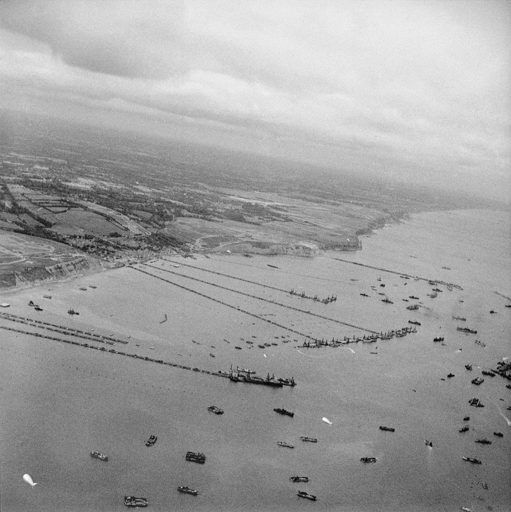

---
authors:
- first: Edward
  last: Ellsberg
  role: author
cover: ./cover.jpg
date_reviewed: 2023-08-21
isbn: '9781387956388'
og_cover: ./og-cover.jpg
page_count: 258
publication_year: 2018
publisher: The P-47 Press
rating: 5.0
reads:
- year: 2023
tags:
- war
title: The Far Shore
type: book
---

"Amateurs study strategy. Experts study logistics"

*--Some French Guy, probably"*

Okay, that French guy was allegedly Napoleon, who might know a thing or two about war. And if you've been paying attention, you know that industrial warfare is in practice often a matter of logistics. Braver men and better equipment aren't much use if those men are starving and the guns have nothing to shoot. As difficult as a forced amphibious landing is, and the Allies had plenty of experience with them after Africa, Italy, and various islands in the Pacific, the initial assault is nothing without continued sustainment. Every port in France was surrounded by coastal fortifications and heavily mined. Conventional wisdom was that supplying an army over the beach was impossible.  Ellsberg had a ringside role in showing that conventional wisdom was wrong.

*Mulberry artificial harbor, Wikimedia*

I went into this book with some trepidation that it'd be bone dry, and was delighted to find that along with being a skilled naval salvage officer, Ellsberg was a commercially successful writer with 18 books.  He's an engaging raconteur, who ably describes the organizational chaos attending the Phoenix caissons which formed a vital part of the Mulberry breakwater.  The Phoenixes were floating sinkable concrete structures, and in the absence of anchors and chains to moor over a hundred of them, the British had stored them by sinking them in a harbor on their side of the channel. The British Royal Engineers, an Army unit, had a plan to refloat them in time for the landing which amounted to 'trust us, guys', and which to a naval officer was slapdash and technically infeasible because they were using the wrong kind of pumps. Ellsberg helped demonstrate that it wouldn't work, and then risked inter-allied political disaster by writing a memo saying the Royal Engineers would botch the job. The memo went to US Naval Commander Admiral Stark, who had been a US observer on the *HMS Collingwood* at Jutland with a junior officer  with the unlikely name Albert Frederick Arthur George Windsor on the *HMS Collingwood*, currently King George VI, who told Winston Churchill that Operation Mulberry was doomed, and the PM himself should set it right. Churchill inspected the Phoenixes for two hours, asked not a single question, and assigned the chief salvage officer of the British Navy to get it done, with they did.

The middle chunk of the book is an action packed account of the landing at Omaha beach, with the US Army attacking into the teeth of the strongest defenses in the landing zone and triumphing with heavy casualties. Ellsberg writes well, but he wasn't at Omaha, and so this is just one of many secondary accounts. His own time around D-Day was hardly risk free. He feel down a ladder on a Phoenix, which nearly broke his leg and could have broken a lot more, fell into the English channel while crossing between ships where he could have easily drowned or been crushed between the hulls, and was nearly blown up by a mine on the beech on D-Day +3. Once on the Far Shore, Ellsberg assisted getting the Omaha Mulberry up, moving over 10,000 tons of supplies into the invasion zone daily before a freak storm destroyed the Omaha Mulberry, leaving the invasion dependent on the better protected British artificial harbor until better ports had been captured.

Ellsberg has written a thrilling account of what it felt like to be a vital, behind the scenes member of what Eisenhower called the Great Crusade, one which puts you in his shoes, showcases individual cleverness and energy in the face of bureaucratic confusion, and is just a damn good tale.