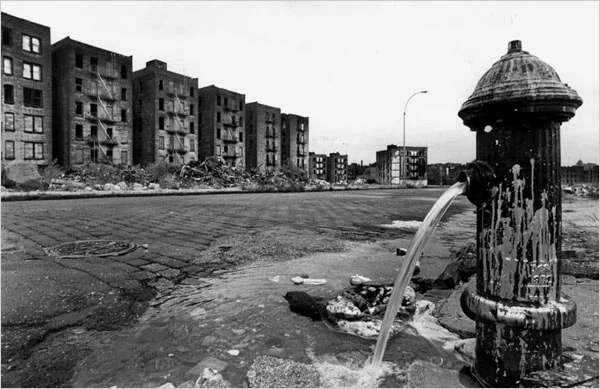

---
authors:
- first: Joe
  last: Flood
  role: author
cover: ./cover.jpg
date_reviewed: 2023-04-21
isbn: '9781594488986'
og_cover: ./og-cover.jpg
page_count: 336
publication_year: 2010
publisher: Riverhead Hardcover
rating: 5.0
reads:
- year: 2023
- year: 2023
tags:
- history
- sts
title: 'The Fires: How a Computer Formula, Big Ideas, and the Best of Intentions Burned
  Down New York City-and Determined the Future of Cities'
type: book
---

Stop me if you've heard this story before.  In 1960s America, an idealistic reform politician, a young operational technocrat, and the RAND corporation decide to manage a complex social issue via sophisticated data-driven models. For all their vaunted scientific objectivity, the effort collapses into a destructive quagmire that devastates an entire region, kills a whole bunch of non-white people, and wrecks the reputations of everyone involved.

No it's not the Vietnam War, JFK, Robert McNamara, and RAND. It's the South Bronx, Mayor John Lindsay, Fire Chief John O'Hagan, and RAND, and a microcosm of everything that the post-war technocratic liberal order did wrong. Flood orients the story around fire as a central actor in the destruction of the South Bronx, and places the story as part of a broader tide between ad hoc 'branch' approaches to governance which distribute power, and top down 'root' approaches which seek comprehensive theoretically driven explanations.

*South Bronx, 1971*

Lindsay and O'Hagan are the two protagonists of the story. Lindsay was an archetype common enough in New York City politics, the grand reformer, though the details of his liberal Republican to independent conversion are fairly unique.  In Flood's analysis, New York City politics waxes in cycles of clubhouse corruption and reformist mayors.  The clubhouse, the system of Tammany Hall ward bosses, is opaque, inefficient, unrepresentative, frequently mired in obvious criminality, but accountable to the ordinary people of the city. Reform programs have grand ambitions, but fail to deliver on their promises, prompting a backlash and return to the clubhouses. 

O'Hagan was a bit more unusual. A paratrooper in the Pacific in WW2, he joined the NYFD and rose through the ranks, becoming the youngest fire chief in NYFD history, and later one of only two people to simultaneously be Fire Chief and Fire Commissioner. O'Hagan was a tough bastard, a tenacious analyst capable of breaking a problem down into elementary components and assembling a solution. His essay question on the chief's exam, about how to prepare fire safety for the upcoming 1964 World's Fair became the actual plan. O'Hagan introduced new technology, like self-contained breathers, bigger hoses, better ladders, and early version of the hydraulic jaws of life. He obsessed over architectural plans and how to fight fires in the new lightweight steel towers of Manhattan.

In Lindsay's first term, he and O'Hagan worked closely together to find new efficiencies in the fire department. O'Hagan was eager to prove his tough budget cutting credentials to his superiors, and Lindsay needed winds as his administration struggled though labor disputes, rising crime, and race riots. While the situation in the city was not great, much of the chaos was a media exaggeration. New York had almost always been crowded, noisy, chaotic, and with its fair share of crime and corrupt, though the actual numbers were better than the nation's average.  The South Bronx was a concern, a mostly Black and Puerto Rican neighborhood with some alarming indicators, but nothing out of the ordinary.

New York had always been able to change with the times, but the difference in 1970 was an ideology of urban renewal which had gripped the city in the prior decades and rendered it extraordinarily fragile. Major commercial streets had been torn out in favor of Robert Moses' grand freeways, whisking people above rather than through neighborhoods. Various administrations deliberately pursued a policy of de-industrialization, eliminating hundreds of thousands of manufacturing jobs that had served as the first step on the ladder to prosperity for generations of immigrants, just as internal migrants from the Jim Crow South and Puerto Rico arrived. While the housing stock had often been crowded, racist red lining loan policies made it impossible to secure money for basic improvements to apartment buildings in the South Bronx, like a new furnace or roof repairs, and small landlords who lived in and invested in their buildings, a second step to the middle class (and one my family used at about this time) were barred from doing business, leaving housing to parasitic corporate landlords who saw buildings as a rapidly deprecating asset, and the grim public housing of the projects. Finally, one of Lindsay's labor deals had allowed city workers to live in the suburbs, transferring tax dollars out of the city and making fire, police, sanitation, and education a matter of "us vs them" rather than all of us together.

The hollowing out of New York City is complex and multifaceted, a long story with a lot of moving parts that Flood can only partially tell. But the spark was the clever idea to get RAND to find efficiencies in the fire service. RAND was looking to diversify from military contracts as the Vietnam War went sour, and O'Hagan had a suspicion that ordinary fire fighters were slacking off in bull session rather than doing their jobs. Or perhaps on an emotional level, O'Hagan wanted absolute control over the department, and sought to break the old boys networks and union leaders which served as alternative centers.

The situation was a tinderbox, and RAND provided the spark. In an absolute fiasco of applied social science, RAND decided that their primary measure of fire fighting effectiveness was response time between a call and the arrival of a truck on scene. And response time matters, but it isn't everything. A false alarm can be dealt with in minutes, or a simple fire in an up-to-code building with accurate plans. But the dangerous fires are the complex ones: old buildings retrofitted into mazes of room and hidden channels for fire without filed plans. Fire in high rises. Or fires in densely crowded apartment buildings, where hundreds of people might have to be rescued. Unable to quantify workload, RAND went with the simplest proxy.

Worse, their data methodology was horrendously flawed. 14 stop watches were distributed to the hundreds of fire companies, and most of those stop watches went to companies in Manhattan. The data was obviously fiddled with, as most fire fighters considered the whole effort a waste of time that could only harm them. Modelling the complexity of fires proved intractable, so RAND divided the city into seven classes of districts, and only considered adjusting stations in the same class of district.  And then O'Hagan adjusted the final recommendation to save politically important stations, the ones near the home of a judge or a congressman.

The end result was that South Bronx lost fire companies just as the population increased and social pressures got worse. The people involved weren't racist *per se,*. Lindsay was in fact an ardent advocate for civil rights. But O'Hagan regarded apartment fires as technically uninteresting, fire fighters from the outer boroughs as unintelligent, and evaluated the inhabitants of the South Bronx as having the least political influence in the city.  A law suit was brought over O'Hagan's closure of South Bronx stations, which was dismissed because the judge glanced at the RAND report and decided that anything with that much math was based on objective science rather than racism.

Fires served as both a leading indicator and a cause of social collapse. While landlord arson made headlines, the majority of fires started as ordinary domestic fires, amplified by the lack of maintenance. And fires in one building caused a rippling decline through the neighborhood. Inhabitants of the building were rendered homeless, and either went to the suburbs, public housing, or squeezing into other overcrowded buildings. Burned out apartments became shelter for junkies and gangs, putting pressure on the remaining honest residents. And junkies nodding off with cigarettes, various people starting fires to stay warm, or bored kids, all burnt semi-abandoned buildings repeatedly, until someone with a can of gasoline put the torched shell out of its misery. One census tract in the South Bronx suffered a 90% population decline between 1965 and 1975 as its housing stock was systematically destroyed. 

Any chance that O'Hagan could have recognized the pattern and recovered was stalled by New York's financial crisis of the 1970s. Deficit spending in the previous decade had been covered up with bond measures, and worsening economic conditions finally made the bill due. While liberal welfare policies attracted much of the scorn, a larger share of the burden was tax breaks and developer incentives, such as the ones used to build the World Trade Center, which directly cost the city money through incentives, replaced stable manufacturing jobs with unstable financial services ones, and made existing office space and luxury apartments unprofitable without meaningfully decreasing rents for ordinary people.  Every city department needed to make cuts, but O'Hagan had made his first. There was no fat to trim from the fire department, and scarcely any muscle. Any cuts started with bone.

So the South Bronx burned, becoming a byword for urban decay. Lindsay went from a presidential hopeful to one of the most despised mayors in America. O'Hagan resigned as chief and commissioner in 1978, his political ambitions dead, and became a technical consultant on fire fighting. RAND's New York-based urban issues branch was shut down, though RAND-style quantified systems analysis has become the parlance of planning.

*The Fires* is a persuasive and compelling history, verging onto the polemical. This is not just about New York in the 1970s. This is a valuable lesson about the limits of grand reforms and the dangers of complex models that hide asinine assumptions. Computers have only gotten faster, data more accessible, and many companies are working towards a vision of the smart city, centrally monitored and managed in real time from an urban command center, even if that managerial vision is a dangerous lie. And finally, I live in San Francisco, which feels a lot like New York in the mid 1960s, with a prosperity built on temporary conditions of tech and real estate that create a situation where the city is both too damn expensive and also empty, and where ordinary life flows around a quagmire of human misery the city is unable to fix and so prefers to ignore. And even if you don't live in the city America loves to hate, as the Strong Towns Project has extensively documented, low-density suburbs and exurbs cannot raise enough property taxes to fund infrastructure and services at a level residents expect, leading to a similar version of fragility.

Things haven't started burning yet, but if I smell smoke I'm not sticking around.