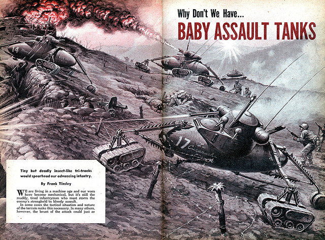

---
authors:
- first: Lawrence
  last: Freedman
  role: author
cover: ./cover.jpg
date_reviewed: 2023-01-24
isbn: '9781610393058'
og_cover: ./og-cover.jpg
page_count: 400
publication_year: 2017
publisher: PublicAffairs
rating: 5.0
reads:
- year: 2023
tags:
- academic
- war
title: 'The Future of War: A History'
type: book
---

*The Future of War* is a magisterial synthesis of conflict studies by one of the field's leading practitioners. I'll admit I was half hoping for a review of weird military futurism, but this is a serious study of how people have thought about war, from Victorian invasion literature such as *The Battle of Dorking* through the 2017 US Department of Defense Quadrennial Review.

*It's a good question.  Why don't we have baby assault tanks?*

Freedman identifies three major periods in conflict studies.  The first is that of traditional industrial warfare.  German victories against Austria and France in the 19th century demonstrated the potential of the strategic surprise offensive to rapidly achieve political ends. A county that was unprepared or slow to mobilize could find its army destroyed as it gathered and its capitol occupied.  The cult of the offensive lead to the slaughter of the First World War, and the fearful reaction that future wars would be slow, bloody, and exhausting. Airpower, fortification lines, and blitzkrieg were reactions to the First World War, which proved in the Second World War that in total war there were no limits, that the entire population was a valid military objective.  Nuclear weapons provided the ultimate example of the cult of the offensive by finally offering the ability to completely annihilate an enemy in a matter of minutes, at the expense of poisoning the planet and potentially inviting an omnicidal retaliation. 

Mutually assured destruction was one keystone of the lack of superpower conflict after World War 2.  The other, in Freedman's estimation, was a strong respect for the norm of national sovereignty. With some significant asterisks, like countries that had been partitioned in the wake of the Second World War, or minor countries without allies who found themselves on the wrong side of a superpower like Afghanistan or Panama, war was not seen as a practical matter of achieving political ends.

This international consensus shifted in the wake of the collapse of the Soviet Union, and bloody civil wars in Africa and the Balkans.  Perhaps national sovereignty had to be balanced against human rights, and the international community had a duty to prevent civil wars from escalating. Freedman is skeptical of humanitarian interventions. While they may save lives, there is a little clarity about why civil wars start or end, and these conflicts can become frozen without any chance of political resolution.

9/11 and the War on Terror provided a third shift, as the United States embarked on a globe spanning war not against nations, but against shifting groups of terrorists. As an aside, I enjoyed the back to back chapters "From Counter-Insurgency to Counter-Terrorism" and "From Counter-Terrorism to Counter-Insurgency" describing the failures of the 2003 invasion of Iraq and the subsequent surge.  It seems that war will continue to be a feature of the human experience, even as the frequency and intensity of conflicts on many measures has declined.

Since this book came out in 2017, it can't cover the lurching uncertainty of Trump's Actual Madman Presidency, China's increased naval aggressiveness, or the major conflicts such as the Russian invasion of Ukraine and the drone heavy Second Nagorno-Karabakh War between Armenia and Azerbaijan. Overall, this is a masterful synthesis of a complex topic, and well worth the read.