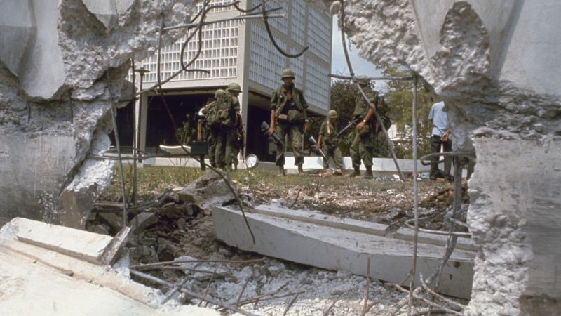

---
authors:
- first: John "Chick"
  last: Donohue
  role: author
- first: J. T.
  last: Molloy
  role: author
cover: ./cover.jpg
date_reviewed: '2026-05-20'
isbn: 978-0062995469
og_cover: ./og-cover.jpg
page_count: 272
publication_year: 2020
publisher: William Morrow
rating: 3.5
reads:
- date_finished: '2026-03-23'
  date_started: '2026-03-21'
  year: 2026
tags:
- vietnam
- vietnam-war
title: 'The Greatest Beer Run Ever: A Memoir of Friendship, Loyalty, and War'
type: book
---

In late 1967, Chick Donohue was hanging out at his local bar when the people got to talking politics, especially the escalating Vietnam War and those damn hippie protestors, and the barkeeper decided that someone should buy those boys a beer to show our appreciation for them.  This idea got a resounding ovation in the tightly knit Irish-American community of Inwood, New York, perched at the top of Manhattan. There was just one little complication. How were they going to get the beer to Vietnam?

Fortunately for all concerned, Donohue was a Merchant Mariner and US Marine veteran (his service was pre-Vietnam, mostly in Japan). The next day the neighborhood gathered up a list of local boys oversees, collected beers, and sent Donohue off to find a ship headed to Vietnam. Since he was senior and had been on the beach for a while, he was off in a few hours with a single change of clothes and two duffle bags full of New York beers. Six weeks and one Panama canal crossing later, he was in Vietnam.

Donohue had arranged for other members of the crew to cover his shifts and went ashore looking for the men on his list, with the understanding that the ship would sail in 3 days.  There were a lot of Americans in Vietnam: soldiers, contractors, journalists, but the idea that a sailor would just go play tourist in a war zone was so insane that Donohue slipped through the bureaucratic cracks.  With his natural charm, he had no problem getting enlisted men to give him lifts north towards his units, and officers assumed that anyone so obviously non-military must be CIA.  

The initial part of the beer run went off without a hitch, with Donohue finding several of his friends, delivering beers, and even going out on night ambush.  He confirmed all the unbelievable New York stories of his friends, and provoked general astonishment. "You're here and you don't have to be here?"

Unfortunately, he had so much fun it took 4 days to get back, and his ship was gone.  A rather dirty and ripe Donohue made his way to Saigon where instead of slipping through the cracks, Donohue got stuck. He couldn't leave Vietnam without an exit visa, and needed to get an American passport first.  By the time all the paperwork and bribes had been filed, it was late January. Donohue had a ticket to Manila to catch up with his ship. Just relax and enjoy Tet. It's going to be a big party.

Tet. 1968. Saigon.

Oh.

Oh no.

<!-- original-image: https://media.cnn.com/api/v1/images/stellar/prod/150417132005-20-vietnam-war-timeline-restricted.jpg -->
*A hole blown in the wall of the embassy, with US troops looking out. Donohue says that the attackers were let in by the ambassador's driver, who was a spy, and the response force shot these holes in the wall to cover this intelligence failure*

As the shooting started, Donohue made his way towards the sound of the guns in the mistaken assumption the US embassy would be the most secure place in the city. Instead, he arrived to witness an ongoing battle between a few embassy guards and a VC sapper squad, and the fight at the Presidential Palace. He managed not to find a bullet and settled in for the long haul.

As gunfire rattled Saigon, Donohue began shuttling food between the refrigerator ship *Limon* and the Carvelle Hotel.  The longshoremen were on strike, much of the city locked down, and Donohue had both the paperwork and the attitude to get food where it was needed. Finally, he departed on the *Limon*, making his way back home to the astonishment and appreciation of the neighborhood and the loving anger of his parents.

Donohue is a natural storyteller, his charisma comes through, with the writing sharpened by Molloy. There's not much new here, war-wise, but it does give an account of how ordinary Americans saw the war in 1967-68, and what one unusual community tried to do to support the troops.  It's a fun story, but as a guy who reads a lot of Vietnam War books, it's definitely just in the middle of the pack.