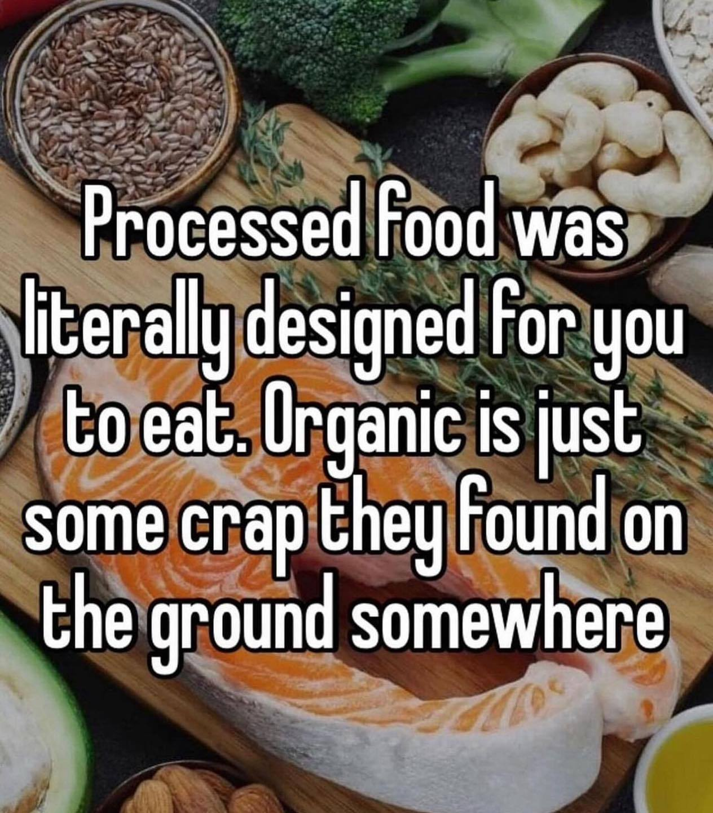

---
authors:
- first: Judson
  last: Brewer
  role: author
cover: ./cover.jpg
date_reviewed: 2024-08-15
isbn: '9780593543276'
og_cover: ./og-cover.jpg
page_count: 302
publication_year: 2024
publisher: Avery
rating: 4.0
reads:
- date_finished: 2024-08-15
  year: 2024
tags:
- non-fiction
- self-help
title: 'The Hunger Habit: Why We Eat When We''re Not Hungry and How to Stop'
type: book
---

The thing about diet and exercise and weight loss is that they mostly don't work. Humans are immensely resistant to ongoing changes in body composition. Brewer, a psychiatrist, neurologist, and mindfulness coach, offers his summary of what might be a more successful program. The basic premise is that you have to break the habits of disordered eating and learn to listen to your body again. Modern snack foods are addictive, at the perfect triple point of sweet, salty, and fatty. Due to past experiences, we eat to deal with moods like depression, anxiety, and boredom. Obviously, you can't eat your way out of a bad mood.

*Processed food was literally designed for you to eat. Organic is just some crap they found on the ground.*

There's a lot of neurojargon, like references to the orbitofrontal cortex, dopamine, and various memory systems, but the basic technique is mindfulness based. No one has enough discipline to simply override the urge the eat, especially not over the long term. What is possible is to recognize the patterns and moods that trigger compulsive eating and develop new habits.  Techniques like mindful eating, using attention to savor food rather than shoveling it down, and RAIN (recognize, accept, investigate, nurture) on junk food cravings can help us relearn 'proper' experiences around eating an entire carne asada super burrito, or a pound of jellybeans. As we learn to take pleasure in healthier foods and remember that junk food comes with a price, better eating habits come naturally.

This book recommends a 21 day course of exercises.  There's also an Eat Right Now app, which I found expensive ($100 a year), and a little intrusive with notifications. I can do mindfulness for free, ya know. I'll also say as a natural born hater, I am *not* doing a loving-kindness meditation. Finally, I just have some stress and boredom eating, which is likely amenable to this kind of intervention. If you have a diagnosed eating disorder, I'm not sure mindfulness is the right approach.