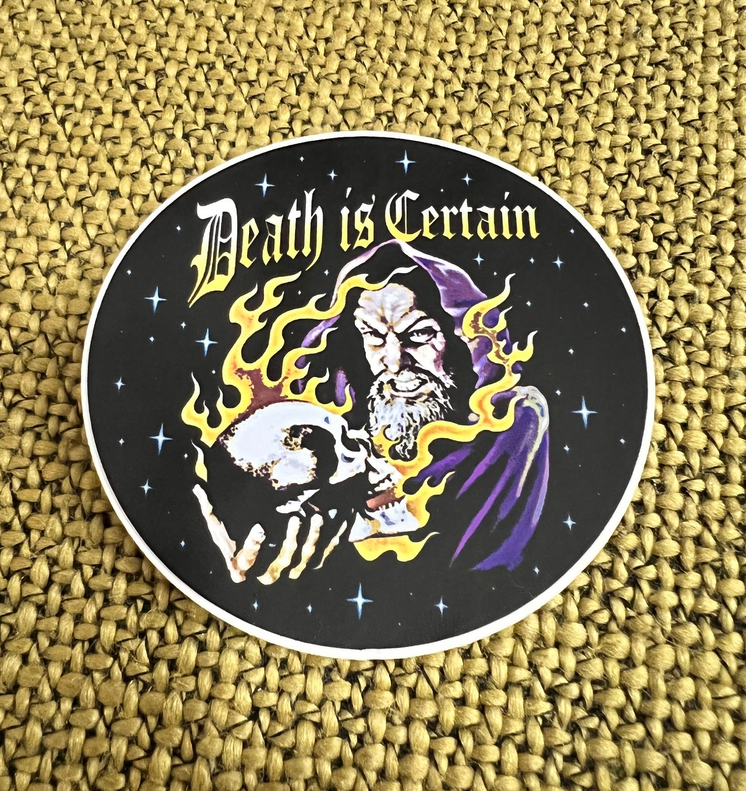

---
authors:
- first: Brianna
  last: Wiest
  role: author
cover: ./cover.jpg
date_reviewed: 2024-06-03
og_cover: ./og-cover.jpg
page_count: 250
publication_year: 2020
publisher: Thought Catalog Books
rating: 2.0
reads:
- year: 2024
- year: 2024
tags:
- self-help
title: 'The Mountain Is You: Transforming Self-Sabotage Into Self-Mastery'
type: book
---

I picked this book up purely because one of my favorite phrases when writing my dissertation was "It's like climbing a mountain, but the mountain is yourself."

*Also, 'Death is certain. Passing is not'*

This book is brief pop-psychology claptrap. Wiest identifies Resistance (see Pressfield's fantastic [The War of Art](https://www.goodreads.com/review/show/3163825235) for more) as a key barrier between the life you are leading, and the life you want to lead, but does not offer much about how to conquer resistance, how to know the difference between times when you should push forward and times you should draw back. The advice is to trust your instincts, not intrusive and misleading repetitive thoughts, but the end result is a kind of anodyne "BONG, you are now enlightened."