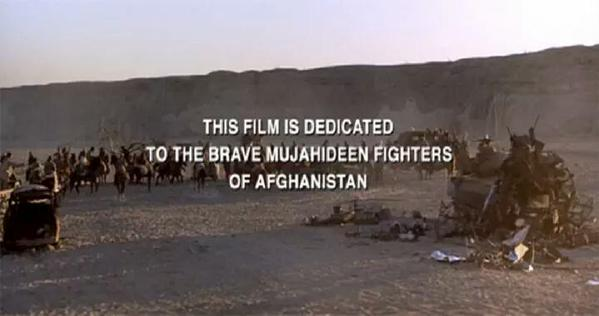

---
authors:
- first: Ali Ahmad
  last: Jalali
  role: author
- first: ''
  last: Lester W. Grau
  role: author
cover: ./cover.jpg
date_reviewed: 2018-10-02
isbn: '9780714682495'
og_cover: ./og-cover.jpg
page_count: 414
publication_year: 2003
publisher: Frank Cass Publishers
rating: 4.0
reads:
- date_finished: 2018-10-02
  year: 2018
tags:
- academic
- history
- war
title: 'The Other Side of the Mountain: Mujahideen Tactics in the Soviet Afghan War'
type: book
---

This is the stronger of Grau's books on the Soviet-Afghan War by far.  Based on hundreds of interviews with former mujahideen in the mid 1990s, it is an invaluable account of how asymmetric warfare looks from the guerrilla's side.

When the mujahideen had it good, they had it very good indeed.  Soviet convoy tactics were laughable, and skilled fighters were able to pick trucks off with ease, while avoiding the counterfire of armored escorts.  Afghan Army outposts were basically supply depots, with guards who were cowardly and unwilling to fight.  Conversely, when things went poorly, they went very poorly very quickly.  Soviet airborne forces were a minority in battle, but they were supremely effective.  Heavy artillery and aircraft pounded anyone exposed.  The mujahideen logistics system and command structure never went beyond 'ramshackle'.  This was both a weakness and a strength. While the mujahideen were unable to press an operational advantage, they were also impossible to decapitate.  New leaders always rose to replace casualties.  The Soviets, following the adage that the guerrilla swims like a fish in the sea of the people, attempted to drain the sea.  Aerial bombardment and massive mining operations turned millions of Afghans into refugees, and led directly to the Taliban, 9/11, the American invasion, and Afghanistan today.

*The Other Side of the Mountain* is focused solely on tactics, and probably should be read with a broader history of the region. But for what it does, it is the best book I've read!

Oh, and one more thing.

