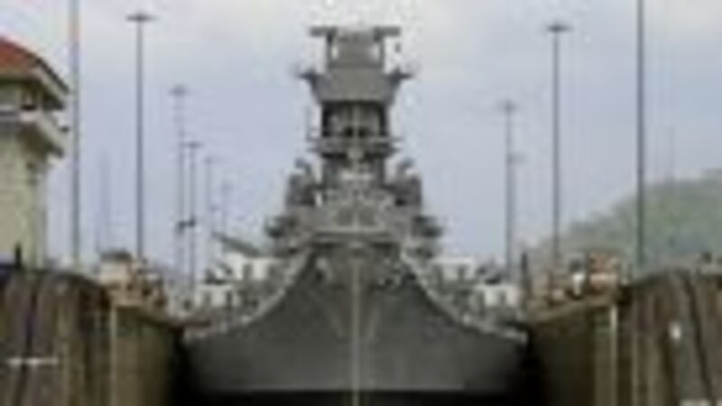

---
authors:
- first: David
  last: McCullough
  role: author
cover: ./cover.jpg
date_reviewed: 2019-01-11
isbn: '9780743262132'
og_cover: ./og-cover.jpg
page_count: 698
publication_year: 2004
publisher: Simon & Schuster
rating: 5.0
reads:
- date_finished: 2019-01-11
  year: 2019
tags:
- history
title: 'The Path Between the Seas: The Creation of the Panama Canal, 1870-1914'
type: book
---

David McCullough ably captures the grand spirit of the age in this book about the Panama canal. For centuries, men had dreamed of a canal through the American isthmus, which would elimate the fraught passage around Cape Horn, opening up the riches of the Far East and the Pacific Coast to traditional Atlantic powers.

The first man to seriously attempt a canal across the isthmus was Ferdinand de Lessup, builder of the Suez Canal and an entrepreneur par excellence. In the wake of the bitter defeat of the Franco-Prussian War, the elderly yet hale Lessups, and his eternal optimism for the canal, represented a possibility for a new France. Thousands of ordinary Frenchmen and women invested their savings in his canal company.

But Lessups, for all his reputation and energy, scorned technical matters.  He had decided on a sea level canal at Panama, and manipulated his board into backing him without a thorough survey or solid plans.  His company leaped into action, assuming that "men of genius" would arrive to meet challenges as they arose, just like at Suez.  

There were definitely men of genius among the French, but they couldn't meet the challenges of the canal.  Yellow fever began to slay men, first by the scores and then by the thousand, including the entire family of the local director.  The Culebra Cut, the most critical part of the canal, slid continuously.  Everything had to be imported to Panama, from massive dredges to Jamaican laborers, and the money ran out.  The collapse of the French Panama Company destroyed Jessups reputation and nearly brought down the republic. Work stalled for decades.

Until the unlikely, almost accident figure of President Theodore Roosevelt.  Americans had long favored a Nicaraguan canal,  closer to the United States and with a more pro-American government.  However, the Nicaraguan route was relatively long and twisty, and in a complex series of international intrigues, Roosevelt's administration bought the remains of the French company for $40 million (a song, relatively speaking), and fomented a revolution in Panama, when the Colombian government balked.

The American canal project succeed because it lead with medical hygiene, including a massive anti-mosquito campaign based on recent breakthroughs in epidemiology, as well as a cadre of tough railroad managers.  The canal was essentially a matter of rail transport, of moving spoilage from the cut to dump piles as efficiently as possible.  The French effort broke down continuously. The American effort was a well-oiled machine. 

McCullough covers the grandeur of the effort, as well as it's darker side.  There was a color line in Panama stricter than any Jim Crow law, where white Americans had every luxury and the best of healthcare, and the mostly black labor force from Trinidad and Tobago had comparatively high death rates and no amenities.  The scale was monumental, from the cut to the the 1000 foot locks.  The Panama Canal was the largest engineering project in history, a masterpiece of technological sublime. This book is the proper marker of its origins and place in history.