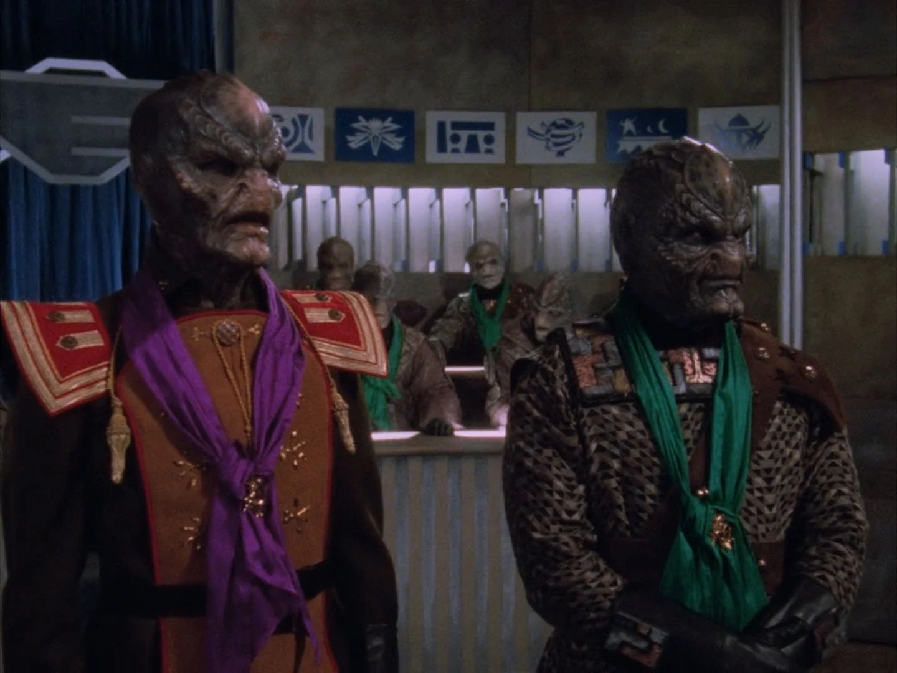

---
authors:
- first: Jay J. Van
  last: Bavel
  role: author
- first: ''
  last: Dominic J. Packer
  role: author
cover: ./cover.jpg
date_reviewed: 2021-07-18
isbn: '9780316538411'
og_cover: ./og-cover.jpg
page_count: 320
publication_year: 2021
publisher: Little, Brown Spark
rating: 4.0
reads:
- date_finished: 2021-07-18
  year: 2021
tags:
- non-fiction
- psychology
title: 'The Power of Us: Harnessing Our Shared Identities to Improve Performance,
  Increase Cooperation, and Promote Social Harmony'
type: book
---

*The Power of Us* is a fun and friendly guided tour through the world of social psychology by two professors. The strengths are a clear and breezy writing style, though many of the specific references in the book are *very* 2020, and I'm curious about how well it'll hold up.  And second, the subtitle and some of the text are more ambitious than the material warrants. Social harmony seems like an admirable goal in the fraught post-truth world of the Trump Regime and Biden Interregnum, but these problems may be beyond the grasp of social psychology to solve.

*[Green vs Purple](https://www.youtube.com/watch?v=ddxIfMRZemc) from Babylon 5 - The Geometry of Shadows*

Cooperation is the human superpower. We're social creatures to a degree unmatched anywhere else. Activating social identity, even ones as arbitrary as green or purple above, improves performance on group tasks and generosity even among selfish people.  Test subjects exhibit less disgust when handling a smelly shirt with their college's logo on it, and are more likely to help a fan of the same soccer team.

But identity has an obvious dark side.  It carves the universe into us and them, and the cognitive heuristics of identity short circuit actual thinking. In my favorite studies from the book, political identities make people bad at math, as partisans are unable to calculate simple averages to determine if a gun control proposal actually works, while being capable of doing the same for an uncontroversial example of an acne cream.  In another study, Asian-American respondents who were asked if they spoke English as part of the experimental intake were three times more likely to order American food like hot dogs and hamburgers for lunch than those in the control group, as a defense of their American identity was provoked. And if you're looking to make a quick and unethical buck, a [Christian identity scam](https://scambusters.org/churchscam.html) is pretty surefire.

Packer and Beval do have some interesting notes on when identities can help. Manchester United fans will help a man in a rival Liverpool jersey if they're reminded of being soccer fans, and not just Man U. An experiment in interfaith soccer teams in Mosul after the city was liberated from ISIL built some bridges between communities who had thousands of reasons to hate each other. And even the baseline level of racism in America can be decreased by making multiracial teams on an arbitrary green vs purple basis.

But the counter-examples are somewhat alarming. Online discourse tends towards moralist and radicalizing language, separating communities into angry echo chambers. The authors have little to say about what I'd say are the most pernicious problems of the 21st century, which is getting someone out of an identity. The book opens with the classic Seekers UFO Cult from *When Prophecy Fails*, who flexibly adjusted to a 1954 end of the world deadline which never happened. But with modern identities forming around vaccine skepticism (hooray COVID fourth wave!), the universal conspiracy theory of QAnon, and a general attitude that the only fixed policy goal is triggering the libs, a book with this subtitle should have a little more ambition and bite, an update of Altemeyer's right-wing authoritarianism theories. *The Power of Us* is fine when it sticks to science, but doesn't have the courage for a real "broader impacts" section.

*I received an ARC of this book from the publisher, and no other compensation for this review.*