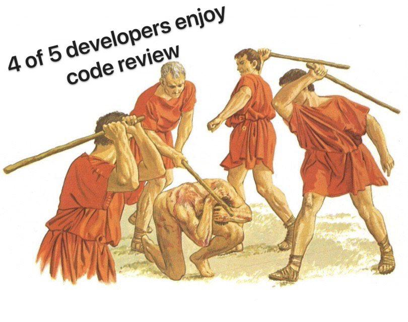

---
authors:
- first: Gerald M.
  last: Weinberg
  role: author
cover: ./cover.jpg
date_reviewed: 2022-01-23
isbn: '9780932633422'
og_cover: ./og-cover.jpg
page_count: 292
publication_year: 1998
publisher: Dorset House
rating: 4.0
reads:
- date_finished: 2022-01-23
  year: 2022
tags:
- data-science
title: The Psychology of Computer Programming
type: book
---

It's a rare technical book that is worth a damn after five years, let alone more than 50.  While technology has changed immensely, the basics of computer programming remain the same.  Weinberg offers a social study of programming, followed by questions for programmers and programming managers.

*4 of 5 developers enjoy code review*

These questions are the best part of the book.  "When was the last time you read a program written by someone else?  When was the last time someone read one of your programs? Was it your manager?"  Like, *what did I do to get called out like this?*. There are good sections on motivation, and how money is rarely enough for good programmers, which is true (though looking at [levels.fyi](www.levels.fyi) I could use a raise, and software is the only career in this capitalist hellscape that is actually well compensated), and how egoless programming helps build robust software.  Simply posing these questions to your software engineering team could reveal some very interesting truths and issues.  

There's also a lot of thoroughly deprecated engineering culture here. The example language is PL/I, the example machine an IBM 360 series mainframe. While we no longer line up to submit our batches of punchcards to the almighty computer, we still have [organizational barriers between developers and infrastructure](https://www.youtube.com/watch?v=3t6L-FlfeaI).  While process protects us from technical debt, security holes, and general anarchy, process is a greater barrier to getting things done at my job than any technical issue.

The reason why I've docked this review a star is that while I think Weinberg is right, he's right in theory and often lacks the evidence to support his claims, [evidence](https://neverworkintheory.org/) which according to [Valia's review](https://www.goodreads.com/review/show/746066243) of this book is now available. The one experiment, which is fascinating, compares groups of programmers on the same task. One group was told to write an efficient program, the other group to just get it done. The efficient group took 5x the time, but their programs used 10% of the computing resources on average.

*The Psychology of Computer Programming* has many fascinating and provocative questions, but gets lost in a tangle of arguments without evidence.  And there's also a faith that despite 50 years of exponential change in processor speed, memory, and quality of tooling, the fundamentals of programming are the same.