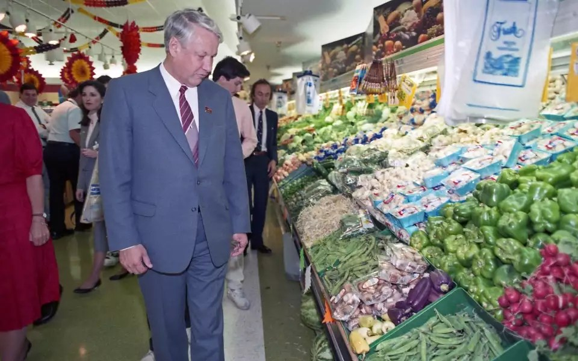

---
authors:
- first: Benjamin
  last: Lorr
  role: author
cover: ./cover.jpg
date_reviewed: 2024-10-03
isbn: '9780553459395'
og_cover: ./og-cover.jpg
page_count: 328
publication_year: 2020
publisher: Avery
rating: 5.0
reads:
- year: 2024
- year: 2024
tags:
- non-fiction
- sts
title: 'The Secret Life of Groceries: The Dark Miracle of the American Supermarket'
type: book
---

The grocery store is the high temple of Late Capitalism, an unending cornucopia of everything that you want. And like any good high temple, it has its shadowy underbelly, a galaxy of corruption and lies that makes the magic work. Food is one of the key universals, but how we eat is highly specific. Lorr follows Upton Sinclair's classic muckraking in *The Jungle*, mixing cultural theory with extended anecdotes based on his reporting to show all sides of store. As I write this, the high price of groceries is one of the key issues of the 2024 election. Yet historically, Americans spend about 10% of their income on groceries today, compared to 30% in 1950 and 50% in 1900. The system is efficient and bountiful, even as parts of it are rotten.

*Premier Gorbachev marveling at the produce at Randall's Supermarket in 1989. Tear down these savings!*

The first thing to note is that the modern supermarket is a relatively new phenomenon, only arriving in the early 20th century and coming into its own in the immediate postwar boom. The ideology of the supermarket is abundance, choice, and cost. To get there, there is an intensive process that takes raw living organisms, crops and animals, and processes them into industrial commodities. Then, these commodities are transformed into products, everything from a single banana (["It's one banana, Michael, how much could it cost? 10 dollars?"](https://www.youtube.com/watch?v=Nl_Qyk9DSUw)) to a frozen meal with dozens of ingredients. Finally, we place in our cart and take it home, where only then does it become food.

Managing the product stage is one key part of the grocery experience. Lorr conducted an extended interview with "Trader Joe" Coulombe, founder of the eponymous chain, who is usually and rightfully deemed a product visionary. Trader Joe's went in a unique direction in the 1960s, focusing on a Southern California customer base of the 'overeducated and underpaid', and achieving record profitability by focusing on employees, profit per square inch of shelf space, and unique products with an aura of sophistication.

Trader Joe's has a unique vision, but most grocery stores are Walmart/Safeway/ALDI. The thousands of products represent not so much a unique vision of the shopper as a random selection of brands engaged in brutal Darwinian competition.  And it is truly Darwinian. Another major arc follows the tragically named Slawsa and its intensely driven owner Julie Busha (she was subsequently on Shark Tank) towards potential success on the shelves. Of new products, over 90% of them disappear within a year. Slawsa is made in a small (by food logistics standards, it's several thousand square feet of reconfigurable production space) industrial kitchen in North Carolina that makes hundreds of  unique products on demand. 

The story of Slawsa is one of those American dreams of an idea that might make it big. Its manufacturing is also hygienic, fair, and efficient. Getting on shelves and then into shopper's carts, is where the corruption lies in this story. Groceries are a notorious unprofitable business, with stores making perhaps 1.5% profit on what they sell. The money is in kickbacks from distributors. A fee for getting in the store, another for better shelf space, mandatory bonus cases in each shipment, requirements to purchase ads in those newspaper inserts that get thrown away unread, two-for-one deals at the distributor's expense. It's pay-to-win, and unless you come in with deep pockets, you simply won't.

A similar story of is in the various certifications on products: Organic, FairTrade, Sustainable Fisheries, etc and so on. Food safety auditing is overwhelming privatized, ethical labelling even more so. In one sense, this public-private partnership, backed up by class action lawsuits, has made American food much safer since the 1990s, as recalls have fallen immense. On the other hand, auditors are barely trained, report to the people who hire them, and have conflicting incentives to not see problems that don't make customers sick.

Ethical and supply-chain labels conceal horrific problems, as the back half of the book focuses on, with a segment with the NGO [Labor Protection Network](https://www.lpnfoundation.org/), its founders, and one of its exemplars, a former fisher named Tun-Lin. Tun-Lin was born in Burma, illegally immigrated to Thailand in search of work, wound up enslaved on a fishing boat for five years (where he witnessed his only friend beaten to death and tossed overboard), enslaved on land in a shrimping facility for more years, and then went back to another boat of his own free will before losing a hand. Slavery is endemic in shrimp, chocolate, and coffee, among other commodities. The pressure is to reduce prices in the store and look the other way, and Lorr is deeply skeptical about reforms doing anything than pushing the problem to another region.

While not technically slavery, the whole grocery system runs on trucking, and trucking is profoundly bad. Lorr rides with Lynne Ryles for a week, a veteran owner-operator who routinely works up to the legal limit of 14 hours a day, 70 hours a week, in the exhausting and alienating ordeal of driving a big rig, and who makes maybe $100 a week above expenses, if everything goes right. Ryles is slowly killing herself in pursuit of the open road, and she's good at this. Trucking as an industry has about a 120% annual turnover, and only functions by a constant influx of indebted trainees, who front the costs to learn how to drive, are coerced to sign owner-operator leases, and then have the money sucked out of them by literally everyone else in the system.

Against this, ordinary grocery retail is merely ordinary bullshit. Lorr worked six months at Whole Foods, just prior to the Amazon acquisition, and retail is long hours, crazy customers, and just-in-time staffing that prevents people from having a predictable income, or a schedule stable enough to work a second job or have a life.  (As an aside, as someone who has only had good 9-5 jobs, I *strongly* believe this kind of mandatory just-in-time staffing should be illegal, and the officers of any company found practicing it should be required to serve jail time in 12 hour shifts at random until their sentence is completed.)

There are things to genuinely critique in this book. It's a series of anecdotes backed up by data, not a systematic analysis.  Lorr is definitely an MFA style writer, and dances a fine line of over-egging his prose. The conclusion about how grocery stores reflect and represent us isn't wrong, but dissipates its impact in a cushion of theory.  Yet those flaws are minor. This book cuts to the core of American life. You may not like what you see, but that's what's for sale.